:tocdepth: 1

.. sectnum::

.. _exec-summary:

Executive Summary
=================

The LSST baseline database architecture for its massive user query
access system is an MPP (massively parallel processing) relational
database composed of a single-node non-parallel DBMS, a distributed
communications layer, and a master controller, all running on a
shared-nothing cluster of commodity servers with locally attached
spinning disk drives, capable of incremental scaling and recovering from
hardware failures without disrupting running queries. All large catalogs
are spatially partitioned horizontally into materialized *chunks*, and
the remaining catalogs are replicated on each server; the chunks are
distributed across all nodes. The Object catalog is further partitioned
into *sub-chunks* with overlaps, materialized on-the-fly when needed.
Chunking is handled automatically without exposure to users. Selected
tables are also partitioned vertically to maximize performance of most
common analysis. The system uses a few critical indexes to speed up
spatial searches, time series analysis, and simple but interactive
queries. Shared scans are used to answer all but the interactive
queries. Such an architecture is primarily driven by the variety and
complexity of anticipated queries, ranging from single object lookups to
complex :math:`O(n^2)` full-sky correlations over billions of
elements.

The LSST baseline database architecture for its real time Alert
Production relies on horizontal time-based partitioning. To guarantee
reproducibility, no-overwrite-update techniques combined with
maintaining validity time for appropriate rows are employed. Two
database replicas are maintained to isolate live production catalogs
from user queries; the replicas are synchronized in real time using
native database replication.

Given the current state of the RDBMS and Map/Reduce market, an
RDBMS-based solution is a much better fit, primarily due to features
such as indexes, schema and speed. No off-the-shelf, reasonably priced
solution meets our requirements (today), even though production systems
at a scale comparable to LSST have been demonstrated already by
industrial users such as eBay using a prohibitively expensive,
commercial RDBMS.

The baseline design involves many choices such as component technology,
partition size, index usage, normalization level, compression
trade-offs, applicability of technologies such as solid state disks,
ingest techniques and others. We ran many tests to determine the design
configuration, determine limits and uncover potential bottlenecks. In
particular, we chose *MySQL* as our baseline open source, single-node
DBMS and `XRootD`_ as an open source, elastic, distributed,
fault-tolerant messaging system.

We developed a prototype of the baseline architecture, called *Qserv*.
To mitigate major risks, such as insufficient scalability or potential
future problems with the underlying RDBMS, Qserv pays close attention to
minimizing exposure to vendor-specific features and add-ons. Many key
features including the scalable dispatch system and 2-level partitioner
have been implemented at the prototype level and integrated with the two
underlying production-quality components: MySQL and `XRootD`_. Scalability
and performance have been successfully demonstrated on a variety of
clusters ranging from 20-node-100TB cluster to 300-node-30TB cluster,
tables as large as 50 billion rows and concurrency exceeding 100,000
in-flight chunk-queries. Required data rates for all types of queries
(interactive, full sky scans, joins, correlations) have been achieved.
Basic fault tolerance recovery mechanisms and basic version of shared
scans were demonstrated. Future work includes adding support for user
tables, demonstrating cross-matching, various non-critical
optimizations, and most importantly, making the prototype more
user-friendly and turning it into a production-ready system.

If an equivalent open-source, community supported, off-the-shelf
database system were to become available, it could present significant
support cost advantages over a production-ready Qserv. The largest
barrier preventing us from using an off-the-shelf system is spherical
geometry and spherical partitioning support.

To increase the chances such a system will become reality in the next
few years, in 2008 we initiated the SciDB array-based scientific
database project. Due to lack of many traditional RDBMS-features in
SciDB and still nascent fault tolerance, we believe it is easier to
build the LSST database system using MySQL+\ `XRootD`_ than it would be to
build it based on SciDB. In addition we closely collaborate with the
MonetDB open source columnar database team – a successful demonstration
of Qserv based on MonetDB instead of MySQL was done in 2012. Further, to
stay current with the state-of-the-art in peta-scale data management and
analysis, we continue a dialog with all relevant solution providers,
both DBMS and Map/Reduce, as well as with data-intensive users, both
industrial and scientific, through the `XLDB`_ conference series we lead,
and beyond.

.. _intro:

Introduction
============

This document discusses the LSST database system architecture.  :ref:`Chapter 3
<baseline-arch>` discusses the baseline architecture. :ref:`Chapter 4
<reqs>` explains the LSST database-related requirements. :ref:`Chapter
5 <potential-solutions>` covers in-depth analysis of existing off-the-shelf
potential solutions (Map/Reduce and RDBMS).  :ref:`Chapter 6
<design-trade-offs>` discusses design trade-offs and decision process,
including small scale tests we run. :ref:`Chapter 7 <risk-analysis>` covers
risk analysis.  :ref:`Chapter 8 <implementation>` discusses the prototype
design (Qserv), including design, current status of the software and future
plans. :ref:`Chapters 9 <large-scale-testing>` and :ref:`10
<other-demonstrations>` describe large scale Qserv tests and demonstrations.

.. _baseline-arch:

Baseline Architecture
=====================

This chapter describes the most important aspects of the LSST baseline
database architecture. The choice of the architecture is driven by the
project requirements (see :ref:`reqs`) as well as cost, availability
and maturity of the off-the-shelf solutions currently available on the
market (see :ref:`potential-solutions`), and design trade-offs (see
:ref:`design-trade-offs`). The architecture is periodically
revisited: we continuously monitor all relevant technologies, and
accordingly fine-tune the baseline architecture.

In summary, the LSST baseline architecture for Alert Production is an
off-the-shelf RDBMS system which uses replication for fault tolerance
and which takes advantage of horizontal (time-based) partitioning. The
baseline architecture for user access to Data Releases is an MPP
(multi-processor, parallel) relational database running on a
shared-nothing cluster of commodity servers with locally attached
spinning disk drives; capable of (a) incremental scaling and (b)
recovering from hardware failures without disrupting running queries.
All large catalogs are spatially partitioned into materialized *chunks*,
and the remaining catalogs are replicated on each server; the chunks are
distributed across all nodes. The Object catalog is further partitioned
into *sub-chunks* with overlaps,\ [#]_ materialized on-the-fly when needed.
Shared scans are used to answer all but low-volume user queries. Details
follow below.

.. [#] A chunk's overlap is implicitly contained within the overlaps of
   its edge sub-chunks.

.. _alert-production:

Alert Production and Up-to-date Catalog
---------------------------------------

Alert Production involves detection and measurement of
difference-image-analysis sources (DiaSources). New DiaSources are
spatially matched against the most recent versions of existing
DiaObjects, which contain summary properties for variable and transient
objects (and false positives). Unmatched DiaSources are used to create
new DiaObjects. If a DiaObject has an associated DiaSource that is no
more than a month old, then a forced measurement (DiaForcedSource) is
taken at the position of that object, whether a corresponding DiaSource
was detected in the exposure or not.

The output of Alert Production consists mainly of three large catalogs –
DiaObject, DiaSource, and DiaForcedSource - as well as several smaller
tables that capture information about e.g. exposures, visits and
provenance. 

.. _tab-estimated-row-counts:

.. table:: The estimated row counts for the 3 largest catalogs in the first and last data releases are shown below (all numbers in billions of rows).

   +---------------------------------+---------------------------+-------------------+
   | Catalog                         | 1\ :sup:`st` Data Release | Last Data Release |
   +=================================+===========================+===================+
   | DiaObject (unique count)        | 0.8                       | 15                |
   +---------------------------------+---------------------------+-------------------+
   | DiaObject (actual in the table) | 15                        | 44                |
   +---------------------------------+---------------------------+-------------------+
   | DiaSource                       | 23                        | 45                |
   +---------------------------------+---------------------------+-------------------+
   | DiaForcedSource                 | 15                        | 301               |
   +---------------------------------+---------------------------+-------------------+

These catalogs will be modified live every night. After Data Release
Production has been run based on the first six months of data and each
year's data thereafter, the live Level 1 catalogs will be archived to
tape and replaced by the catalogs produced by DRP. The archived catalogs
will remain available for bulk download, but not for queries.

Note that existing DiaObjects are never overwritten. Instead, new
versions of the AP-produced and DRP-produced DiaObjects are inserted,
allowing users to retrieve (for example) the properties of DiaObjects as
known to the pipeline when alerts were issued against them. To enable
historical queries, each DiaObject row is tagged with a validity start
and end time. The start time of a new DiaObject version is set to the
observation time of the DiaSource or DiaForcedSource that led to its
creation, and the end time is set to infinity. If a prior version
exists, then its validity end time is updated (in place) to equal the
start time of the new version. As a result, the most recent versions of
DiaObjects can always be retrieved with:

.. code:: sql

    SELECT * FROM DiaObject WHERE validityEnd = infinity

Versions as of some time *t* are retrievable via:

.. code:: sql

    SELECT * FROM DiaObject WHERE validityStart <= t AND t < validityEnd

Note that a DiaSource can also be reassociated to a solar-system object
during day time processing. This will result in a new DiaObject version
unless the DiaObject no longer has any associated DiaSources. In that
case, the validity end time of the existing version is set to the time
at which the reassociation occurred.

Once a DiaSource is associated with a solar system object, it is never
associated back to a DiaObject. Therefore, rather than also versioning
DiaSources, columns for the IDs of both the associated DiaObject and
solar system object, as well as a reassociation time, are included.
Reassociation will set the solar system object ID and reassociation
time, so that DiaSources for DiaObject 123 at time *t* can be obtained
using:

.. code:: sql

   SELECT *
   FROM DiaSource
   WHERE diaObjectId = 123
   AND midPointTai <= t
   AND (ssObjectId is NULL OR ssObjectReassocTime > t)

DiaForcedSources are never reassociated or updated in any way.

From the database point of view then, the alert production pipeline will
perform the following database operations 189 times (once per LSST CCD)
per visit (every 39 seconds):

1. Issue a point-in-region query against the DiaObject catalog, returning the
   most recent versions of the objects falling inside the CCD.

2. Use the IDs of these diaObjects to retrieve all associated diaSources and
   diaForcedSources.

3. Insert new diaSources and diaForcedSources.

4. Update validity end times of diaObjects that will be superseded.

5. Insert new versions of diaObjects.

All spatial joins will be performed on in-memory data by pipeline code,
rather than in the database. While Alert Production does also involve a
spatial join against the Level 2 (DRP-produced) Object catalog, this
does not require any database interaction: Level 2 Objects are never
modified, so the Object columns required for spatial matching will be
dumped to compact binary files once per Data Release. These files will
be laid out in a way that allows for very fast region queries, allowing
the database to be bypassed entirely.

The DiaSource and DiaForcedSource tables will be split into two tables,
one for historical data and one containing records inserted during the
current night. The current-night tables will be small and rely on a
transactional engine like InnoDB, allowing for speedy recovery from
failures. The historical-data tables will use the faster
non-transactional MyISAM or Aria storage engine, and will also take
advantage of partitioning. The Data Release catalogs used to seed the
live catalogs will be stored in a single initial partition, sorted
spatially (using the Hierarchical Triangular Mesh trixel IDs for their
positions). This means that the diaSources and diaForcedSources for the
diaObjects in a CCD will be located close together on disk, minimizing
seeks. Every month of new data will be stored in a fresh partition,
again sorted spatially. Such partitions will grow to contain just a few
billion rows over the course of a month, even for the largest catalog.
At the end of each night, the contents of the current-night table are
sorted and appended to the partition for the current-month, then
emptied. Each month, the entire current-month partition is sorted
spatially (during the day), and a partition for the next month is
created.

For DiaObject, the same approach is used. However, DiaObject validity
end-time updates can occur in any partition, and are not confined to the
current-night table. We therefore expect to use a transactional storage
engine like InnoDB for all partitions. Because InnoDB clusters tables
using the primary key, we will likely declare it to consist of a leading
HTM ID column, followed by disambiguating columns (diaObjectId,
validityStart). The validity end time column will not be part of any
index.

No user queries will be allowed on the live production catalogs. We
expect to maintain a separate replica just for user queries,
synchronized in real time using one-way master-slave native database
replication. The catalogs for user queries will be structured
identically to the live catalogs, and views will be used to hide the
splits (using a “``UNION ALL``”).

For additional safety, we might choose to replicate the small
current-night tables, all DiaObject partitions, and the remaining
(small) changing tables to another hot stand-by replica. In case of
disastrous master failure that cannot be fixed rapidly, the slave
serving user queries will be used as a temporary replacement, and user
queries will be disallowed until the problem is resolved.

Based on the science requirements, only short-running, relatively simple
user queries will be needed on the Level 1 catalogs. The most complex
queries, such as large-area near neighbor queries, will not be needed.
Instead, user queries will consist mainly of small-area cone searches,
light curve lookups, and historical versions of the same. Since the
catalogs are sorted spatially, we expect to be able to quickly answer
spatial queries using indexed HTM ID columns and the scisql UDFs, an
approach that has worked well in data-challenges to date. Furthermore,
note that the positions of diaSources/diaForcedSources associated with
the same diaObject will be very close together, so that sorting to
obtain good spatial locality also ends up placing sources belonging to
the same light curve close together. In other words, the data
organization used to provide fast pipeline query response is also
advantageous for user queries.

.. _drp:

Data Release Production
-----------------------

Data Release Production will involve the generation of significantly
larger catalogs than Alert Production. However, these are produced over
the course of several months, pipelines will not write directly to the
database, and there are no pipeline queries with very low-latency
execution time requirements to be satisfied. While we do expect several
pipeline-related full table scans over the course of a Data Release
Production, we will need to satisfy many user queries involving such
scans on a daily basis. User query access is therefore the primary
driver of our scalable database architecture, which is described in
detail below. For a description of the data loading process, please see
:ref:`qserve-data-loading`.

.. _user-query-access:

User Query Access
-----------------

The user query access is the primary driver of the scalable database
architecture. Such architecture is described below.

.. _user-query-distrib-parallel:

Distributed and parallel
~~~~~~~~~~~~~~~~~~~~~~~~

The database architecture for user query access relies on a model of
distributing computation among autonomous worker nodes. Autonomous
workers have no direct knowledge of each other and can complete their
assigned work without data or management from their peers. This implies
that data must be partitioned, and the system must be capable of
dividing a single user query into sub-queries, and executing these
sub-queries in parallel – running a high-volume query without
parallelizing it would take unacceptably long time, even if run on very
fast CPU. The parallelism and data distribution should be handled
automatically by the system and hidden from users.

.. _user-query-shared-nothing:

Shared-nothing
~~~~~~~~~~~~~~

Such architecture provides good foundation for incremental scaling and
fault recovery: because nodes have no direct knowledge of each other and
can complete their assigned work without data or management from their
peers, it is possible to add node to, or remove node from such system
with no (or with minimal) disruption. However, to achieve fault
tolerance and provide recover mechanisms, appropriate smarts have to be
build into the node management software.

.. _fig-shared-nothing-arch:

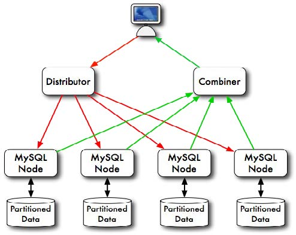

   Shared-nothing database architecture.

.. _user-query-indexing:

Indexing
~~~~~~~~

Disk I/O bandwidth is expected to be the greatest bottleneck. Data can
be accessed either through index, which typically translates to a random
access, or a scan, which translates to a sequential read (unless
multiple competing scans are involved).

Indexes dramatically speed up locating individual rows, and avoid
expensive full table scans. They are essential to answer low volume
queries quickly, and to do efficient table joins. Also, spatial indexes
are essential. However, unlike in traditional, small-scale systems, the
advantages of indexes become questionable when a larger number of rows
is to be selected from a table. In case of LSST, selecting even a 0.01%
of a table might lead to selecting millions of rows. Since each fetch
through an index might turn into a disk seek, it is often cheaper to
read sequentially from disk than to seek for particular rows via index,
especially when the index itself is out-of-memory. For that reason the
architecture forgoes relying on heavy indexing, only a small number of
carefully selected indexes essential for answering low-volume queries,
enabling table joins, and speeding up spatial searches will be
maintained. For an analytical query system, it makes sense to make as
few assumptions as possible about what will be important to our users,
and to try and provide reasonable performance for as broad a query load
as possible, i.e. focus on scan throughput rather than optimizing
indexes. A further benefit to this approach is that many different
queries are likely to be able to share scan IO, boosting system
throughput, whereas caching index lookup results is likely to provide
far fewer opportunities for sharing as the query count scales (for the
amounts of cache we can afford).

.. _user-query-shared-scanning:

Shared scanning
~~~~~~~~~~~~~~~

Now with table-scanning being the norm rather than the exception and
each scan taking a significant amount of time, multiple full-scan
queries would randomize disk access if they each employed their own
full-scanning read from disk. Shared scanning (also called *convoy
scheduling*) shares the I/O from each scan with multiple queries. The
table is read in pieces, and all concerning queries operate on that
piece while it is in memory. In this way, results from many full-scan
queries can be returned in little more than the time for a single
full-scan query. Shared scanning also lowers the cost of data
compression by amortizing the CPU cost among the sharing queries,
tilting the tradeoff of increased CPU cost versus reduced I/O cost
heavily in favor of compression.

Shared scanning will be used for all high-volume and super-high volume
queries. Shared scanning is helpful for unpredictable, ad-hoc analysis,
where it prevents the extra load from increasing the disk /IO cost –
only more CPU is needed. On average we expect to continuously run the
following scans:

- one full table scan of Object table for the latest data release
  only,

- one synchronized full table scan of Object, Source and
  ForcedSource tables every 12 hours for the latest data release only,

- one synchronized full table scan of Object and
  Object\_Extra every 8 hours for the latest and previous data
  releases.

Appropriate Level 3 user tables will be scanned as part of each shared
scan as needed to answer any in-flight user queries.

Shared scans will take advantage of table chunking explained below. In
practice, within a single node a scan will involve fetching sequentially
a chunk of data at a time and executing on this chunk all queries in the
queue. The level of parallelism will depend on the number of available
cores.

Running multiple shared scans allows relatively fast response time for
Object-only queries, and supporting complex, multi-table joins:
synchronized scans are required for two-way joins between different
tables. For a self-joins, a single shared scans will be sufficient,
however each node must have sufficient memory to hold 2 chunks at any
given time (the processed chunk and next chunk). Refer to the sizing
model [LDM-141]_ for further details on the cost of shared scans.

.. FIXME footnote?

Low-volume queries will be executed ad-hoc, interleaved with the shared
scans. Given the number of spinning disks is much larger than the number
of low-volume queries running at any given time, this will have very
limited impact on the sequential disk I/O of the scans, as shown in
[LDM-141]_.

.. FIXME figure?

.. _user-query-clustering:

Clustering
~~~~~~~~~~

The data in the Object Catalog will be physically clustered on disk
spatially – that means that objects collocated in space will be also
collocated on disk. All Source-type catalogs (Source, ForcedSource,
DiaSource, DiaForcedSource) will be clustered based on their
corresponding objectId – this approach enforces spatial clustering and
collocates sources belonging to the same object, allowing sequential
read for queries that involve times series analysis.

SSObject catalog will be unpartitioned, because there is no obvious
fixed position that we could choose to use for partitioning. The
associated diaSources (which will be intermixed with diaSources
associated with static diaSources) will be partitioned, according their
position. For that reason the SSObject-to-DiaSource join queries will
require index searches on all chunks, unlike DiaObject-to-DiaSource
queries. Since SSObject is small (low millions), this should not be an
issue.

.. _user-query-partitioning:

Partitioning
~~~~~~~~~~~~

Data must be partitioned among nodes in a shared-nothing architecture.
While some *sharding* approaches partition data based on a hash of the
primary key, this approach is unusable for LSST data since it eliminates
optimizations based on celestial objects' spatial nature.

.. _shard-data-queries:

Sharded data and sharded queries
^^^^^^^^^^^^^^^^^^^^^^^^^^^^^^^^

All catalogs that require spatial partitioning (Object, Source,
ForcedSource, DiaSource, DiaForcedSource) as well as all the auxiliary
tables associated with them, such as ObjectType, or PhotoZ, will be
divided into spatial partitions of roughly the same area by partitioning
then into *declination* zones, and chunking each zone into *RA* stripes.
Further, to be able to perform table joins without expensive inter-node
data transfers, partitioning boundaries for each partitioned table must
be aligned, and chunks of different tables corresponding to the same
area of sky must be co-located on the same node. To ensure chunks are
appropriately sized, the two largest catalogs, Source and ForcedSource,
are expected to be partitioned into finer-grain chunks. Since objects
occur at an approximately-constant density throughout the celestial
sphere, an equal-area partition should spread a load that is uniformly
distributed over the sky.

Smaller catalogs that can be partitioned spatially, such as Alert and
exposure metadata will be partitioned spatially. All remaining catalogs,
such provenance or SDQA tables will be replicated on each node. The size
of these catalogs is expected to be only a few terabytes.

With data in separate physical partitions, user queries are themselves
fragmented into separate physical queries to be executed on partitions.
Each physical query's result can be combined into a single final result.

.. _two-level-partitions:

Two-level partitions
^^^^^^^^^^^^^^^^^^^^

Determining the size and number of data partitions may not be obvious.
Queries are fragmented according to partitions so an increasing number
of partitions increases the number of physical queries to be dispatched,
managed, and aggregated. Thus a greater number of partitions increases
the potential for parallelism but also increases the overhead. For a
data-intensive and bandwidth-limited query, a parallelization width
close to the number of disk spindles should minimize seeks and
maximizing bandwidth and performance.

From a management perspective, more partitions facilitate rebalancing
data among nodes when nodes are added or removed. If the number of
partitions were equal to the number of nodes, then the addition of a new
node would require the data to be re-partitioned. On the other hand, if
there were many more partitions than nodes, then a set of partitions
could be assigned to the new node without re-computing partition
boundaries.

Smaller and more numerous partitions benefit spatial joins. In an
astronomical context, we are interested in objects near other objects,
and thus a full :math:`O(n^2)` join is not required–a localized
spatial join is more appropriate. With spatial data split into smaller
partitions, an SQL engine computing the join need not even consider (and
reject) all possible pairs of objects, merely all the pairs within a
region. Thus a task that is :math:`O(n^2)` naively becomes :math:`O(kn)`
where :math:`k` is the number of objects in a partition.

In consideration of these trade-offs, two-level partitioning seems to be
a conceptually simple way to blend the advantages of both extremes.
Queries can be fragmented in terms of coarse partitions (“chunks”), and
spatial near-neighbor joins can be executed over more fine partitions
(“sub-chunks”) within each partition. To avoid the overhead of the
sub-chunks for non-join queries, the system can store chunks and
generate sub-chunks on-demand for spatial join queries. On-the-fly
generation for joins is cost-effective due to the drastic reduction of
pairs, which is true as long as there are many sub-chunks for each
chunk.

.. _overlap:

Overlap
^^^^^^^

A strict partitioning eliminates nearby pairs where objects from
adjacent partitions are paired. To produce correct results under strict
partitioning, nodes need access to objects from outside partitions,
which means that data exchange is required. To avoid this, each
partition can be stored with a pre-computed amount of overlapping data.
This overlapping data does not strictly belong to the partition but is
within a preset spatial distance from the partition's borders. Using
this data, spatial joins can be computed correctly within the preset
distance without needing data from other partitions that may be on other
nodes.

Overlap is needed only for the Object Catalog, as all spatial
correlations will be run on that catalog only. Guided by the experience
from other projects including SDSS, we expect to preset the overlap to
~1 arcmin, which results in duplicating approximately 30% of the Object
Catalog.

.. _spherical-geometry:

Spherical geometry
^^^^^^^^^^^^^^^^^^

Support for spherical geometry is not common among databases and
spherical geometry-based partitioning was non-existent in other
solutions when we decided to develop Qserv. Since spherical geometry is
the norm in recording positions of celestial objects (right-ascension
and declination), any spatial partitioning scheme for astronomical
object must account for its complexities.

.. _data-immutability:

Data immutability
^^^^^^^^^^^^^^^^^

It is important to note that user query access operates on read-only
data. Not having to deal with updates simplifies the architecture and
allows us to add extra optimizations not possible otherwise. The Level 1
data which is updated is small enough and will not require the scalable
architecture – we plan to handle all Level 1 data set with out-of-the
box MySQL as described in :ref:`alert-production`.

.. _async-queries:

Long-running queries
~~~~~~~~~~~~~~~~~~~~

Many of the typical user queries may need significant time to complete,
at the scale of hours. To avoid re-submission of those long-running queries
in case of various failures (networking or hardware issues) the system will
support asynchronous query execution mode. In this mode users will submit
queries using special options or syntax and the system will dispatch a
query and immediately return to user some identifier of the submitted query
without blocking user session. This query identifier will be used by user
to retirieve query processing status, query result after query completes,
or a partial query result while query is still executing.

The system should be able to estimate the time which user query will need
to complete and refuse to run long queries in a regular blocking mode.

.. _tech-choice:

Technology choice
~~~~~~~~~~~~~~~~~

As explained in :ref:`Chapter 5 <potential-solutions>`, no off-the-shelf
solution meets the above requirements today, and RDBMS is a much better fit
than Map/Reduce-based system, primarily due to features such as indexes, schema
and speed. For that reason, our baseline architecture consists of *custom*
software built on two production components: an open source, “simple”,
single-node, non-parallel DBMS (MySQL) and `XRootD`_. To ease potential
future DBMS migrations, the communication with the underlying DBMS relies on
*basic* DBMS functionality only, and avoids any vendor-specific features and
additions.

.. _fig-qserve-components:

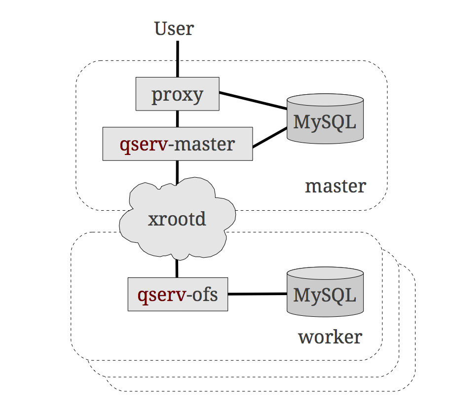

   Component connections in Qserv.

.. _reqs:

Requirements
============

The key requirements driving the LSST database architecture include:
incremental scaling, near-real-time response time for ad-hoc simple user
queries, fast turnaround for full-sky scans/correlations, reliability,
and low cost, all at multi-petabyte scale. These requirements are
primarily driven by the ad-hoc user query access.

.. _general-reqs:

General Requirements
--------------------

**Incremental scaling**. The system must to tens of petabytes and trillions
of rows. It must grow as the data grows and as the access requirements grow.
New technologies that become available during the life of the system must be
able to be incorporated easily. Expected sizes for the largest database
catalogs (for the last data release, uncompressed, data only) are captured in
:ref:`the table below <tab-expected-catalog-size>`. For further storage, disk
and network bandwidth and I/O analyses, see [LDM-141]_.

.. _tab-expected-catalog-size:

.. table:: Expected sizes for the largest database catalogs

   +---------------------+---------------+----------------------+-------------+--------------------------------------------------------------+
   | **Table**           | **Size [TB]** | **Rows [billion]**   | **Columns** | **Description**                                              |
   +=====================+===============+======================+=============+==============================================================+
   | Object (narrow)     | ~107          | ~47                  | ~330        | Most heavily used, for all common queries on stars/galaxies, |
   |                     |               |                      |             | including spatial correlations and time series analysis      |
   |                     |               |                      |             | using summarized information                                 |
   +---------------------+---------------+----------------------+-------------+--------------------------------------------------------------+
   | Object (all extras) | ~1,200        | Largest ~1,500       | ~7,650      | Specialized analysis of objects, including photo-Z,          |
   |                     |               |                      |             | covariances, B+D samples                                     |
   +---------------------+---------------+----------------------+-------------+--------------------------------------------------------------+
   | Source              | ~5,000        | ~9,000               | ~50         | Time series analysis of bright objects and detections        |
   +---------------------+---------------+----------------------+-------------+--------------------------------------------------------------+
   | ForcedSource        | ~1,900        | ~50,000              | 6           | Specialized analysis of faint objects and detections         |
   +---------------------+---------------+----------------------+-------------+--------------------------------------------------------------+
   | SSObject            | ~0.003        | 0.006                | ~80         | Analysis of solar system (moving) objects                    |
   +---------------------+---------------+----------------------+-------------+--------------------------------------------------------------+
   | DiaObject           | ~27 (76 max)  | ~15 unique (~44 max) | ~260        | Analysis of variable and transient objects, often            |
   |                     |               |                      |             | alert-related                                                |
   +---------------------+---------------+----------------------+-------------+--------------------------------------------------------------+
   | DiaSource           | ~23           | ~45                  | ~70         | Time series analysis of variable and transient objects,      |
   |                     |               |                      |             | often alert-related                                          |
   +---------------------+---------------+----------------------+-------------+--------------------------------------------------------------+
   | DiaForcedSource     | ~13           | ~300                 | 8           | Specialized analysis of faint diaObjects and detections      |
   +---------------------+---------------+----------------------+-------------+--------------------------------------------------------------+

**Reliability**. The system must not lose data, and it must provide at
least 98% up time in the face of hardware failures, software failures,
system maintenance, and upgrades.

**Low cost**. It is essential to not overrun the allocated budget,
thus a cost-effective, preferably open-source solution is strongly
preferred.

.. _dpr-reqs:

Data Production Related Requirements
------------------------------------

In a nutshell, the LSST database catalogs will be generated by a small
set of production pipelines:

- Data Release Production – it produces all key catalogs. Ingest
  rates are very modest, as DRP takes several months to complete and
  is dominated by CPU-intensive application jobs. Ingest can be done
  separately from pipeline processing, as an post-processing step.

- Nightly Alert Production – it produces difference image sources,
  and updates the DiaObject, SSObject, DiaSource, DiaForcedSource
  catalogs. Since alerts need to be generated in under a minute after
  data has been taken, data has to be ingested/updated in almost-real
  time. The number of row updates/ingested is modest: ~40K new rows
  and updates occur every ~39 sec [Becla07]_.

- Calibration Pipeline – it produces calibration information. Due to
  small data volume and no stringent timing requirements, ingest
  bandwidth needs are very modest.

In addition, the camera and telescope configuration is captured in the
Engineering & Facility Database. Data volumes are very modest.

Further, the Level 1 live catalog will need to be updated with minimal
delay. This catalog should not be taken off-line for extended periods of
time.

The database system must allow for occasional schema changes for the
Level 1 data, and occasional changes that do not alter query results [#]_
for the Level 2 data after the data has been released. Schemas for
different data releases are allowed to be very different.

.. [#] Example of non-altering changes including
       adding/removing/resorting indexes, adding a new column with derived
       information, changing type of a column without loosing information,
       (eg., ``FLOAT`` to ``DOUBLE`` would be always allowed, DOUBLE to
       ``FLOAT`` would only be allowed if all values can be expressed using
       ``FLOAT`` without loosing any information)

.. _query-access-reqss:

Query Access Related Requirements
---------------------------------

The Science Data Archive Data Release query load is defined primarily in
terms of access to the large catalogs in the archive: Object, Source,
and ForcedSource. Queries to image metadata, for example, though
numerous, are expected to be fast and can easily be handled by
replicating the relatively small metadata tables.

The large catalog query load is specified as follows:

1. 100 simultaneous queries for rows corresponding to single Objects or
   small spatial regions (on the order of at most 10s of arcminutes),
   with each query having an average response time of 10 seconds. This
   leads to a throughput of 10 "low-volume" queries per second. This
   number is approximately five times the peak "professional astronomer"
   query rate to the SDSS SkyServer. Each low-volume query is expected
   to return 0.5 GB of data or less.  These queries are further
   subdivided as follows:

   A. Single object fetches: 5%.
   
   B. Few objects fetched by objectId: 60%.
   
   C. Small area by spatial index: 25%.
   
   D. Small area by scan: 10%.

   Furthermore, 70% of queries are expected to be of Objects only,
   with 20% retrieving Sources for Objects and 10% retrieving
   ForcedSources.

2. 50 simultaneous analytical queries involving full table scans of one
   or more large tables, with a target throughput of 20 queries per
   hour. Each "high-volume" query is expected to return up to 6 GB of
   data. We further subdivide these as follows:

   A. Throughput of 16 queries per hour with an average latency of 1
      hour on the most frequently accessed columns in the Object table.
      These provide fast turnaround and high throughput for the most common
      types of queries.
   
   B. Throughput of 1 query per hour with average latency of 12 hours
      for joins of the Source table with the most frequently accessed
      columns in the Object table. These provide a reasonable turnaround
      time and good throughput for time series queries.
   
   C. Throughput of 1 query per hour with average latency of 12 hours
      for joins of the ForcedSource table with the most frequently
      accessed columns in the Object table. These provide a reasonable
      turnaround time and good throughput for detailed time series
      queries.
   
   D. Throughput of 1 query per hour with average latency of 8 hours
      for scans of the full Object table or joins of it with up to three
      additional tables other than Source and ForcedSource. These provide
      "adhoc" access for complex queries.
   
   E. Throughput of 1 query per hour with average latency of 8 hours
      for scans of the full Object table in the previous Data Release or
      joins of it with up to three additional tables. These provide "ad
      hoc" access for older data.

We also include in the requirements up to 20 simultaneous queries for
the Level 1 Database and 5 simultaneous queries for the Engineering and
Facilities Database, both completing in an average of 10 seconds.

**Reproducibility**. Queries executed on any Level 1 and Level 2 data
products must be reproducible.

**Real time**. A large fraction of ad-hoc user access will involve so
called “low-volume” queries – queries that touch small area of sky, or
request small number of objects. These queries are required to be
answered in under 10 sec. On average, we expect to see ~100 such queries
running at any given time.

**Fast turnaround**. High-volume queries – queries that involve
full-sky scans are expected to be answered in 1 hour , while more
complex full-sky spatial and temporal correlations are expected to be
answered in ~8-12 hours. ~50 simultaneous high-volume queries are
expected to be running at any given time.

**Cross-matching with external/user data**. Occasionally, LSST
database catalog will need to be cross-matched with external catalogs:
both large, such as SDSS, SKA or GAIA, and small, such as small amateur
data sets. Users should be able to save results of their queries, and
access them during subsequent queries.

**Query complexity**. The system needs to handle complex queries,
including spatial correlations, time series comparisons. Spatial
correlations are required for the Object catalog only – this is an
important observation, as this class of queries requires highly
specialized, 2-level partitioning with overlaps.

**Ad-hoc**. It is impossible to predict all types of analysis
astronomers will run. The unprecedented volume and scope of data might
enable new kind of analysis, and new ways of analysis.

**Flexibility**. Sophisticated end users need to be able to access all
this data in a flexible way with as few constraints as possible. Many
end users will want to express queries directly in SQL, most of basic
SQL92 will be required. It is not yet clear whether the full language is
necessary or if a subset is adequate, and, if so, what operations need
to be part of that subset.

.. _reqs-discussions:

Discussion
----------

.. _reqs-implications:

Implications
~~~~~~~~~~~~

The above requirements have important implications on the LSST data
access architecture.

- The system must allow rapid selection of small number of rows out of
  multi-billion row tables. To achieve this, efficient data indexing in
  both spatial and temporal dimensions is essential.

- The system must efficiently join multi-trillion with multi-billion row
  tables. Denormalizing these tables to avoid common joins, such as
  Object with Source or Object with ForcedSource, would be prohibitively
  expensive.

- The system must provide high data bandwidth. In order to process
  terabytes of data in minutes, data bandwidths on the order of tens to
  hundreds of gigabytes per second are required.

- To achieve high bandwidths, to enable expandability, and to provide
  fault tolerance, the system will need to run on a distributed cluster
  composed of multiple machines.

- The most effective way to provide high-bandwidth access to large
  amounts of data is to partition the data, allowing multiple machines
  to work against distinct partitions. Data partitioning is also
  important to speed up some operations on tables, such as index
  building.

- Multiple machines and partitioned data in turn imply that at least the
  largest queries will be executed in parallel, requiring the management
  and synchronization of multiple tasks.

- Limited budget implies the system needs to get most out available
  hardware, and scale it incrementally as needed. The system will be
  disk I/O limited, and therefore we anticipate attaching multiple
  queries to a single table scan (shared scans) will be a must.

.. _query_complexity:

Query complexity and access patterns
~~~~~~~~~~~~~~~~~~~~~~~~~~~~~~~~~~~~

A compilation of representative queries provided by the LSST Science
Collaborations, the Science Council, and other surveys have been
captured [common-queries]_. These queries can be divided into several distinct groups:
analysis of a single object, analysis of objects meeting certain
criteria in a region or across entire sky, analysis of objects close to
other objects, analysis that require special grouping, time series
analysis and cross match with external catalogs. They give hints as to
the complexity required: these queries include distance calculations,
spatially localized self-joins, and time series analysis.

.. FIXME footnote

Small queries are expected to exhibit substantial spatial locality
(refer to rows that contain similar spatial coordinates: right ascension
and declination). Some kinds of large queries are expected to exhibit a
slightly different form of spatial locality: joins will be among rows
that have nearby spatial coordinates. Spatial correlations will be
executed on the Object table; spatial correlations will *not* be needed
on Source or ForcedSource tables.

Queries related to time series analysis are expected to need to look at
the history of observations for a given Object, so the appropriate
Source or ForcedSource rows must be easily joined and aggregate
functions operating over the list of Sources must be provided.

External data sets and user data, including results from past queries
may have to be distributed alongside distributed production table to
provide adequate join performance.

The query complexity has important implications on the overall
architecture of the entire system.

.. _potential-solutions:

Potential Solutions - Research
==============================

The two most promising technologies able to scale to LSST size available
today are Relational Database Management Systems (RDBMS) and Map/Reduce
(MR): the largest DBMS system, based on commercial Teradata and reaching
20+ petabytes is hosted at eBay, and the largest MR-based systems,
reaching many tens of petabytes are hosted at Google, Facebook, Yahoo!
and others.

.. _solutions-research:

The Research
------------

To decide which technology best fits the LSST requirements, we did an
extensive market research and analyses, reviewed relevant literature,
and run appropriate stress-tests for selected “promising” candidates,
focusing on weak points and the most uncertain aspects. Market research
and analyses involved (a) discussions about lessons learned with many
industrial and scientific users dealing with large data sets, (b)
discussions about existing solutions and future product road-maps with
leading solution providers and promising start-ups, and (c), research
road-map with leading database researchers from academia. See
:ref:`community-consult`.

.. _solutions-results:

The Results
-----------

As a result of our research, we determined an RDBMS-based solution
involving a shared-nothing parallel database is a much better fit for
the LSST needs than MR. The main reasons are availability of indexes
which are absolutely essential for low-volume queries and spatial
indexes, support for schemas and catalogs, performance and efficient use
of resources.

Even though a suitable open source off-the-shelf DMBS capable of meeting
LSST needs does *not* exist today, there is a good chance a system
meeting most of the key requirements will be available well before LSST
production starts. In particular, there are two very promising
by-products of our research:

- we co-initiated, co-founded, and helped bootstrap SciDB – a new
  open source shared nothing database system, and

- we pushed the development of MonetDB, an open source columnar
  database into directions very well aligned with LSST needs. We
  closely collaborate with the MonetDB team – building on our Qserv
  lessons-learned, the team is trying to add missing features and turn
  their software into a system capable of supporting LSST needs. In
  2012 we demonstrated running Qserv with a MonetDB backend instead of
  MySQL.

Both SciDB and MonetDB have strong potential to become the LSST database
solution once they mature.

Further, our research led to creation a new, now
internationally-recognized conference series, `Extremely Large Databases
(XLDB) <http://xldb.org>`_. As we continue leading the `XLDB`_ effort, it
gives us a unique opportunity to reach out to a wide range of
high-profile organizations dealing with large data sets, and raise
awareness of the LSST needs among researchers and developers working on
both MR and DBMS solutions.

The remaining of this chapter discusses lessons learned to-date, along
with a description of relevant tests we have run.

.. _mapreduce-nosql:

Map/Reduce-based and NoSQL Solutions
------------------------------------

Map/Reduce is a software framework to support distributed computing on
large data sets on clusters of computers. Google’s implementation
[Dean04]_, believed to be the most advanced, is proprietary, and in
spite of Google being one of the LSST collaborators, we were unable to
gain access to any of their MR software or infrastructure. Additional
Google-internal MR-related projects include BigTable [Bigtable06]_,
Chubby [Chubby]_, and Sawzall [Pike]_.  BigTable addresses the need for rapid
searches through a specialized index; Chubby adds transactional support;
and Sawzall is a procedural language for expressing queries. Most of
these solutions attempt to add partial database-like features such as
schema catalog, indexes, and transactions. The most recent MR
developments at Google are Dremel [Dremel]_ - an interactive ad-hoc query
system for analysis of read-only data, and Tenzing – a full SQL
implementation on the MR Framework [Chattopadhyay11].\ [#]_

.. [#] Through our `XLDB`_ efforts, Google has provided us with a
   preprint of a Tenzing manuscript accepted for publication at VLDB 2011.

In parallel to the closed-source systems at Google, similar open-source
solutions are built by a community of developers led by Facebook, Yahoo!
and Cloudera, and they have already gained wide-spread acceptance and
support. The open source version of MR, *Hadoop*, has became popular in
particular among industrial users. Other solutions developed on top (and
“around”) Hadoop include `HBase`_ (equivalent of BigTable), `Hive`_
(concept similar to Google's Dremel), *Pig Latin* (equivalent to
Google's Sawzall), `Zookeeper`_ (equivalent to Google's Chubby), *Simon*,
and others. As in Google's case, the primary purpose of building these
solutions is adding database-features on top of MR. Hadoop is
commercially supported by Cloudera, `Hortonworks`_ [Yahoo] and
`Hadapt`_.

We have `experimented with Hadoop (0.20.2) and Hive (0.7.0) in mid 2010
using a 1 billion row USNO-B data set on a 64 node cluster
<http://dev.lsstcorp.org/trac/wiki/db`Hive`_Experiment>`_. Common LSST
queries were tested, ranging from low-volume type (such as finding a
single object, selecting objects near other know object), through
high-volume ones (full table scans) to complex queries involving joins
(join was implemented in a standard way, in the *reduce* step). The
results were discussed with Hadoop/`Hive`_ experts from Cloudera.
Periodically we revisit the progress and feature set available in the
Hadoop ecosystem, but to date we have not found compelling reasons to
consider Hadoop as a serious alternative for managing LSST data.

Independently, Microsoft developed a system called `Dryad`_, geared
towards executing distributed computations beyond “flat” *Map* and
*Reduce*, along with a corresponding language called *LINQ*. Due to its
strong dependence on Windows OS and limited availability, use of `Dryad`_
outside of Microsoft is very limited. Based on news reports [Zdnet]_,
Microsoft dropped support for `Dryad`_ back in late 2011.

Further, there is a group of new emerging solutions often called as
*NoSQL*. The two most popular ones are `MongoDB`_ and `Cassandra`_.

The remaining of this section discusses all of the above-mentioned
products.

Further details about individual MR and no-SQL solutions can be found in
:ref:`mr-solutions` and :ref:`db-solutions`.

.. _dbms-solutions:

DBMS Solutions
--------------

Database systems have been around for much longer than MR, and therefore
they are much more mature. They can be divided into many types:
parallel/single node, relational/object-oriented, columnar/row-based;
some are built as appliances. Details about individual DBMS products and
solutions we considered and/or evaluated can be found in
:ref:`db-solutions`.

.. _parallel-dbms:

Parallel DBMSes
~~~~~~~~~~~~~~~

Parallel databases, also called MPP DBMS (massively parallel processing
DBMS), improve performance through parallelization of queries: using
multiple CPUs, disks and servers in parallel. Data is processed in
parallel, and aggregated into a final result. The aggregation may
include computing average, max/min and other aggregate functions. This
process is often called *scatter-gather*, and it is somewhat similar to
*map* and *reduce* stages in the MR systems.

Shared-nothing parallel databases, which fragment data and in many cases
use an internal communications strategy similar to MR, scale
significantly better than single-node or shared-disk databases. Teradata
uses proprietary hardware, but there are a number of efforts to leverage
increasingly-fast commodity networks to achieve the same performance at
much lower cost, including Greenplum, DB2 Parallel Edition, Aster Data,
GridSQL, ParAccel, InfiniDB, SciDB, and Project Madison at Microsoft
(based on DATAllegro, acquired by Microsoft in 2008). Most of these
efforts are relatively new, and thus the products are relatively
immature. EBay's installation used to be based on Greenplum in 2009 and
reached 6.5 PB, but their current Singularity system is now approaching
30 PB and is based on Teradata's appliances. Some of these databases
have partition-wise join, which can allow entity/observation join
queries to execute more efficiently, but none allow overlapping
partitions, limiting the potential performance of pairwise analysis.

Microsoft SQL Server offers Distributed Partitioned Views, which provide
much of the functionality of a shared-nothing parallel database by
federating multiple tables across multiple servers into a single view.
This technology is used in the interesting GrayWulf project [Szalay08]_
[Simmhan09]_ which is designed to host observational data consisting of
Pan-STARRS PS1 [Jedicke06]_ astronomical detections and summary information
about the objects that produced them. GrayWulf partitions observation
data across nodes by “zones” [Gray07]_, but these partitions cannot overlap.
Fault tolerance is built in by having three copies of the data, with one
undergoing updates – primarily appending new detections – and the other
two in a hot/warm relationship for failover. GrayWulf has significant
limitations, however. The object information for the Pan-STARRS PS1 data
set is small enough (few TB) that it can be materialized on a single
node. The lack of partition-wise join penalizes entity/observation join
queries and pairwise analysis. The overall system design is closely tied
to the commercial SQL Server product, and re-hosting it on another
RDBMS, in particular an open source one, would be quite difficult.

The MPP database is ideal for the LSST database architecture.
Unfortunately, the only scalable, proven off-the-shelf solutions are
commercial and expensive: Teradata, Greenplum. Both systems are (or
recently were) behind today world's largest production database systems
at places such as eBay [dbms209]_ [dbms210]_ and Walmart [eweek04]_.
IBM's DB2 “parallel edition”, even though it implements a shared-nothing
architecture since mid-1990 focuses primarily on supporting unstructured
data (XML), not large scale analytics.

The emergence of several new startups, such as Aster Data, DataAllegro,
ParAccel, GridSQL and SciDB is promising, although some of them have
already been purchased by the big and expensive commercial RDBMSes:
Teradata purchased Aster Data, Microsoft purchased DataAllegro. To date,
the only shared-nothing parallel RDBMS available as open source is SciDB
– its first production version (*v11.06*) was released in June 2011.
ParAccel is proprietary, we did not have a chance to test it, however
given we have not heard of any large scale installation based on
ParAccel we have doubts whether it'll meet our needs. After testing
GridSQL we determined it does not offer enough benefits to justify using
it, the main cons include limited choices of partitioning types (hash
partitioning only), lack of provisions for efficient near neighbor
joins, poor stability and lack of good documentation.

SciDB is the only parallel open source DBMS currently available on the
market. It is a columnar, shared-nothing store based on an array data
model. The project has been inspired by the LSST needs [scidb]_, and the
LSST Database team is continuously in close communication with the SciDB
developers. SciDB’s architectural features of chunking large arrays into
overlapping chunks and distributing these chunks across a shared nothing
cluster of machines match the LSST database architecture. Initial tests
run with the v0.5 SciDB release exposed architectural issues with SciDB
essential for LSST, related to clustering and indexing multi-billion,
sparse arrays of objects in a 2-dimensional (ra, declination) space.
These issues have been addressed since then and re-testing is planned.

There are several reasons why SciDB is not our baseline, and we
currently do not have plans to use it for LSST catalog data. First, as
an array database, SciDB uses a non-SQL query language (actually, two)
appropriate for arrays. Adapting this to SQL, likely through a
translation layer, is a substantial burden, even more difficult than
parsing SQL queries for reissue as other SQL queries. (Given the
widespread use of SQL in the astronomy community and the ecosystem of
tools available for SQL, moving away from SQL would be a major
endeavor.) Second, while relations can be thought of as one-dimensional
arrays, SciDB is not optimized to handle them as well as a traditional
RDBMS, in particular for the variety of joins required (including star
schema, merge joins, and self joins). Standard RDBMS features like
views, stored procedures, and privileges would have to be added from the
ground up. Third, SciDB's fault tolerance is not yet at the level of
`XRootD`_. Overall, the level of coding we would have to do to build on the
current SciDB implementation appears to be larger than what we are
planning on top of `XRootD`_/MySQL. As SciDB's implementation progresses,
though, this trade-off could change.

.. _object-oriented-solution:

Object-oriented solutions
~~~~~~~~~~~~~~~~~~~~~~~~~

The object-oriented database market is very small, and the choices are
limited to a few small proprietary solutions, including Objectivity/DB
and InterSystems Caché. Objectivity/DB was used by the BaBar experiment
in 1999 – 2002, and the BaBar database reached a petabyte [Becla05]_. The
members of LSST database team, being the former members of the BaBar
database team are intimately familiar with the BaBar database
architecture. The Objectivity/DB was used primarily as a simple data
store, all the complexity, including custom indices had to be all built
in custom, user code. Given that, combining with the challenges related
to porting and debugging commercial system led as to a conclusion
Objectivity/DB is not the right choice for LSST.

InterSystems Caché has been chosen as the underlying system for the
European Gaia project [25, 26], based on our limited knowledge, so far
the Gaia project focused primarily on using Caché for ingest-related
aspects of the system, and did not have a chance to research analytical
capabilities of Caché at scale.

.. _row-vs-columnar:

Row-based vs columnar stores
~~~~~~~~~~~~~~~~~~~~~~~~~~~~

Row-based stores organize data on disk as rows, while columnar store –
as columns. Column-store databases emerged relatively recently, and are
based on the C-store work [Stonebaker05]_. By operating on columns
rather than rows, they are able to retrieve only the columns required
for a query and greatly compress the data within each column. Both
reduce disk I/O and hence required hardware by a significant factor for
many analytical queries on observational data that only use a fraction
of the available columns. Current column stores also allow data to be
partitioned across multiple nodes, operating in a shared-nothing manner.
Column stores are less efficient for queries retrieving small sets of
full-width records, as they must reassemble values from all of the
columns.

Our baseline architecture assumes all large-volume queries will be
answered through shared scans, which reduces wasting disk I/O for
row-based stores: multiple queries attached to the same scan will
typically access most columns (collectively). We are also vertically
partitioning our widest table into frequently-accessed and
infrequently-accessed columns to get some of the advantage of a column
store.

Nevertheless, a column store could still be more efficient. Work done at
Google (using Dremel) has claimed that “the crossover point often lies
at dozens of fields but it varies across data sets” [Dremel]_. In our case,
the most frequently accessed table: Object, will have over “20 dozens”
columns. The Source, DiaObject, and DiaSource tables will each have
about 4 dozen columns. These could be wide enough that all
simultaneously executing queries will still only touch a subset of the
columns. Most other large tables are relatively narrow and are expected
to have all columns used by every query. Low query selectivity (expected
to be <1% for full table scans) combined with late materialization
(postponing row assembly until the last possible moment) is expected to
further boost effectiveness of columnar stores.

The two leading row-based DBMSes are MySQL and PostgreSQL. Of these two,
MySQL is better supported, and has much wider community of users,
although both are commercially supported (MySQL: Oracle,
MontyProgram+SkySQL, Percona. PostgreSQL: EnterpriseDB). PostgreSQL
tends to focus more on OLTP, while MySQL is closer to our analytical
needs, although both are weak in the area of scalability. One of the
strongest points of PostgreSQL used to be spatial GIS support, however
MySQL has recently rewritten their GIS modules and it now offers true
spatial relationship support (starting from version 5.6.1). Neither
provides good support for spherical geometry including wraparound,
however.

Many commercial row-bases DBMSes exist, including Oracle, SQL Server,
DB2, but they do not fit well into LSST needs, since we would like to
provide all scientists with the ability to install the LSST database at
their institution at low licensing and maintenance cost.

Columnar stores are starting to gain in popularity. Although `the list
is already relatively large
<http://en.wikipedia.org/wiki/Column-oriented_DBMS>`_, the number of
choices worth considering is relatively small. Today's most popular
commercial choice is HP Vertica, and the open source solutions include
MonetDB and Calpont's InfiniDB. The latter also implements shared
nothing MPP, however the multi-server version is only available as part
of the commercial edition.

With help from Calpont, we evaluated InfiniDB and demonstrated it could
be used for the LSST system – we run the most complex (near neighbor)
query. Details are available in :ref:`infinidb-tests`.

We are working closely with the MonetDB team, including the main
architect of the system, Martin Kersten and two of his students who
worked on porting MonetDB to meet LOFAR database needs. In 2011 the
MonetDB team has run some basic tests using astronomical data (USNOB as
well as our DC3b-PT1.1 data set). During the course of testing our
common queries they implemented missing features such as support for
user defined functions, and are actively working on further extending
MonetDB to build remaining missing functionality, in particular ability
to run as a shared-nothing system. To achieve that, existing MonetDB
server (*merovingian*) has to be extended. Table partitioning and
overlaps (on a single node) can be achieved through table views,
although scalability to LSST sizes still needs to be tested. Cross-node
partitioning requires new techniques, and the MonetDB team is actively
working on it.

In 2012 with help from the MonetDB team we demonstrated a limited set of
queries on a Qserv system integrated with MonetDB on the backend rather
than MySQL. While the integration was left incomplete, the speed at
which we were able to port Qserv to a new database and execute some
queries is convincing evidence of Qserv's modularity. Because basic
functionality was ported in one week, we are confident that porting to
another DBMS can be done with modest effort in a contingency or for
other reasons. The experience has also guided Qserv design directions
and uncovered unintended MySQL API dependence in Qserv and broader LSST
DM systems.

.. _appliances:

Appliances
~~~~~~~~~~

Appliances rely on specialized hardware to achieve performance. In
general, we are skeptical about appliances, primarily because they are
locking us into this specialized hardware. In addition, appliances are
usually fast, however their replacement cost is high, so often commodity
hardware is able to catch up, or even exceed the performance of an
appliance after few years (the upgrade of an appliance to a latest
version is usually very costly).

.. _solution-comparison-discussion:

Comparison and Discussion
-------------------------

The MR processing paradigm became extremely popular in the last few
years, in particular among peta-scale industrial users. Most industrial
users with peta-scale data sets heavily rely on it, including places
such as Google, Yahoo!, Amazon or Facebook, and even eBay has recently
started using Hadoop for some of their (offline, batch) analysis. The
largest (peta-scale) RDBMS-based systems all rely on shared-nothing, MPP
technology, and almost all on expensive Teradata solutions (eBay,
Walmart, Nokia, for a few years eBay used Greenplum but they switched
back to Teradata's Singularity).

In contrast, science widely adopted neither RDBMS nor MR. The community
with the largest data set, HEP, is relying on a home-grown system,
augmented by a DBMS (typically Oracle or MySQL) for managing the
metadata. This is true for most HEP experiments of the last decade (with
the exception of BaBar which initially used Objectivity), as well as the
LHC experiments. In astronomy, most existing systems as well as the
systems starting in the near future are RDBMS-based (SDSS – SQL Server,
Pan-STARRS – SQL Server, 2MASS – Informix, DES – Oracle, LOFAR –
MonetDB, Gaia – Caché). It is worth noting that none of these systems
was large enough so far to break the single-node barrier, with the
exception of Pan-STARRS. Geoscience relies primarily on netCDF/HDF5
files with metadata in a DBMS. Similar approach is taken by bio
communities we have talked to. In general, MR approach has not been
popular among scientific users so far.

The next few sections outline key differences, strengths and weaknesses
of MR and RDBMS, and the convergence.

.. _comparison-apis:

APIs
~~~~

In the MR world, data is accessed by a pair of functions, one that is
“mapped” to all inputs, and one that “reduces” the results from the
parallel invocations of the first. Problems can be broken down into a
sequence of MR stages whose parallel components are explicit. In
contrast, a DBMS forces programmers into less natural, declarative
thinking, giving them very little control over the flow of the query
execution; this issue might partly go away by interacting with database
through a user defined function (UDFs), which are becoming increasingly
popular. They must trust the query optimizer's prowess in “magically”
transforming the query into a query *plan*. Compounding the difficulty
is the optimizer's unpredictability: even one small change to a query
can make its execution plan efficient or painfully slow.

The simplicity of the MR approach has both advantages and disadvantages.
Often a DBMS is able to perform required processing on the data in a
small number of passes (full table scans). The limited MR operators on
the other hand may lead to many more passes through the data, which
requires more disk I/O thus reduces performance and increases hardware
needed. Also, MR forced users to code a lot of operations typically
provided by an RDBMS *by-hand* – these include joins, custom indexes or
even schemas.

.. _comparison-scability:

Scalability, fault tolerance and performance
~~~~~~~~~~~~~~~~~~~~~~~~~~~~~~~~~~~~~~~~~~~~

The simple processing framework of MR allows to easily, incrementally
scale the system out by adding more nodes as needed. Frequent
check-pointing done by MR (after every “map” and every “reduce” step)
simplifies recoverability, at the expense of performance. In contrast,
databases are built with the optimistic assumptions that failures are
rare: they generally checkpoint only when necessary. This has been shown
through various studies [Pavlo09]_.

The frequent checkpointing employed by MR, in combination with limited
set of operators discussed earlier often leads to inefficient usages of
resources in MR based systems. Again, this has been shown through
various studies. EBay's case seems to support this as well: back in 2009
when they managed 6.5 petabytes of production data in an RDBMS-based
system they relied on a mere 96 nodes, and based on discussions with the
original architects of the eBay system, to achieve comparable processing
power through MR, many thousand nodes would be required.

.. _comparison-flexibility:

Flexibility
~~~~~~~~~~~

MR paradigm treats a data set as a set of key-value pairs. It is
structure-agnostic, leaving interpretation to user code and thus
handling both poorly-structured and highly-complex data. Loose
constraints on data allow users to get to data quicker, bypassing schema
modeling, complicated performance tuning, and database administrators.
In contrast, data in databases are structured strictly in records
according to well-defined schemata.

While adjusting schema with ease is very appealing, in large scientific
projects like LSST, the schema has to be carefully thought through to
meet the needs of many scientific collaborations, each having a
different set of requirements. The flexibility would be helpful during
designing/debugging, however it is of lesser value for a science
archive, compared to industry with rapidly changing requirements, and a
strong focus on agility.

.. _comparison-cost:

Cost
~~~~

As of now, the most popular MR framework, *Hadoop*, is freely available
as open source. In contrast, none of the freely available RDBMSes
implements a shared-nothing MPP DBMS (to date), with the exception of
SciDB, which can be considered only partially relational.

From the LSST perspective, plain MR does not meet project's need, in
particular the low-volume query short response time needs. Significant
effort would be required to alleviate Hadoop's high latency (today's
solution is to run idle MR daemons, and attach jobs to them, which
pushes the complexity of starting/stopping jobs onto user code). Also,
table joins, typically done in *reduce* stage, would have to be
implemented as *maps* to avoid bringing data for joined tables to
Reducer – in practice this would require implementing a clever data
partitioning scheme. The main advantages of using MR as a base
technology for the LSST system include scalability and fault-tolerance,
although as alluded above, these features come at a high price:
inefficient use of resources (full checkpointing between each *Map* and
each *Reduce* step), and triple redundancy.

.. _comparison-summary:

Summary
~~~~~~~

The key features of an ideal system, along with the comments for both
Map/Reduce and RDBMS are given in the table below.

.. table::

   +-----------------------+---------------------+------------------------------+
   | Feature               | Map/Reduce          | RDBMS                        |
   +=======================+=====================+==============================+
   | Shared nothing, MPP,  | Implements it.      | Some implement it, but only  |
   | columnar              |                     | as commercial, non open      |
   |                       |                     | source to date,              |
   |                       |                     | except not-yet-mature SciDB. |
   +-----------------------+---------------------+------------------------------+
   | Overlapping           | Nobody implements   | Only SciDB implements this   |
   | partitions, needed    | this.               | to-date.                     |
   | primarily for         |                     |                              |
   | near-neighbor         |                     |                              |
   | queries               |                     |                              |
   +-----------------------+---------------------+------------------------------+
   | Shared scans          | This kind of logic  | There is a lot of research   |
   | (primarily for        | would have to be    | about shared scans in        |
   | complex queries that  | implemented by us.  | databases. Implemented       |
   | crunch through large  |                     | by Teradata. Some vendors,   |
   | sets of data)         |                     | including SciDB are          |
   |                       |                     | considering implementing it  |
   +-----------------------+---------------------+------------------------------+
   | Efficient use of      | Very inefficient.   | Much better than MR.         |
   | resources             |                     |                              |
   | Catalog/schema        | Started adding      | Much better than in MR.      |
   |                       | support, e.g.,      |                              |
   |                       | `Hive`_, HadoopDB   |                              |
   +-----------------------+---------------------+------------------------------+
   | Indexes (primarily    | Started adding      | Much better than in MR.      |
   | for simple queries    | support, e.g.,      |                              |
   | from public that      | `Hive`_, HadoopDB   |                              |
   | require real time     |                     |                              |
   | response)             |                     |                              |
   +-----------------------+---------------------+------------------------------+
   | Open source           | Hadoop (although it | No shared-nothing MPP        |
   |                       | is implemented in   | available as open source     |
   |                       | Java, not ideal     | yet except still-immature    |
   |                       | from LSST point of  | SciDB. We expect there will  |
   |                       | view)               | be several by the time LSST  |
   |                       |                     | needs it (SciDB, MonetDB,    |
   |                       |                     | ParAccel and others)         |
   +-----------------------+---------------------+------------------------------+

.. _convergence:

Convergence
~~~~~~~~~~~

Despite their differences, the database and MR communities are learning
from each other and seem to be converging.

The MR community has recognized that their system lacks built-in
operators. Although nearly anything can be implemented in successive MR
stages, there may be more efficient methods, and those methods do not
need to be reinvented constantly. MR developers have also explored the
addition of indexes, schemas, and other database-ish features.\ [#]_
Some have even built a complete relational database system\ [#]_ on top
of MR.

.. [#] An example of that is `Hive`_.

.. [#] An example of that is `HadoopDB <http://db.cs.yale.edu/hadoopdb/hadoopdb.html>`_

The database community has benefited from MR's experience in two ways:

1. Every parallel shared-nothing DBMS can use the MR execution style
   for internal processing – while often including more-efficient
   execution plans for certain types of queries. Though systems such as
   Teradata or IBM's DB2 Parallel Edition have long supported this, a
   number of other vendors are building new shared-nothing-type
   systems.\ [#]_ It is worth noting that these databases typically use
   MR-style execution for aggregation queries.

2. Databases such as Greenplum (part of EMC) and Aster Data (part of
   Teradata since March 2011) have begun to explicitly support the MR
   programming model with user-defined functions. DBMS experts have
   noted that supplying the MR programming model on top of an existing
   parallel flow engine is easy, but developing an efficient parallel
   flow engine is very hard. Hence it is easier for the DMBS community
   to build map/reduce than for the map/reduce community to add full
   DBMS functionality.

.. [#] ParAccel, Vertica, Aster Data, Greenplum, DATAllegro (now part of Microsoft), Datapuia, Exasol and SciDB

The fact MR community is rapidly adding database/SQL like features on
top of their plain MR (Tenzing, `Hive`_, HadoopDB, etc), confirms the need
for database-like features (indexes, schemas, catalogs, sql).

As we continue monitoring the latest development in both RDBMS and MR
communities and run more tests, we expect to re-evaluate our choices as
new options become available.

.. FIXME look for footnotes

.. _design-trade-offs:

Design Trade-offs
=================

The LSST database design involves many architectural choices. Example of
architectural decisions we faced include how to partition the tables,
how many levels of partitioning is needed, where to use an index, how to
normalize the tables, or how to support joins of the largest tables.
This chapter covers the test we run to determine the optimal
architecture of MySQL-based system.

.. _standalone-tests:

Standalone Tests
----------------

.. _spatial-join-performance:

Spatial join performance
~~~~~~~~~~~~~~~~~~~~~~~~

This test was run to determine how quickly we can do a spatial self-join
(find objects within certain spatial distance of other objects) inside a
single table. Ultimately, in our architecture, a single table represents
a single partition (or sup-partition). The test involved trying various
options and optimizations such as using different indexes (clustered and
non clustered), precalculating various values (like ``COS(RADIANS(decl))``),
and reordering predicates. We run these tests for all reasonable table
sizes (using MySQL and PostgreSQL). We measured CPU and disk I/O to
estimate impact on hardware. In addition, we re-run these tests on the
lsst10 machine at NCSA to understand what performance we may expect
there for DC3b. These tests are documented at
http://dev.lsstcorp.org/trac/wiki/db/SpatialJoinPerf. We found that
PostgreSQL was 3.7x slower for spatial joins over a range of row counts,
and reducing the row-count per partition to less than 5k rows was
crucial in achieving lowering compute intensity, but that predicate
selectivity could compensate for a 2-4x greater row count.

.. _building-sub-partitions:

Building sub-partitions
~~~~~~~~~~~~~~~~~~~~~~~

Based on the “spatial join performance” test we determined that in order
to speed up self-joins within individual tables (partitions), these
partitions need to be very small, :math:`O(\mathrm{few~} K)` rows.
However, if we partition large tables into a very large number of small
tables, this will result in unmanageable number of tables (files). So,
we determined we need a second level of partitioning, which we call
*sub-partition on the fly*. This test included:

- sub-partitioning through queries:

  1. one query to generate one sub-partition
  
  2. relying on specially introduced column (``subPartitionId``).

- segregating data into sub-partitions in a client C++ program,
  including using a binary protocol.

We timed these tests. This test is described at
http://dev.lsstcorp.org/trac/wiki/db/BuildSubPart. These tests showed
that it was fastest to build the on-the-fly sub-partitions using SQL in
the engine, rather than performing the task externally and loading the
sub-partitions back into the engine.

.. _sub-partition-overhead:

Sub-partition overhead
~~~~~~~~~~~~~~~~~~~~~~

We also run detailed tests to determine overhead of introducing
sub-partitions. For this test we used a 1 million row table, measured
cost of a full table scan of such table, and compared it against
scanning through a corresponding data set partitioned into
sub-partitioned. The tests involved comparing in-memory with
disk-based tables. We also tested the influence of introducing
“skinny” tables, as well as running sub-partitioning in a client C++
program, and inside a stored procedure. These tests are described at
http://dev.lsstcorp.org/trac/wiki/db/SubPartOverhead. The on-the-fly
overhead was measured to be 18% for ``select *`` queries, but
3600% if only one column (the skinniest selection) was needed.

.. _avoiding-materializing-sub-partitions:

Avoiding materializing sub-partitions
~~~~~~~~~~~~~~~~~~~~~~~~~~~~~~~~~~~~~

We tried to run near neighbor query on a 1 million row table. A starting
point is 1000 sec which is ~16 min 40 sec (based on earlier tests we
determined it takes 1 sec to do near neighbor for 1K row table).

The testing included:

- Running near neighbor query by selecting rows with given subChunkId
  into in memory table and running near neighbor query there. It took 7
  min 43 sec.

- Running near neighbor query by running neighbor once for each
  subChunkId, without building sub-chunks. It took 39 min 29 sec.

- Running near neighbor query by mini-near neighbor once for each
  subChunkId, without building sub-chunks, using in-memory table. It
  took 13 min 13 sec.

.. _billion-row-table:

Billion row table / reference catalog
~~~~~~~~~~~~~~~~~~~~~~~~~~~~~~~~~~~~~

One of the catalogs we will need to support is the reference catalog,
even in DC3b it is expected to contain about one billion rows. We have
run tests with a table containing 1 billion rows catalog (containing
USNO-B data) to determine how feasible it is to manage a billion row
table without partitioning it. These tests are described in details at:
http://dev.lsstcorp.org/trac/wiki/DbStoringRefCat This revealed that
single 1-billion row table usage is adequate in loading and indexing,
but query performance was only acceptable when the query predicates
selectivity using an index was a small absolute number of rows (1%
selectivity is too loose). Thus a large fraction of index-scans were
unacceptably slow and the table join speed was also slow.

.. _compression:

Compression
~~~~~~~~~~~

We have done extensive tests to determine whether it is cost effective
to compress LSST databases. This included measuring how different data
types and indexes compress, and performance of compressing and
decompressing data. These tests are described in details at
https://dev.lsstcorp.org/trac/wiki/MyIsamCompression. We found that
table data compressed only 50%, but since indexes were not compressed,
there was only about 20% space savings. Table scans are significantly
slower due to CPU expense, but short, indexed queries were only impacted
40-50%.

.. _full-table-scan-performance:

Full table scan performance
~~~~~~~~~~~~~~~~~~~~~~~~~~~

To determine performance of full table scan, we measured:

1. raw disk speed with ``dd if=<large file> of=/dev/zero`` and got
   54.7 MB/sec (2,048,000,000 bytes read in 35.71 sec)

2. speed of ``select count(*) from XX where muRA = 4.3`` using a 1
   billion row table. There was no index on muRA, so this forced a full
   table scan. Note that we did not do ``SELECT *`` to avoid measuring
   speed of converting attributes. The scan of 72,117,127,716 bytes took
   28:49.82 sec, which is 39.8 MB/sec.

So, based on this test the full table scan can be done at *73% of the
raw disk speed* (using MySQL MyISAM).

.. _low-volume-queries:

Low-volume queries
~~~~~~~~~~~~~~~~~~

A typical low-volume queries to the best of our knowledge can be divided
into two types:

- analysis of a single object. This typically involves locating a small
  number of objects (typically just one) with given objectIds, for
  example find object with given id, select attributes of a given
  galaxy, extract time series for a given star, or select variable
  objects near known galaxy. Corresponding representative queries:

  .. code:: sql

     SELECT * from Object where objectId=<xx>
     SELECT * from Source where objectId =<xx>

- analysis of objects meeting certain criteria in a small spatial
  region. This can be represented by a query that selects objects in a
  given small ra/dec bounding box, so e.g.:

  .. code:: sql

     SELECT * FROM Object
     WHERE ra BETWEEN :raMin AND :raMax
     AND decl BETWEEN :declMin AND :declMax
     AND zMag BETWEEN :zMin AND :zMax

Each such query will typically touch one or a few partitions (few if the
needed area is near partition edge). In this test we measured speed for
a single partition.

Proposed partitioning scheme will involve partitioning each large table
into a “reasonable” number of partitions, typically measured in low tens
of thousands. Details analysis are done in the storage spreadsheet
([LDM-141]_). Should we need to, we can partition
the largest tables into larger number of smaller partitions, which would
reduce partition size. Given the hardware available and our time
constraints, so far we have run tests with up to 10 million row
partition size.

We determined that if we use our custom spatial index (“subChunkId”), we
can extract 10K rows out of a 10 million row table in 30 sec. This is
too long – low volume queries require under 10 sec response time.
However, if we re-sort the table based on our spatial index, that same
query will finish in under 0.33 sec.

We expect to have 50 low volume queries running at any given time. Based
on details disk I/O estimates, we expect to have ~200 disk spindles
available in DR1, many more later. Thus, it is likely majority of low
volume queries will end up having a dedicated disk spindle, and for
these that will end up sharing the same disk, caching will likely help.

Note that these tests were done on fairly old hardware (7 year old).

In summary, we demonstrated low-volume queries can be answered through
an index (objectId or spatial) in well under 10 sec.

.. _ssd:

Solid state disks
~~~~~~~~~~~~~~~~~

We also run a series of tests with solid state disks to determine where
it would be most cost-efficient to use solid state disks. The tests are
described in details in [Docushare-11701]_. We found that concurrent query execution
is dominated by software inefficiencies when solid-state devices (SSDs)
with fast random I/O are substituted for slow disks. Because the cost
per byte is higher for SSDs, spinning disks are cheaper for bulk
storage, as long as access is mostly sequential (which can be
facilitated with shared scanning). However, because the cost per random
I/O is much lower for SSDs than for spinning disks, using SSDs for
serving indexes, exposure metadata, perhaps even the entire Object
catalog, as well as perhaps for temporary storage is advised. This is
true for the price/performance points of today's SSDs. Yet even with
high IOPS performance from SSDs, table-scan based selection is often
faster than index-based selection: a table-scan is faster than an index
scan when >9% of rows are selected (cutoff is >1% for spinning disk).
The commonly used 30% cutoff does not apply for large tables for present
storage technology.

.. _data-challenge-tests:

Data Challenge Related Tests
----------------------------

During each data challenge we test some aspects of database performance
and/or scalability. In DC1 we demonstrated ingest into database at the
level of 10% of DR1, in DC2 we demonstrated near-real-time object
association, DC3 is demonstrating catalog construction and DC4 will
demonstrate the end user query/L3 data production.

In addition to DC-related tests, we are running standalone tests,
described in detail in :ref:`large-scale-testing`.

.. _dc1:

DC1: data ingest
~~~~~~~~~~~~~~~~

We ran detailed tests to determine data ingest performance. The test
included comparing ingest speed of MySQL against SQL Server speed, and
testing different ways of inserting data to MySQL, including direct
ingest through INSERT INTO query, loading data from ASCII CSV files. In
both cases we tried different storage engines, including MyISAM and
InnoDB. Through these tests we determined the overhead introduced by
MySQL is small (acceptable). Building indexes for large tables is slow,
and requires making a full copy of the involved table. These tests are
described in details in Docushare Document-1386. We found that as long
as indexes are disabled during loading, ingest speed is typically CPU
bound due to data conversion from ASCII to binary format. We also found
that ingest into InnoDB is usually ~3x slower than into MyISAM,
independently of table size.

.. _dc2:

DC2: source/object association
~~~~~~~~~~~~~~~~~~~~~~~~~~~~~~

One of the requirements is to associated DiaSource with Object is almost
real-time. Detailed study how to achieve that has been done in
conjunction with the Data Challenge 2. The details are covered at:
https://dev.lsstcorp.org/trac/wiki/db/DC2/PartitioningTests and the
pages linked from there. We determined that we need to maintain a narrow
subset of the data, and fetch it from disk to memory right before the
time-critical association in order to minimize database-related delays.

.. _dc3:

DC3: catalog construction
~~~~~~~~~~~~~~~~~~~~~~~~~

In DC3 we demonstrated catalog creation as part of the Data Release
Production.

.. _winter2013-querying:

Winter-2013 Data Challenge: querying database for forced photometry
~~~~~~~~~~~~~~~~~~~~~~~~~~~~~~~~~~~~~~~~~~~~~~~~~~~~~~~~~~~~~~~~~~~

Prior to running Winter-2013 Data Challenge, we tested performance of
MySQL to determine whether the database will be able to keep up with
forced photometry production which runs in parallel. We determined that
a single MySQL server is able to easily handle 100-200 simultaneous
requests in well under a second. As a result we chose to rely on MySQL
to supply input data for forced photometry production. Running the
production showed it was the right decision, e.g., the database
performance did not cause any problems. The test is documented at
https://dev.lsstcorp.org/trac/wiki/db/tests/ForcedPhoto.

.. _winter2013-partitioning:

Winter-2013 Data Challenge: partitioning 2.6 TB table for Qserv
~~~~~~~~~~~~~~~~~~~~~~~~~~~~~~~~~~~~~~~~~~~~~~~~~~~~~~~~~~~~~~~

The official Winter-2013 production database, as all past data
challenged did not rely on Qserv, instead, plain MySQL was used instead.
However, as an exercise we partitioned and loaded this data set into
Qserv. This data set relies on table views, so extending the
administrative tools and adding support for views inside Qserv was
necessary. In the process, administrative tools were improved to
flexibly use arbitrary number of batch machines for partitioning and
loading the data. Further, we added support for partitioning RefMatch\*
tables; RefMatch objects and sources have to be partitioned in a unique
way to ensure they join properly with the corresponding Object and
Source tables.

.. _winter2014-multi-billion-row:

Winter-2013 Data Challenge: multi-billion-row table
~~~~~~~~~~~~~~~~~~~~~~~~~~~~~~~~~~~~~~~~~~~~~~~~~~~

The early Winter 2013 production resulted in 2.6 TB database; the
largest table, ForcedSource, had nearly 4 billion rows.\ [#]_
Dealing with multi-billion row table is non-trivial are requires special
handling and optimizations. Some operations, such as building an index
tend to take a long time (tens of hours), and a single ill-tuned
variable can result in 10x (or worse) performance degradation. Producing
the final data set in several batches was in particular challenging, as
we had to rebuild indexes after inserting data from each batch. Key
lessons learned have been documented at
https://dev.lsstcorp.org/trac/wiki/mysqlLargeTables. Issues we uncovered
with MySQL (myisamchk) had been reported to the MySQL developers, and
were fixed immediately fixed.  

In addition, some of the more complex queries, in particular these with
spatial constraints had to be optimized.\ [#]_ The query
optimizations have been documented at
https://dev.lsstcorp.org/trac/wiki/db/MySQL/Optimizations.

.. [#] It is worth noting that in real production we do not anticipate
   to manage billion+ rows in a *single physical table* - the Qserv system
   that we are developing will split every large table into smaller,
   manageable pieces.

.. [#] Some of these optimizations will not be required when we use
   Qserv, as Qserv will apply them internally.

.. _risk-analysis:

Risk Analysis
=============

.. _potential-key-risks:

Potential Key Risks
-------------------

Insufficient **database performance and scalability** is one of the
major risks [Docushare-7025]_.

We have a prototype system (*Qserv*) that will be turned into a
production system. Given that a large fraction of its functionality is
derived from two stable, production quality, open source components
(MySQL and `XRootD`_), turning it into production system is possible during
the LSST construction phase.

A viable alternative might be to use an off-the-shelf system. In fact,
an off-the-shelf solution could present significant support cost
advantages over a production-ready Qserv, especially if it is a system
well supported by a large user and developer community. It is likely
that an open source, scalable solution will be available on the time
scale needed by LSST (for the beginning of LSST construction a stable
beta would suffice, beginning of production scalability approaching few
hundred terabytes would be sufficient). Database systems larger than the
largest single LSST data set have been successfully demonstrated in
production today. For example, eBay manages a 10+ petabyte production
database [dbms210]_ and expects to deploy a 36 petabyte system later in 2011.
For comparison, the largest single LSST data set, including all indexes
and overheads is expected to be below 10 petabytes in size, and will be
produced ~20 years from now (the last Data Release).\ [#]_ The eBay
system is based on an expensive commercial DBMS (Teradata), but there is
a growing demand for large scale systems and growing competition in that
area (Hadoop, SciDB, Greenplum, InfiniDB, MonetDB, Caché and others).

.. [#] The numbers, both for eBay and LSST are for compressed data sets.

Finally, a third alternative would be to use a closed-source, non free
software, such as Caché, InfiniDB or Greenplum (Teradata is too
expensive). Some of these systems, in particular Caché and InfiniDB are
very reasonably priced. We believe the largest barrier preventing us
from using an off-the-shelf DBMS such as InfiniDB is spherical geometry
and spherical partitioning support.

Potential **problems with off-the-shelf database software** used, such
as MySQL is another potential risk. MySQL has recently been purchased by
Oracle, leading to doubts as to whether the MySQL project will be
sufficiently supported in the long-term. Since the purchase, several
independent forks of MySQL software have emerged, including MariaDB
(supported by one of the MySQL founders), `Drizzle`_ (supported by key
architects of MySQL), and Percona. Should MySQL disappear, these
open-source, MySQL-compatible\ [#]_ systems are a solid alternative.
Should we need to migrate to a different DBMS, we have taken multiple
measures to minimize the impact:

- our schema does not contain any MySQL-specific elements and we have
  successfully demonstrating using it in other systems such as MonetDB
  and Microsoft's SQL Server;

- we do not rely on any MySQL specific extensions, with the exception of
  MySQL Proxy, which can be made to work with non-MySQL systems if
  needed;

- we minimize the use of stored functions and stored procedures which
  tend to be DBMS-specific, and instead use user defined functions,
  which are easier to port (only the interface binding part needs to be
  migrated).

.. [#] With the exception of `Drizzle`_, which introduced major
   changes to the architecture.

**Complex data analysis**. The most complex analysis we identified so
far include spatial and temporal correlations which exhibit
:math:`O(n^2)` performance characteristics, searching for anomalies
and rare events, as well as searching for unknown are a risk as well –
in most cases industrial users deal with much simpler, well defined
access patters. Also, some analysis will be ad-hoc, and access patterns
might be different than these we are anticipating. Recently, large-scale
industrial users started to express strong need for similar types of
analyses; understanding and correlating user behavior (time-series of
user clicks) run by web companies, searching for abnormal user behavior
to detect fraud activities run by banks and web companies, analyzing
genome sequencing data run by biotech companies, and what-if market
analysis run by financial companies are just a few examples. Typically
these analysis are ad-hoc and involve searching for unknowns, similar to
scientific analyses. As the demand (by rich, industrial users) for this
type of complex analyses grows, the solution providers are rapidly
starting to add needed features into their systems.

The complete list of all database-related risks maintained in the LSST
risk registry:

- DM-014: Database performance insufficient for planned load

- DM-015: Unexpected database access patterns from science users

- DM-016: Unexpected database access patterns from DM productions

- DM-032: LSST DM hardware architecture becomes antiquated

- DM-060: Dependencies on external software packages

- DM-061: Provenance capture inadequate

- DM-065: LSST DM software architecture incompatible with de-facto
  community standards

- DM-070: Archive sizing inadequate

- DM-074: LSST DM software architecture becomes antiquated

- DM-075: New SRD requirements require new DM functionality

Risks Mitigations
-----------------

To mitigate the insufficient performance/scalability risk, we developed
Qserv, and demonstrated scalability and performance. In addition, to
increase chances an equivalent open-source, community supported,
off-the-shelf database system becomes available in the next few years,
we initiated the SciDB array-based scientific database project and work
closely with its development team. We also closely collaborate with the
MonetDB open source columnar database team – building on our Qserv
lessons-learned, they are trying to add missing features and turn their
software into a system capable of supporting LSST needs. A demonstration
is expected in late 2011. Further, to stay current with the
state-of-the-art in peta-scale data management and analysis, we continue
a dialog with all relevant solution providers, both DBMS and Map/Reduce,
as well as with data-intensive users, both industrial and scientific,
through the `XLDB`_ conference and workshop series we lead, and beyond.

To understand query complexity and expected access patterns, we are
working with LSST Science Collaborations and the LSST Science Council to
understand the expected query load and query complexity. We have
compiled a set of common queries [common-queries]_ and distilled this
set into a smaller set of representative queries we use for various
scalability tests–this set represents each major query type, ranging
from trivial low volume, to complex correlations. [perftests]_. We have also
talked to scientists and database developers from other astronomical
surveys, including SDSS, 2MASS, Gaia, DES, LOFAR and Pan-STARRS.

To deal with unpredictability of analysis, we will use shared scans.
With shared scans, users will have access to all the data, all the
columns, even these very infrequently used, at a predictable cost – with
shared scans increasing complexity does not increase the expensive disk
I/O needs, it only increases the CPU needs.

To keep query load under control, we will employ throttling to limit
individual query loads.

.. _implementation:

Implementation of the Query Service (Qserv) Prototype
=====================================================

To demonstrate feasibility of running LSST queries without relying on
expensive commercial solutions, and to mitigate risks of not having an
off-the-shelf system in time for LSST construction, we built a prototype
system for user query access, called *Query Service* (Qserv). The system
relies on two production-quality components: MySQL and `XRootD`_. The
prototype closely follows the LSST baseline database architecture
described in chapter 3

.. _components:

Components
----------

.. _mysql:

MySQL
~~~~~

MySQL is used as an underlying SQL execution engine. To control the
scope of effort, Qserv uses an existing SQL engine, MySQL, to perform as
much query processing as possible. MySQL is a good choice because of its
active development community, mature implementation, wide client
software support, simple installation, lightweight execution, and low
data overhead. MySQL's large development and user community means that
expertise is relatively common, which could be important during Qserv's
development or long-term maintenance in the years ahead. MySQL's MyISAM
storage engine is also lightweight and well-understood, giving
predictable I/O access patterns without an advanced storage layout that
may demand more capacity, bandwidth, and IOPS from a tightly constrained
hardware budget.

It is worth noting, however, that Qserv's design and implementation do
not depend on specifics of MySQL beyond glue code facilitating results
transmission. Loose coupling is maintained in order to allow the system
to leverage a more advanced or more suitable database engine in the
future.

.. _sec-xrootd:

XRootD
~~~~~~

The `XRootD`_ distributed file system is used to provide a distributed,
data-addressed, replicated, fault-tolerant communication facility to
Qserv. Re-implementing these features would have been non-trivial, so we
wanted to leverage an existing system. `XRootD`_ has provided scalability,
fault-tolerance, performance, and efficiency for over 10 years of in the
high-energy physics community, and its relatively flexible API enabled
its use as a more general communication medium instead of a file system.
Since it was designed to serve large data sets, we were confident that
it could mediate not only query dispatch communication, but also bulk
transfer of results.

A `XRootD`_ cluster is implemented as a set of data servers and a
redirector(s). A client connects to the redirector, which acts as a
caching namespace lookup service that redirects clients to appropriate
data servers. In Qserv, `XRootD`_ data servers become Qserv workers by
plugging custom code into `XRootD`_ as a custom file system implementation.
The Qserv master dispatches work as an `XRootD`_ client to workers by
writing to partition-addressed `XRootD`_ paths and reads results from
hash-addressed `XRootD`_ paths.

.. _fig-xrootd:

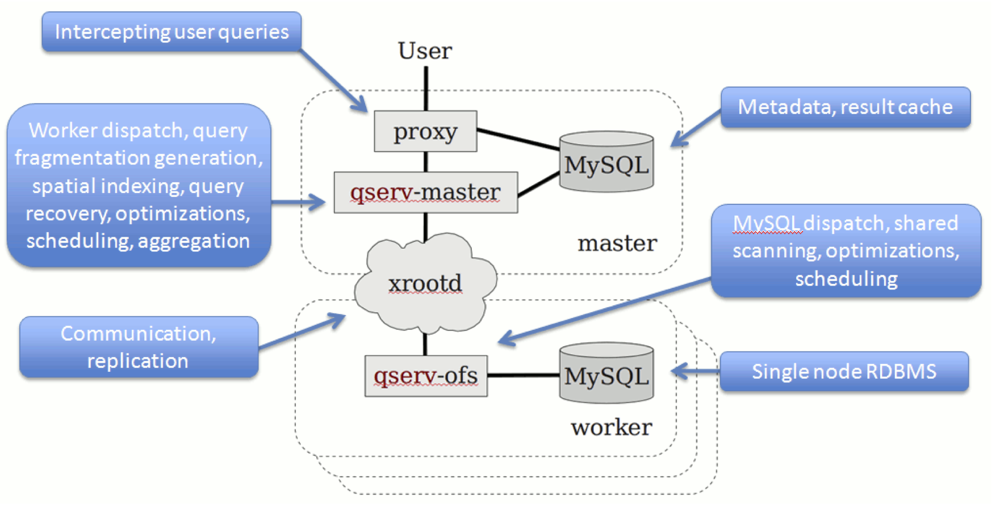

   XRootD.

.. _partitioning:

Partitioning
------------

In Qserv, large spatial tables are fragmented into spatial pieces in the
two-level partitioning scheme. The partitioning space is a spherical
space defined by two angles φ (right ascension/α) and θ (declination/δ).
For example, the Object table is fragmented spatially, using a
coordinate pair specified in two columns--right-ascension and
declination. On worker nodes, these fragments are represented as tables
named *Object\_CC* and *Object\_CC\_SS* where *CC* is the “chunk id”
(first-level fragment) and *SS* is the “sub-chunk id” (second-level
fragment of the first larger fragment. Sub-chunk tables are built
on-the-fly to optimize performance of spatial join queries. Large tables
are partitioned on the same spatial boundaries where possible to enable
joining between them.

.. _query-generation:

Query Generation
----------------

Qserv is unusual (though not unique) in processing a user query into one
or more queries that are subsequently executed on off-the-shelf
single-node RDBMS software. This is done in the hopes of providing a
distributed parallel query service while avoiding a full
re-implementation of common database features. However, we have found
that it is necessary to implement a query processing framework much like
one found in a more standard database, with the exception that the
resulting query plans contain SQL statements as the intermediate
language.

A significant amount of query analysis not unlike a database query
optimizer is required in order to generate a distributed execution plan
that accurately and efficiently executes user queries. Incoming user
queries are first parsed into an intermediate representation using a
modified SQL92-compliant grammar (Lubos Vnuk's SqlSQL2). The resulting
query representation is equivalent to the original user query, and does
not include any stateful interpretation, but may not completely reflect
the original syntax. The purpose of this representation is to provide a
semantic representation that may be operated upon by query analysis and
transformation modules without the complexity of a parse tree containing
every node in the original EBNF grammar.

Once the representation has been created, the query representation is
processed by two sequences of modules. The first sequence operates on
the query as a single statement. A transformation step occurs to split
the single representation into a "plan" involving multiple phases of
execution, one to be executed per-data-chunk, and a one to be executed
to combine the distributed results into final user results. The second
sequence is applied on this plan to apply the necessary transformations
for an accurate result.

We have found that regular expressions and parse element handlers to be
insufficient to analyze and manipulate queries for anything beyond the
most basic query syntax constructions.

.. _processing-modules:

Processing modules
~~~~~~~~~~~~~~~~~~

The processing modules perform most of the work in transforming the user
query into statements that can produce a faithful result from a Qserv
cluster. These include:

- Identify spatial indexing opportunities. This allows Qserv to dispatch
  spatially-restricted queries on only a subset of the available chunks
  constituting a table. Spatial restrictions given in Qserv-specific
  syntax are rewritten as boolean SQL clauses.

- Identify secondary index opportunities. Qserv databases designate one
  column (more are under consideration) as a key column where its values
  are guaranteed to exist in one spatial location.  Identification
  allows Qserv to convert point queries on this column into spatial
  restrictions.

- Identify table joins and generate syntax to perform distributed join
  results. Qserv primarily supports "near-neighbor" spatial joins for
  limited distances defined in the partitioning coordinate space.
  Arbitrary joins between distributed tables are only supported using
  the key column. Classify queries according to data coverage and table
  scanning. By identifying tables scanned in a query, Qserv is able to
  mark queries for execution using shared scanning, which greatly
  increases efficiency.

.. _processing-module-overview:

Processing module overview
~~~~~~~~~~~~~~~~~~~~~~~~~~

.. _fig-processing-modules:

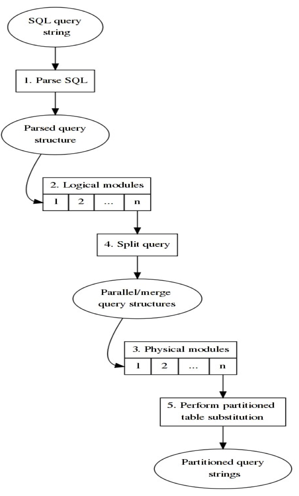

   Processing modules.

This figure illustrates the query preparation pipeline that generates
physical queries from an input query string. User query strings are
parsed (1) into a structured query representation that is passed through
a sequence of processing modules (2) that operate on that representation
in-place. Then, it is broken up (3) into pieces that are explicitly
intended for parallel execution on table partitions and pieces intended
to merge parallel results into user results. Another processing sequence
(4) operates on this new representation, and then finally, concrete
query strings are generated (5) for execution.

The two sequences of processing modules provide an extensible means to
implement query analysis and manipulation. Earlier prototypes performed
analysis and manipulation during parsing, but this led to a practically
unmaintainable code base and the functionality has been ported the
processing module model. Processing is split into two sequences to
provide the flexibility to modules that manipulate the physical
structures while offering the simpler single-query representation to
modules that do not require the complexity. The clear separation between
parsing, whose only goal is to provide a intelligible and modifiable
query representation, and the qserv-specific analysis and manipulation
is a key factor in the overall flexibility, maintainability, and
extensibility of the system and should help the system adapt to current
and future LSST needs.

.. _dispatch:

Dispatch
--------

The baseline Qserv uses `XRootD`_ as a distributed, highly-available
communications system to allow Qserv frontends to communicate with data
workers. Current versions of Qserv use a synchronous client API with
named files as communication channels, but the baseline system will
utilize a more general two-way named-channeling system which eliminates
explicit file abstractions in favor of generalized protocol messages
that can be flexibly streamed.

.. _wire-protocol:

Wire protocol
~~~~~~~~~~~~~

Qserv encodes query dispatches in ProtoBuf messages, which contain SQL
statements to be executed by the worker and annotations that describe
query dependencies and characteristics. Transmitting query
characteristics allows Qserv workers to optimize query execution under
changing CPU and disk loads as well as memory considerations. The worker
need not re-analyze the query to discover these characteristics or guess
at conditions that cannot be determined by query inspection.

Query results are also returned by ProtoBuf messages. Current versions
transmit a MySQL dump file allowing the query results to be faithfully
reproduced on the Qserv frontend, but the baseline system will transmit
results directly. Initial implementations avoided logic to encode and
decode data values, but experience with the prototype MonetDB worker
backend proved that data encoding and marshalling were a contained
problems whose solution could significantly improve overall query
latency by avoiding mutating metadata operations on worker and frontend
DBMS systems. Thus the baseline system will encode results in protobuf
messages containing schema and row-by-row encoded data values. Streaming
results directly from worker dbms instances into frontend dbms instances
is a technique under consideration, as is a custom aggregation engine
for results that would likely ease the implementation of providing
partial query results to end users.

.. _frontend:

Frontend
~~~~~~~~

In 2012, a new `XRootD`_ client API was developed to address our concerns
over the older version's scalability (uncovered during a 150 node, 30TB
scalability test). The new client API began production use for the
broader `XRootD`_ community in late 2012. Subsequently, work began under
our guidance towards an `XRootD`_ client API that was based on
request-response interaction over named channels, instead of opening,
reading, and writing files. Qserv will begin porting to this API in late
2013, and in the process should eliminate a significant body of code
that maps dispatching and result-retrieving to file operations. The
equivalent logic will reside in the Xroot code base, where it may be
exercised by other projects.

The new API (XrdSci) provides Qserv with a fully asynchronous interface
that eliminates nearly all blocking threads used by the Qserv frontend
to communicate with its workers. This should eliminate one class of
problems we have encountered during large-scale testing. The new API has
defined interfaces that should integrate smoothly with the
Protobufs-encoded messages used by Qserv. One novel feature will be a
streaming response interface that enables reduced buffering in
transmitting query results from a worker mysqld to a the frontend, which
should enable lower end-to-end query latency and lower storage
requirements on workers.

The fully asynchronous API is crucial on the master because of the large
number of concurrent chunk queries in flight expected in normal
operation. For example, with the sky split into 10k pieces, having 10
full-scanning queries running concurrently would have 100k concurrent
chunk queries--too large a number of threads to allow on a single
machine. Hence an asynchronous API to `XRootD`_ is crucial. Threads are
used to parallelize multiple CPU-bound tasks. While it does not seem to
be important to parse/analyze/manipulate a single user query in parallel
(and such a task would be a research topic), the retrieval and
processing of results could be done in parallel if some portion of the
aggregation/merging were done in Qserv code rather than loaded into the
frontend's MySQL instance and merged via SQL queries. Thus results
processing should be parallelized among results from individual chunks,
and query parsing/analysis/manipulation can be parallelized among
independent user queries.

.. _worker:

Worker
~~~~~~

The Qserv worker uses both threads and asynchronous calls to provide
concurrency and parallelism. To service incoming requests from the
`XRootD`_ API, an asynchronous API is used to receive requests and enqueue
them for action. Threads are maintained in a thread pool to perform
incoming queries and wait on calls into the DBMS's API (currently, the
MySQL C-API, which does not seem to have an asynchronous API). Threads
will be allowed to run in observance of the amount of parallel resources
available. The worker estimates the I/O dependency of each incoming
chunk query in terms of the chunk tables involved and disk resources
involved, and attempts to ensure that disk access is almost completely
sequential. Thus if there are many queries that access the same table
chunk, the worker allows as many of them to run as there are CPU cores
in the system, but if it has many queries that involve different chunk
tables, it allows fewer simultaneous chunk queries in order to ensure
that only one table scan per disk spindle occurs. Further discussion of
this "shared scanning" feature is described in :ref:`shared-scans`.

.. _threading-model:

Threading Model
---------------

Nearly every portion of Qserv is written using a combination of threaded
and asynchronous execution.

Qserv heavily relies on multi-threading to take advantage of all
available CPU cores when executing queries, as an example, to complete
one full table scan on a table consisting of 1,000 chunks, 1,000 queries
(processes) will be executed. To efficiently handle large number of
processes that are executed on each worker, we ended up rewriting the
`XRootD`_ client and switching from thread-per-request model to a
thread-pool model. The new client is completely asynchronous, with real
call-backs.

+--------------------------+-------------------------------------------------+
| mysqlproxy               | Single-threaded Lua code                        |
+--------------------------+-------------------------------------------------+
| Frontend-python          | Single-threaded asynchronous reactor;           |
|                          | blocking-thread per user query                  |
+--------------------------+-------------------------------------------------+
| Frontend-C++             | Processing thread per user-query for            |
|                          | preparation; Results-merging                    |
|                          | thread-per-user-query on-demand;                |
+--------------------------+-------------------------------------------------+
| Frontend-xrootd          | Callback threads perform query transmission and |
|                          | results retrieval                               |
+--------------------------+-------------------------------------------------+
| Frontend-xrootd internal | Threads for maintaining worker connections      |
|                          | (< 1 per host)                                  |
+--------------------------+-------------------------------------------------+
| Xrootd, cmsd             | Small thread pools for managing live network    |
|                          | connections and performing lookups              |
+--------------------------+-------------------------------------------------+
| Worker-xrootd plugin     | Small thread pool O(#cores) to make blocking    |
|                          | mysql C-API calls into                          |
|                          | local mysqld; callback threads from `XRootD`_   |
|                          | perform admission/scheduling of tasks from      |
|                          | frontend and transmission of results            |
+--------------------------+-------------------------------------------------+

.. _aggregation:

Aggregation
-----------

Qserv supports several SQL aggregation functions: AVG(), COUNT(), MAX(),
MIN(), and SUM(), and should support SQL92 level GROUP BY.

.. _indexing:

Indexing
--------

The secondary index utilizes one or more tables using the InnoDB storage
engine on each czar to perform lookups on the database's key colume
(objectId).  Performance tests (Figure fig-indexing_tests_) on a single,
dual-core host with 1 TB hard disk storage (not SSD) have shown that this
configuration will support a full load of 40 billion rows in about 400,000
seconds (110 hours).  A more realistic configuration with multiple cores and
SSD storage is expected to meet the requirement of fully loading in less
than 48 hours.

.. _fig-indexing_tests:

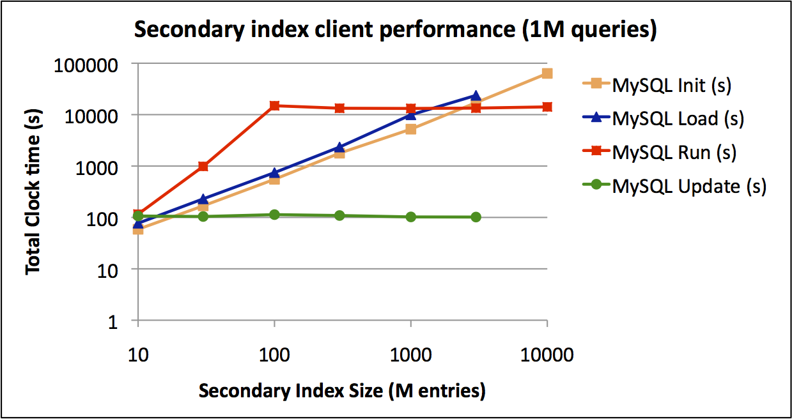

   Performance tests of MySQL-based secondary index.

To improve the performance of the InnoDB storage engine for queries, the
secondary index may be split across a small number (dozens) of tables, each
containing a contiguous range of keys.  This splitting, if done, will be
independent of the partitioning of the database itself.  The contiguity of
key ranges will allow the secondary index service to identify the
appropriate split table arithmetically via an in-memory lookup.

.. _index-structure:

Secondary Index Structure
~~~~~~~~~~~~~~~~~~~~~~~~~

The secondary index consists of three columns: the key (objectId), the
chunk where all data with that key are located (chunkId), and the subchunk
within that chunk where data with the key are located (subChunkId).  The
objectId is assigned by the science pipelines as a 64-bit integer value; the
chunkId and subChunkId are both 16-bit integers which identify spatial
regions on the sky.

.. _index-loading:

Secondary Index Loading
~~~~~~~~~~~~~~~~~~~~~~~

The InnoDB storage engine loads tables most efficiently if it is provided
input data which has been presorted according to the table's primary key.
When the secondary index information is collected for loading (from each
worker node handling a collection of chunks), it is sorted by objectId, and
may be divided into roughly equal "splits".  Each of those splits is loaded
into a table *en masse*.

.. The paragraph below is not as "directive" as the rest of the document.
   Is it reasonable to keep?

To fully optimize the loading and table splitting, the entire index should
be collected from all workers and pre-sorted in memory on the czar.  This is
not reasonable for 40 billion entries (requiring a minimum of 480 GB memory,
plus overhead).  Instead, the index data from a single worker can be assumed
to be a "representative sample" from the full range of objectIds, so table
splitting can be done using the first worker's index data.  The remaining
workers will be split and loaded according to those defined tables.

.. If we keep the paragraph above, we need to run some performance tests to
   verify that the workers really will carry "random" subsets of the full
   dataset.

.. _data-distribution:

Data Distribution
-----------------

LSST will maintain the released data store both on tape media and on a
database cluster. The tape archive is used for long-term archival. Three
copies of the compressed catalog data will be kept. The database cluster
will maintain 3 online copies of the data. Because computer clusters of
reasonable size failure regularly, the cluster must maintain replicas in
order to provide continuous data access. A replication factor of 3 (r=3)
is needed in order to determine data integrity by majority rule when one
replica is corrupt.

If periodic unplanned downtime is acceptable, an on-tape replica may
function as one of the three. However, the use of tape dramatically
increases the cost of recovering from a failure. This may be acceptable
for some tables, particularly those that are large and lesser-used,
although allowing service disruption may make it difficult to make
progress on long-running analysis on those large tables.

.. _db-data-distribution:

Database data distribution
~~~~~~~~~~~~~~~~~~~~~~~~~~

The baseline database system will provide access for two database
releases: latest and previous . Data for each release will be spread out
among all nodes in the cluster.

Data releases are partitioned spatially, and spatial pieces (chunks) are
distributed in a round-robin fashion across all nodes. This means that
area queries involving multiple chunks are almost guaranteed to involve
resources on multiple nodes.

Each node should maintain at least 20% free space of its data storage
allocation. The remaining free space is then available to be "borrowed"
when another node fails. This will a temporary use of storage capacity
until more server resources can be put online, until the 80% storage use
is returned.

.. _failure-integrity-maintenance:

Failure and integrity maintenance
~~~~~~~~~~~~~~~~~~~~~~~~~~~~~~~~~

There will be failures in any large cluster of node, in the nodes
themselves, in data storage volumes, in networks access and so on. These
failures will remove access to data that is resident on those nodes, but
this loss of data access should not affect that ability of scientists to
analyze the dataset as a whole. We need to set a data availability time
over 99.5% to ensure confidence of the community in the stability of the
system. To ensure this level of data access, and to allow acceptable
levels of node failures in a cluster, there will be replication of data
on a table level throughout the cluster.

The replication level will be that each table in the database will exist
3 times, each on separate nodes. A monitoring layer to the system will
check on the availability of each table every few hours, although this
time will be tuned in practice. When this layer sees that a table has
less than three replicas available, this will initiate a replication of
that table to another nodes, not currently hosting that table. The times
for the checking, and speed of replication will be tuned to the
stability of the cluster, such that about 5% of all tables at any given
time will only have 1 or 2 replicas. Three replicas will ensure that
tables will be available even in cases of large failures, or when nodes
need to be migrated to new hardware in bulk.

Should an entire node fail, replicating that data to another single node
would be fairly expensive in terms of time. As of July 2013, a 3TB drive
will have a write speed of 60/150/100 MB/s (min/max/avg),
[http://www.legitreviews.com/article/2092/3/] and refilling this single
drive would remove access to that replica of the data for about 8 hours.
We plan on having free space on each node, and only fill local storage
to 80%. The free space will be used for temporary storage of tables on
failures, where replicas can take place in parallel between nodes into
this free space. When new nodes with free storage are added to the
cluster, then this data can be copied off this free space into the
drive, taking the full 8 hours, but there will still be 3 replicas of
data during this time. Once this is complete, this data will have 4
replicas for the short period of time while these tables can be removed
from the temporary storage, returning each node to 80% usage.

.. _metadata:

Metadata
--------

Qserv needs to track various metadata information, static (not changing
or changing very infrequently), and dynamic (run-time) in order to
maintain schema and data integrity and optimize the cluster usage.

.. _static-metadata:

Static metadata
~~~~~~~~~~~~~~~

Qserv typically works with databases and tables distributed across many
different machines: it breaks individual large tables into smaller
chunks and distributes them across many nodes. All chunks that belong to
the same logical table must have the same schema and partitioning
parameters. Different tables often need to be partitioned differently,
for example some tables might be partitioned with overlap (such as the
Object table), some might be partitioned with no overlap (for example
the Source table), and some might not need partitioning at all (e.g., a
tiny Filter table). Further, there might be different partitioning
strategies, such as spherical-box based, or HTM-based. All this
information about schema and partitioning for all Qserv-managed
databases and tables needs to be tracked and kept consistent across the
entire Qserv cluster.

Implementation of the static metadata in Qserv is based on hierarchical
key-value storage which uses a regular MySQL database as a storage backend.
This database is shared between multiple masters and it must be served by a
fault-taulerant MySQL server instance, e.g. using a master-master replication
solution like MariaDB Galera cluster. Database consistency is critical for
metadata and it should be implemented using one of the transactional
database engines in MySQL.

Static metadata may contain following information:

- Per-database and per-table partitioning and scan scheduling parameters.

- Table schema for each table, used to create database tables in all
  worker and master instances; the schema in the master MySQL instance can
  be used to obtain the same information when a table is already created.

- Database and table state information, used primarily by the process of
  database and table creation or deletion.

- Definitions for the set of worker and master nodes in a cluster
  including their availability status.

The main clients of the static metadata are:

- Administration tools (command-line utilities and modules) which allow
  one to define or modify metadata structures.

- Qserv master(s), mostly querying partitioning parameters but also allowed
  to modify table/database status when deleting/creating new tables and
  databases. Master(s) should not depend on node definitions in metadata,
  the xrootd facility is used to communicate with workers.

- Special "watcher" service which implements distributed process of
  database and table management.

- An initial implementation of the data loading application which will use
  the node definitions and will create/update database and table definitions.
  This initial implementation will eventually be replaced by a distributed
  loading mechanism which may be based on separate mechanisms.

.. _dynamic-metadata:

Dynamic metadata
~~~~~~~~~~~~~~~~

In addition to static metadata, a Qserv cluster also needs to track its
current state, and keep various statistics about query execution. This sort
of data is udated frequently, several times per query execution, and is
called dynamic metadata.

Prototype implementation of the dynamic metadata is based on MySQL database.
Like static metadata it needs to be shared between all master instances and
will be served via a single fault-talerant MySQL instance which will be
shared with static metadata database.

Dynamic metadata will contain the following information:

- Definition of every master instance in a Qserv cluster.

- Record of every SELECT-type query processed by cluster. This record
  includes query processing state and some statistical/timing information.

- Per-query list of table names used by the asynchronous queries, this
  information is used to delay table deletion while async queries are in
  progress.

- Per-query worker information, which includes chunk ID and identifying
  information for the worker processing that chunk ID. This information will
  be used to transparently restart the master or migrate query processing to
  a different master in case of master failure.

The most significant use of the dynamic metadata is to track execution of
asyncronous queries. When an async query is submitted it is registered in
dynamic metadata and its ID is returned to the user immediately. Later users
can request status information for that query ID which is obtained from
dynamic metadata. When query processing is finished users can request results
from that query, and the master can obtain the location of the result data
from dynamic metadata.

Additionally dynamic metadata can be used to collect statistical information
about queries that were executed in the past which may be an important tool
in understanding and improving system performance.

.. _architecture:

Architecture
~~~~~~~~~~~~

The Qserv metadata system is implemented based on master/server
architecture: the metadata is centrally managed by a *Qserv Metadata
Server* (qms). The information kept on each worker is kept to a bare
minimum: each worker only knows which databases it is supposed to
handle, all remaining information can be fetched from the qms (through
Qserv) as needed. This follows our philosophy of keeping the workers as
simple as possible.

The real-time metadata is managed inside qms in in-memory tables,
periodically synchronized with disk-based table. Such configuration
allows reducing qms latency—important to avoid delaying query execution
time. Should a qms failure occur, the in-flight queries for which the
information was lost will be restarted. Since the synchronization to
disk-based table will occur relatively frequently (eg. at least 1 per
minute), the lost time is insignificant. To avoid overloading the qms
with, only the high-level information available from Qserv-master is
stored in qms; all worker-based information is cached in a scratch space
locally to each worker in a simple, raw form (e.g, key-value, ASCII
file), and can be fetched on demand as needed.

At the moment we use xml-rpc as a message protocol to communicate with
qms. It was a natural choice given that this protocol is already in use
by Qserv master.

Typical Data Flow
~~~~~~~~~~~~~~~~~

Static metadata:

1. Parts of the static metadata known before data is partitioned/loaded
   are loaded by the administration scripts responsible for loading data
   into the database, then these scripts start data partitioner.

2. The data partitioner reads static metadata loaded by the
   administration scripts, loads remaining information.

3. When Qserv starts, it fetches all static metadata and caches it in
   memory in a special, in-memory optimized C++ structure.

4. The contents of the in-memory metadata cache inside Qserv can be
   refreshed on demand if the static metadata changes (for example, when
   a new database or a table is added).

Dynamic-metadata:

1. Master loads the information for each query (when it starts, when it
   completes).

2. Detailed statistics are dumped by each worker into a scratch space
   kept locally. This information can be requested from each worker on
   demand. A typical use case: if all chunk-queries except one
   completed, qms would fetch statistics for the still-running
   chunk-query to estimate when the query might finish, whether to
   restart this query etc.

.. _shared-scans:

Shared Scans
------------

Arbitrary full-table scanning queries must be supported in LSST's
baseline catalog, and in order to provide this support cost-effectively
and efficiently, Qserv implements shared scans. Shared scans effectively
reduces the I/O cost of executing multiple scanning queries
concurrently, reducing the system hardware need and purchasing costs.

Shared scans reduce overall I/O costs by forcing incoming queries to
share. When multiple queries scan the same table, theoretically, they
can completely share I/O and incur only the I/O cost of a single query
rather than the sum of their individual costs. In general, it is
difficult for queries to share I/O because their arrival times are
random and uncorrelated. Each query begins scanning at different times,
and because LSST's catalog tables will be so large, general system
caching is ineffective. In Qserv, scanning queries are broken up into
many parts, and shared scanning forces each query to operate on the same
portion and thus share I/O cost, rather than allowing each to perform
its own ordered scan and incur costs individually.

.. _shared-scan-background:

Background
~~~~~~~~~~

Historically, shared scanning has been a research topic that has very
few real-world implementations. We know of only one implementation in
use (Teradata). Most database implementations assume OS or database
caching is sufficient, encouraging heavy use of indexing to reduce the
need of table scans. However, our experiments have shown that when
tables are large enough (by row count) and column access sufficiently
variable (cannot index enough columns when there are hundreds to choose
from), indexes are insufficient. With large tables, indexes no longer
fit in memory, and even when they do fit in memory, the seek cost to
retrieve each row is dominant when the index selects a percentage of
rows, rather than some finite number (thousands or less).

.. _shared-scan-implementation:

Implementation
~~~~~~~~~~~~~~

The implementation of shared scans in Qserv is two parts. The first
part is a basic classification of incoming queries as scanning queries
or non-scanning queries. A query is considered to scan a table
if it depends on non-indexed column values and involves more than *k*
chunks (where *k* is a tunable constant). Note that involving multiple
chunks implies that the query selects from at least one partitioned
table. This classification is performed during query analysis on the
front-end and leveraging table metadata. The metadata includes a
“scan rating”, which is set by hand. Higher scan ratings indicate larger
tables that take longer to read from disk. The identified “scan tables”
and their ratings are marked and passed along to Qserv workers, which
use the information in scheduling the fragments of these scanning queries.

The second part of the shared scans implementation is a scheduling
algorithm that orders query fragment execution to optimize cache
effectiveness. Because Qserv relies on individual off-the-shelf DBMS
instances on worker nodes, it is not allowed to modify those instances
to implement shared scans.  Instead, it issues query fragments ordered to
maximize locality of access in data and time, and tries to lock the files
associated with the tables in memory as much as possible. Using the
identified scan tables and their ratings, the worker places them on the
appropriate scheduler. There will be at least three schedulers. One for
queries expected to be complete in under an hour, which are expected to
be related to the Object table. One for queries expected to take less than
eight hours, expected to be related to Object_Extra. And one for scans
expected to take twelve hours for ForcedSource and/or Source tables. The
reasoning being that a single slow query can impede the progress of a
shared scan and all the other user queries on that scan. There may be a
need for another scheduler to handle queries taking more than 12 hours.

Each scheduler places incoming chunk queries into one of two priority
queues sorted by chunk id then scan rating of the individual tables. If
the query is for a chunk after the currently scanning chunk id, it is
placed on the active priority queue, otherwise it is placed on the pending
priority queue. After chunk id, the priority queue is sorted by the table
with highest scan rating to ensure that the largest tables in the chunk
are grouped together.

The once the query is on the appropriate scheduler, the algorithm proceeds
as follows. When a dispatch slot is available, it checks the highest
priority scheduler. If that scheduler has a query fragments, hereafter
called tasks, and it is not at its quota limit, it is allowed to start its
next task, otherwise the worker checks the next scheduler. It continues
doing this until a task has been started or all the schedulers have been
checked.

Each scheduler is only allowed to start a task under certain circumstances.
There must be enough threads available from the pool so that none of the
other schedulers are starved for threads as well as enough memory available
to lock all the tables for the task in memory. If the scheduler has no tasks
running, it may start one task and have memory reserved for the tables in
that task. This should prevent any scheduler from hanging due to memory
starvation without requiring complicated logic but could incur extra
disk I/O. More on locking tables in memory later.

Schedulers check for tasks by first checking the head of the active
priority queue. If the active priority queue is empty, and the pending
priority queue is not, then the active and pending queues are swapped
with the task being taken from the top of the “new” active queue.

Since the queries are being run by a separate DBMS instance of which there
is little control of how it goes about running queries. The worker can
control when queries are sent to the DBMS and it can also lock files in
memory. Files in memory are among the most likely items to be paged out
when memory resources are low, which would increase disk I/O. Locking files
in memory prevents this from happening. However, care must taken in choosing
how much memory can used for locking files. Use too much and there will be a
significant impact on DBMS performance. Set aside too little, and schedulers
will not make optimum use of the resources available and may be forced to
run tasks without actually locking the files in memory.

The memory manager controls which files are locked in memory. When a
scheduler tries to run a task, the task asks the memory manager to lock all
the shared scan tables it needs. The memory manager determines which files
are associated with the tables. If the files are already locked in memory
and there is enough memory available to lock the files which are not
already locked, the task is given a handle and allowed to run. When the
task completes, it hands the handle back to the memory manager. If it was
the last task using any particular table, the memory for the files used by
that table is freed.

When the memory manager locks a file, it does not read the file. It only
sets aside memory for the file to occupy when it is read by the DBMS. In
the special case where a task can run even though there is not enough memory
available, those tables that can not fit are put on a list of reserved
tables and there size is subtracted from the quota until they can be
locked or freed. When memory is freed, the memory manager will try to
lock the reserved tables.

Because Qserv processes interactive, short queries concurrently with
scanning queries, its query scheduler should be able to allow for those
queries to complete without waiting for a query scan. To achieve this,
Qserv worker nodes choose between the scan scheduler described above and
a simpler *grouping* scheduler. Incoming queries with identified scan
tables are admitted to the scan scheduler, and all other queries are
admitted to the grouping scheduler. The grouping scheduler is a simple
scheduler that is a simple variant of a plain FIFO (first-in-first-out)
scheduler. Like a FIFO scheduler, it maintains a queue of queries to
execute, and operates identically to a FIFO scheduler with one
exception--queries are grouped by chunk id. Each incoming query is
inserted into the queue behind another query on the same chunk, and at
the back if no queued query matches. The grouping scheduler assumes that
the queue will never get very long, because it is intended to only
handle short interactive queries lasting fractions of seconds, but
groups its queue according to chunk id in order to provide a minimal
amount of access locality to improve throughput at a limited cost to
latency. Some longer queries will be admitted to the grouping scheduler
even though they are scanning queries, provided that they have been
determined to only scan a single chunk. Although these non-shared scan
query will disrupt performance of the overall scan on the particular
disk on a worker, the impact is thought to be small because each of
these represents all (or a large fraction of) the work for a single user
query, and the impact is amortized among all disks on all workers.

For discussion about the performance of the existing prototype, refer to
:ref:`demo-shared-scans`.

.. _shared-scan-multiple-tables:

Multiple tables support
~~~~~~~~~~~~~~~~~~~~~~~

Handling multiple tables in shared scans requires an additional level of
management. The scheduler will aim to satisfy a throughput yielding
average scan latencies as follows:

- ``Object`` queries: 1 hour

- ``Object``, ``Source`` queries (join): 12 hours

- ``Object``, ``ForcedSource`` queries (join): 12 hours

- ``Object_Extras`` [#]_ queries (join): 8 hours.

As stated in 8.10.2, there will schedulers for queries that are expected to
take one hour, eight hours, or twelve hours and the schedulers group the
the tasks by chunk id and then the highest scan rating of the all tables in
the task. The scan ratings are meant to be unique per table and indicative
of the size of the table, so that this sorting places scans using the
largest table from the same chunk next to each other in the queue. Using
scan rating allows flexibility to work with data sets with schemas different
than that of LSST.

Since scan are not limited to specific tables, and it is impossible to
predict how long an individual query will take, a separate scan for queries
that could take more than twelve hours may be needed. The worker may need
to be able to identify user queries too slow for the current scheduler and
move them to a different scheduler based on the time it takes to complete
tasks for that user query.

.. [#] This includes all ``Object``-related tables, e.g.,
   ``Object_Extra``, ``Object_Periodic``, ``Object_NonPeriodic``,
   ``Object_APMean``

.. _l3:

Level 3: User Tables, External Data
-----------------------------------

Level 3 tables including tables generated by users, and data catalogs
brought from outside, depending on their type and size, will be either
partitioned and distributed across the production database servers, or
kept unpartitioned in one central location. While the partitioned and
distributed Level 3 data will share the nodes with Level 2 data, it will
be kept on dedicated disks, independent from the disks serving Level 2
data. This will simplify maintenance and recoverability from failures.

Level 3 tables will be tracked and managed through the Qserv Metadata
System (qms), described in the *Metadata* chapter above. This includes
both the static, as well as the dynamic metadata.

.. _cluster-task-management:

Cluster and Task Management
---------------------------

Qserv delegates management of cluster nodes to `XRootD`_. The `XRootD`_ system
manages cluster membership, node registration/de-registration, address
lookup, replication, and communication. Its distributed filesystem API
provides data-addressed communication channels to the rest of Qserv,
hiding details like node count, the mapping of data to nodes, the
existence of replicas, and node failure. The Qserv manager focuses on
dispatching queries to endpoints and Qserv workers focus on receiving
and executing queries on their local data.

Cluster management performed outside of `XRootD`_ does not directly affect
query execution, but include coordinating data distribution, loading,
nodes joining/leaving and is discussed in :ref:`qserve-admin`.

.. _fault-tolerance:

Fault Tolerance
---------------

Qserv approaches fault tolerance in several ways. The design exploits
the immutability of the underlying data by replicating and distributing
data chunks across a cluster such that in the event of a node failure,
the problem can be isolated and all subsequent queries re-routed to
nodes maintaining duplicate data. Moreover, this architecture is
fundamental to Qserv's incremental scalability and parallel performance.
Within individual nodes, Qserv is highly modularized with minimal
interdependence among its components, which are connected via narrow
interfaces. Finally, individual components contain specialized logic for
minimizing, handling, and recovering from errors.

The components that comprise Qserv include features that independently
provide failure-prevention and failure-recovery capabilities. The MySQL
proxy is designed to balance its load among several underlying MySQL
servers and provide automatic fail-over in the event a server fails. The
`XRootD`_ distributed file system provides multiple managers and highly
redundant servers to provide high bandwidth, contend with high request
rates, and cope with unreliable hardware. And the Qserv master itself
contains logic that works in conjunction with `XRootD`_ to isolate and
recover from worker-level failures.

A worker-level failure denotes any failure mode that can be confined to
one or more worker nodes. In principle, all such failures are
recoverable given the problem nodes are identified and alternative nodes
containing duplicate data are available. Examples of such failures
include a disk failure, a worker process or machine crashing, or network
problems that render a worker unreachable.

Consider the event of a disk failure. Qserv's worker logic is not
equipped to manage such a failure on localized regions of disk and would
behave as if a software fault had occurred. The worker process would
therefore crash and all chunk queries belonging to that worker would be
lost. The in-flight queries on its local mysqld would be cleaned up and
have resources freed. The Qserv master's requests to retrieve these
chunk queries via `XRootD`_ would then return an error code. The master
responds by re-initializing the chunk queries and re-submits them to
`XRootD`_. Ideally, duplicate data associated with the chunk queries exists
on other nodes. In this case, `XRootD`_ silently re-routes the request(s)
to the surviving node(s) and all associated queries are completed as
usual. In the event that duplicate data does not exist for one or more
chunk queries, `XRootD`_ would again return an error code. The master will
re-initialize and re-submit a chunk query a fixed number of times
(determined by a parameter within Qserv) before giving up, logging
information about the failure, and returning an error message to the
user in response to the associated query.

Error handling in the event that an arbitrary hardware or software bug
(perhaps within the Qserv worker itself) causes a worker process or
machine to crash proceeds in the same manner described above. The same
is true in the event that network loss or transient
sluggishness/overload has the limited effect of preventing `XRootD`_ from
communicating with one or more worker nodes. As long as such failures
are limited to a finite number of workers and do not extend to the Qserv
master node, `XRootD`_ is designed to record the failure and return an
error code. Moreover, if duplicate data exists on other nodes, this will
be registered within `XRootD`_, which will successfully route any
subsequent chunk queries.

In the event of an unrecoverable error, the Qserv master is equipped
with a status/error messaging mechanism designed to both log detailed
information about the failure and to return a human-readable error
message to the user. This mechanism includes C++ exception handling
logic that encapsulates all of the master's interactions with `XRootD`_. If
an unrecoverable exception occurs, the master gracefully terminates the
query, frees associated resources, logs the event, and notifies the
user. Qserv's internal status/error messaging system also generates a
status message and timestamp each time an individual chunk query
achieves a milestone. Such milestones include: chunk query dispatch,
written to `XRootD`_, results read from `XRootD`_, results merged, and query
finalized. This real-time status information provides useful context in
the event of an unrecoverable error.

Building upon the existing fault-tolerance and error handling features
described above, future work includes introducing a heart-beat mechanism
on worker nodes that periodically pings the worker process and will
restart it in the event it becomes unresponsive. Similarly, a master
monitoring process could periodically ping worker nodes and restart a
worker machine if necessary. We are also considering managing failure at
a per-disk level, but this would require research since
application-level treatment of disk failure is relatively rare. It
should also be possible to develop an interface for checking the
real-time status of queries currently being processed by Qserv by
leveraging its internally used status/error messaging mechanism.

.. _next-to-db-processing:

Next-to-database Processing
---------------------------

We expect some data analyses will be very difficult, or even impossible
to express through SQL language. This might be particularly useful for
time-series analysis. For this type of analyses, we will allow users to
execute their analysis algorithms in a procedural language, such as
Python. To do that, we will allow users to run their own code on their
own hardware resources co-located with production database servers.
Users then run queries on the production database which stream rows
directly from database cluster nodes to the user processing cluster,
where arbitrary code may run without endangering the production
database. This allows their incurred database I/O needs to be satisfied
using the database system's shared scanning infrastructure while
providing the full flexibility of running arbitrary code.

.. _qserve-admin:

Administration
--------------

.. _qserve-install:

Installation
~~~~~~~~~~~~

Qserv as a service requires a number of components that all need to be
running, and configured together. On the master node we require mysqld,
mysql-proxy, `XRootD`_, cmsd, qserv metadata service, and the qserv master
process. On each of the worker nodes there will also be the mysqld,
cmsd, and `XRootD`_ service. These major components come from the MySQL,
`XRootD`_, and Qserv distributions. But to get these to work together we
will also require many more software package, such as protobuf, lua,
expat, libevent, python, zope, boost, java, antlr, and so on. And many
of these require more recent versions than you are provided in most
system distributions. We have an installation layer, developed by SLAC,
and LPC in Clermont-Ferrand, France in collaboration, which will
determine the packages, configure, compile and install them in an
automated process.

Currently, the Qserv installation procedure supports only the official
LSST platform—RHEL6, and SL6 Linux distributions. Other UNIX-like system
will be supported in the future as needed. The Qserv package first can
be downloaded from SLAC for install. In the initial README there are
basic install procedures, which start with a bootstrap script, that will
perform a yum install of needed packages distributed with RHEL6, where
the versions will support the Qserv install. Once that is done an
install script can be started. This will first download needed packages
not shipped with RHEL6 from SLAC, and get those installed first. All
software will be installed into a sandbox root path, and all installed
by the production username. Along with this is an install of MySQL from
source that will be configured for Qserv. These further packages will be
configured to run together, and then Qserv will be complied and linked
to these installed packages. All this runs without user interaction, and
usually completes within 15 to 20 minutes, to provide a complete Qserv
either master or worker node.

.. _qserve-data-loading:

Data loading
~~~~~~~~~~~~

As previously mentioned, Data Release Production will not write directly
to the database. Instead, the DRP pipelines will produce binary FITS
tables and image files that are reliably archived as they are produced.
Data will be loaded into Qserv in bulk for every table, so that tables
are either not available, or complete and immutable from the user query
access perspective.

For replicated tables, these FITS files are converted to CSV (e.g. by
harvesting FITS image header keyword value pairs, or by translating
binary tables to ASCII), and the resulting CSV files are loaded directly
into MySQL and indexed. For partitioned tables like Object and Source,
FITS tables are fed to the Qserv partitioner, which assigns partitions
based on sky coordinates and converts to CSV.

In particular, the partitioner divides the celestial sphere into
latitude angle "stripes" of fixed height H. For each stripe, a width W
is computed such that any two points in the stripe with longitudes
separated by at least W have angular separation of at least H. The
stripe is then broken into an integral number of chunks of width at
least W, so that each stripe contains a varying number of chunks (e.g.
polar stripes will contain just a single chunk). Chunk area varies by a
factor of about pi over the sphere. The same procedure is used to obtain
subchunks: each stripe is broken into a configurable number of
equal-height "substripes", and each substripe is broken into equal-width
subchunks. This scheme is preferred over the Hierarchical Triangular
Mesh for its speed (no trigonometry is required to locate the partition
of a point given in spherical coordinates), simplicity of
implementation, and the relatively fine control it offers over the area
of chunks and sub-chunks.

The boundaries of subchunks constructed as described are boxes in
longitude and latitude - the overlap region for a subchunk is defined as
the spherical box containing all points outside the subchunk but within
the overlap radius of its boundary.

The task of the partitioner is to find the IDs of the chunk and subchunk
containing the partitioning position of each row, and to store each row
in the output CSV file corresponding to its chunk. If the partitioning
parameters include overlap, then the row's partitioning position might
additionally fall inside the overlap regions of one or more subchunks.
In this case, a copy of the row is stored for each such subchunk (in
overlap CSV files).

Tables that are partitioned in Qserv must be partitioned identically
within a Qserv database. This means that chunk tables in a database
share identical partition boundaries and identical mappings of chunk ID
to spatial partition. In order to facilitate table joining, a single
table's columns are chosen to define the partitioning space and all
partitioned tables (within a related set of tables) are either
partitioned according that pair of columns, or not partitioned at all.
Our current plan chooses the Object table's ``ra_PS`` and ``decl_PS``
columns, meaning that rows in the Source and ForcedSource tables will be
partitioned according to the Objects they reference.

There is one exception: we allow for pre-computed spatial match tables.
As an example, such a table might provide a many-to-many relationship
between the LSST Object catalog and a reference catalog from another
survey, listing all pairs of LSST Objects and reference objects
separated by less than some fixed angle. The reference catalog cannot be
partitioned by associated Object, as more than one Object might be
matched to a reference object. Instead, the reference catalog must be
partitioned by reference object position. This means that a row in the
match table might refer to an Object and reference object assigned to
different chunks stored on different Qserv worker nodes.

We avoid this complication by again exploiting overlap. We mandate (and
verify at partitioning time) that no match pair is separated by more
than the overlap radius. When partitioning match tables, we store a copy
of each match in the chunk of both positions referenced by that match.
When joining Objects to reference objects via the match table then, we
are guaranteed to find all matches to Objects in chunk C by joining with
all match records in C and all reference objects in C or in the overlap
region of C.

All Qserv worker nodes will partition subsets of the pipeline output
files in parallel – we expect partitioning to achieve similar aggregate
I/O rates to those of full table scans for user query access, so that
partitioning should complete in a low factor (2-3x) of the table scan
time. Once it does, each Qserv worker will gather all output CSV files
for its chunks and load them into MySQL. The structure of the resulting
chunk tables is then optimized to maximize performance of user query
access (chunk tables will likely be sorted, and will certainly be
compressed), and appropriate indexes are built. Since chunks are sized
to fit in memory, all of these steps can be performed using an in-memory
file-system. I/O costs are incurred only when reading the CSV files
during the load and when copying finalized tables (i.e. .MYD/.MYI files)
to local disk.

The last phase of data loading is to replicate each chunk to one other
Qserv worker node. We will rely on table checksum verification rather
than a majority rule to determine whether a replica is corrupt or not.

The partitioner has been prototyped as a multi-threaded C++ program. It
uses an in-memory map-reduce implementation internally to scale across
cores, and can read blocks of one or more input CSV files in parallel.
It does not currently understand FITS table files. CSV file writes are
also parallelized - each output chunk is processed by a single reducer
thread and can be written to in parallel with no application level
locking. In preliminary testing, our partitioner was able to sustain
several hundred MB/s of both read and write bandwidth when processing a
CSV dump of the PT1.2 Source table.

We are investigating a pair of data loading optimizations. One is to
have pipeline processes either integrate the partitioning code or feed
data directly to the partitioner, rather than communicating via
persistent storage. The other is to write out tables in the native
database format (e.g. as .MYD files, ideally using the MySQL/MariaDB
server code to do so), allowing the CSV database loading step to be
bypassed.

.. _qserve-admin-scripts:

Administrative scripts
~~~~~~~~~~~~~~~~~~~~~~

The administration of the qserv cluster will require a set of scripts,
all run from the one master machine, to control the large set of
workers. The main admin script, qserv-admin, will supply the base needs,
with starting all processes needed for the service, in order, and taking
down all processes to stop the service. Also base monitoring of service
is supplied here, to report on processes that are running, and
responding to base queries, to check on MySQL or `XRootD`_ dying or locking
up. Also is supplied is the updating of the configuration definitions
from the master out to all workers, such that all machines need to have
the same configurations for the services.

The base data loading onto the nodes tends to be a slightly detailed
process, beyond the just the data preparation. Up to now, data
preparation produces text files in csv format, and then these will be
loaded into the MySQL layer as a MyISAM table. The schema for these
tables will need to have added to them the fields for chunk and subchunk
number needed for the Qserv service. The modification of the schema and
the control of the loading of the data, which can take hours, is done
with the qserv-load script. The loading of the data is also done without
index creation, and then that is done after the data loading. We are
also experimenting with the use of compressed read-only tables for the
data serving, and this is an option.

Another needed setup for the data service in qserv, is the creation of
the “emptyChunks” list. The data will be spatially partitioned into
“chunks”, as previously described, but the for the complete service, the
master process with need to know how many chunks exist in the data, and
which of these chunks contain no data. In queries which will involve a
complete table scan, which chunks to create query, or not, will need to
be known. Once the data is loaded, there is a another script which will
go out to nodes and see what chunks are there, and compile a list of all
possible chunks and which chunks do not contain data, or the
“emptyChunks” lists. This is loaded by the qserv master process at
startup.

.. _result-correctness:

Result Correctness
------------------

To verify Qserv does not introduce any unexpectedly alter results (e.g.,
does not show the same object twice or does not miss any objects on the
chunk boundaries), we developed an automated testbed, which allows us to
run pre-set queries on pre-set data sets both through plain MySQL and
through Qserv, and compare results.

.. _current_future:

Current Status and Future Plans
-------------------------------

As of now (June 2013) we have implemented a basic version of the system
end-to-end. Our prototype is capable of parsing a wide range of queries,
including queries executed by our QA system, “PipeQA”, rewriting them
into sub-queries, executing these sub-queries in parallel and returning
results to the user. The implementation includes a generic parser, basic
query scheduler, job executor, query result collector. We demonstrated
running all query types (low, high, super-high such as large-area
near-neighbor) including aggregations, scalably on a 150-node cluster
using 30 TB data set; and a smaller subset of queries scalably on
300-node cluster (remaining tests in progress, expecting to complete in
the next 2-3 weeks) we also demonstrated the system performs well enough
to meet the LSST query response time requirements. We demonstrated the
system can handle high-level of concurrency (10 concurrent queries
simultaneously accessing 10,000 chunks each). We demonstrated the system
can recover from a variety of faults, or at minimum gracefully fail if
the error is unrecoverable. We extended SQL syntax coverage and ensured
the system is capable of supporting all types of queries executed over
the course of recent data challenges by PipeQA and users. We implemented
a core foundation for the metadata, currently used for managing static
metadata about Qserv-managed databases and tables, a set of
administrative tools, and scalable data partitioner. We made the system
easy to set up, resilient to typical failures and common user mistakes.
We implemented automated test bed. We consider the current prototype to
have a quality of a typical late-alpha / early-beta software.

Future work includes:

- switching to a new `XRootD`_ client

- extending metadata to support run-time statistics, implementing query
  management tools

- implementing support for Level 3 data

- completing initial shared scan implementation, testing and
  implementing concurrent and synchronized shared scans on multiple
  spindles

- demonstrating cross-match with external catalogs

- improving interfaces for users (eg hiding internal tables)

- re-examining and improving query coverage, including more advanced SQL
  syntax, such as sub-queries as needed

- improvements to administration scripts

- support for HTM partitioning in Qserv

- authentication and authorization

- resource management

- early partition results

- performance improvements

- partition granularity varying per table

- security

**Switching to a new XRootD client**. Based on large-scale tests we
run the Qserv (the `XRootD`_ client qserv relies on) uses threads
inefficiently. The `XRootD`_ team recently implemented a new,
thread-efficient client requested by us.

**Extending metadata to support run-time statistics, implementing query
management tools**. Qserv currently does not maintain any explicit
run-time system state. Keeping such state would simplify managing Qserv
cluster, and building features such as query management: currently there
are no tools for inspecting and managing queries in-flight, and there
are no interfaces for halting queries except upon error detection. It is
clear that users and administrators will need to list running queries,
check query status and possibly abort queries.

**Implementing support for Level 3 data**. Qserv will need to support
level 3. That means users should be able to maintain their own tables to
store their own data or results from previous queries. They should be
able to create, drop, and update their own tables within the system.

**Completing initial shared scan implementation, testing and
implementing concurrent and synchronized shared scans on multiple
spindles.** The first prototype implementation of shared scanning is
mostly complete, with the remaining work focused on basic analysis and
characterization of incoming user queries to determine scanning tables
and plumbing to convey the appropriate hints to worker nodes.

**Demonstrating cross-match with external catalogs**. One of the use
cases involves cross matching with external catalogs. In case the
catalogs to cross-match with is small, it will be treated as a small
table and replicated as metadata tables will be. For cross-matching with
larger catalogs, the catalog to cross-match with will need to be
partitioned and distributed on the worker nodes.

**Improving interfaces for users**. Many admin-type commands such as
“list processes” or “explain” are not ported to the distributed Qserv
architecture, and thus will not show correct result. At the moment we
have disabled these commands. Additionally, commands such as listing
tables in a given database will have to be overloaded, for example, we
should show user a table “Object” (even though in practice such table
does not exist in the Qserv system), instead of all the chunk
``Object_XXX`` tables, that are internal, and should not be exposed to the
end-user.

**Re-examining and improving query coverage, including more advanced
SQL syntax, such as sub-queries as needed**. We examined what queries
users and production processes execute, however we realize this query
set is far from the complete list of queries we will see in the future.
All needed syntax needs to be understood and fully supported. Design and
feasibility evaluation for sub-query support. Qserv does not support SQL
sub-queries. Since there is evidence that such a capability might be
useful to users, so we should formulate a few possible designs and
understand how easy/difficult they would be to implement. Note that
there are some alternative viable alternatives, such as splitting
sub-queries into multiple queries, and/or using session variables. A
naïve implementation that involves dumping all sub-query results to disk
and then reading these results from disk, similarly to how multiple
map/reduce stages are implemented, should be tractable to implement.

**Improvements to administration scripts**. To further automate common
tasks related to database management, table management, partition
management, data distribution, and others we need to implement many
improvements to the administration scripts.

**Support for HTM partitioning in Qserv**. HTM is an alternative to
the rectangular box form of spatial partitioning currently implemented
in Qserv. Since HTM allows for more advanced indexing and optimization,
it may eventually replace the current partitioning algorithm.

**Authentication and authorization**. The current Qserv does not
implement any form of security or privileges. All access is full access.
A production database system should provide some facility of user or
role-based access so that usage can be controlled and resources can be
shared. This is in particular needed for Level-3 data products.

**Resource management**. A production system should have some way to
manage/restrict resource usage and provide quality-of-service controls.
This includes a monitoring facility that can track each node’s load and
per-user-query resource usage.

**Early partition results**. When performing interactive exploration
of an observational data set, users frequently issue large-scale queries
that produce undesired results, even after testing such queries on small
subsets of the data. We can ameliorate this behavior by providing the
investigator with early partial results from the query, allowing the
user to recognize that the returned values are incorrect and permitting
the query to be aborted without wasting additional resources. There are
two mechanisms we will implement in Qserv for providing early results.
First, for queries that retrieve a filtered set of rows, matching rows
can be returned as their query fragments complete, well before all
fragments finish. Second, for queries that group, sort, or aggregate
information and therefore perform a global operation after any
per-partition processing, the global operation can be applied to
increasingly large subsets of the per-partition results, returning an
early partial result each time.

**Performance improvements**. Significant performance gain can be
obtained by improving scheduler. These improvements pose interesting
state of the art computing challenges; more details are available in
Appendix D. In addition, some parts of Qserv are inefficient since they
were implemented under constraints of development time rather than
efficiency, or maintainability – rewriting them would result in further
performance gains. Caching results for future queries is another example
of performance optimization that can yield significant speed
improvements.

**Partitioning granularity varying per table**. Since large tables in
LSST vary significantly in row count and row size, it may be worthwhile
to support partitioning with multiple granularities. For execution
management it is useful to have partitions sized so that query fragments
have similar execution cost. To achieve this, partitions may need
different spatial sizes.

**Security**. The system needs to be secure and resilient against
denial of service attacks.

Open Issues
-----------

What follows is a (non-exhaustive) list of issues, technical and
scientific, that are still being discussed and where changes are
possible.

- **Support for updates**. Size of Level 1 catalog is relatively small,
  and the expected query access patterns are relatively non-challenging,
  thus currently do not envision any need to deploy scalable Qserv-like
  architecture for Alert Production. Should this change, we will need to
  support updates in Qserv, which will likely have some non-trivial
  impact on the architecture.

- **Very large objects**. Some objects (eg, large galaxies) are much
  larger than our overlap region, in some cases their footprint will
  span multiple chunks. Currently we are working with the object center,
  neglecting the actual footprint. While there are some science use
  cases that would benefit from a system that tracks objects based on
  their footprint, this is currently not a requirement. Potential
  solution would involve adding a custom index similar to the
  r-tree-based indexes such as the TOUCH [67].

.. _large-scale-testing:

Large-scale Testing
===================

.. _large-scale-testing-intro:

Introduction
------------

.. _large-scale-ideal-env:

Ideal environment
~~~~~~~~~~~~~~~~~

Based on the detailed spreadsheet analysis, we expect the ultimate LSST
production system will be composed of few hundred database servers
[LDM-144]_, so a realistic test should include a cluster of at least 100
nodes.

Total database size of a single data release will vary from ~1.3 PB
(DR1) to ~15 PB (DR11).\ [#]_ Realistic testing requires at least ~20-30
TB of storage (across all nodes).

.. [#] These numbers are for single copy, data and indices,
   compressed when appropriate.

Note that *a lot* of highly focused tests which are extremely useful to
fine tune different aspects of the system can be done on a very small,
2-3 cluster, or even on a single machine. An example of that can be
measuring the effect of table size on the performance of near-neighbor
join: this type of join will be done per sub-partition, and
sub-partitions will be small (few K rows), thus almost all tests
involving a single sub-partition can be done on a single machine with
very little disk storage.

A significant amount of testing should be done where the dataset size
exceeds the system memory size by an order of magnitude. This testing is
important to reveal system performance in the presence of disk
performance characteristics.

It is essential to have at least two different types of catalogs: Object
and Source. Of course this data needs to be correlated, that is, the
objects should corresponds to the sources. Having these 2 tables will
allow us to measure speed of joins. It is not necessary to have other
types of source-like tables (DiaSource, ForcedSource) – the tests done
with Source should be a good approximation.

The most important characteristic of the test data is its spatial
distribution. The data should reflect realistic densities: presence of
very crowded or very sparse regions have influence on how data is
partitioned and on performance of certain queries (e.g., speed of near
neighbor inside one partition). Other than realistic spatial
distribution, we need several fields to be valid (e.g., magnitudes) in
order to try some queries with predicates.

These tests are not only used to prove our system is capable of meeting
the requirements, but also as a mean to stress the system and uncover
potential problems and bottlenecks. In practice, whoever runs these
tests should well understand the internals of the scalable architecture
system and turning MySQL.

.. _testing-schedule:

Schedule of testing
~~~~~~~~~~~~~~~~~~~

- Selecting the base technology – Q2 2009

- Determining the architecture – Q3 2009

- Pre-alpha tests focused on parallel distributed query execution
  engine, tests at small scale (~20 nodes) – Q4 2009

- Most major features in (except shared scan, user tables), performance
  tests on mid-size cluster (~100 nodes) – Q4 2010

- Scalability and performance improvements and tests on a large cluster
  (150-250 nodes) – Q4 2011

- Large scale tests, performance tests on a large cluster (250-300
  nodes) – Q2 2013

- Shared scans – Q3 2013

- Fault tolerance – Q4 2013

.. _current-test-status:

Current status of tests
~~~~~~~~~~~~~~~~~~~~~~~

We have run several large scale tests

1. (10/2009) A test with the “pre-alpha” version of our software written
   on top of MySQL, using the *Tuson* cluster at LLNL (160 nodes, each
   node: two Intel Xeon 2.4 GHz GPUs with 4 GB RAM and 1 local hard disk
   of 80 Gbs)

2. (2010) several 100-node tests run at SLAC [58]. These tests helped us
   uncover many bottlenecks and prompted rewriting parts of our
   software, as well as implementing several missing features in `XRootD`_.

3. (4/2011) A 30 TB test on 150-node SLAC cluster using Qserv in
   40/100/150 node configurations, using 2 billion row Object and 32
   billion row Source tables, total of 30 TB data set.

4. (12/2012) A 100-terabyte test on JHU's *Datascope* 20-node cluster.
   Due to high instability of the cluster this test turned into testing
   resilience to faults of Qserv and the associated administrative
   tools.

5. (05/2013) A 10,000-chunk test on a 120-node SLAC cluster to reproduce
   and understand subtle issues with concurrency at scale.

6. (07/2013) A test on 300-node IN2P3 cluster to re-test scalability,
   performance, concurrency, and uncover unexpected issues and
   bottlenecks.

7. (08/2013) A demonstration of shared scans.

The tests 3-6 listed above are described in further details below.

.. _test-150-node:

150-node Scalability Test
-------------------------

.. _test-150-node-hardware:

Hardware
~~~~~~~~

We configured a cluster of 150 nodes interconnected via gigabit
Ethernet. Each node had 2 quad-core Intel Xeon X5355 processors with
16GB memory and one 500GB 7200RPM SATA disk. Tests were conducted with
Qserv SVN r21589, MySQL 5.1.45 and `XRootD`_ 3.0.2 with Qserv patches.

.. _test-150-node-data:

Data
~~~~

We tested using a dataset synthesized by spatially replicating the
dataset from the LSST data challenge (“PT1.1”). We used two tables:
Object and Source.\ [#]_ These two tables are among the largest expected
in LSST. Of these two, the Object table is expected to be the most
frequently used. The Source table will have 50-200X the rows of the
Object table, and its use is primarily confined to time series analyses
that generally involve joins with the Object table.

.. [#] The schema may be browsed online at
   http://lsst1.ncsa.uiuc.edu/schema/index.php?sVer=PT1_1

The PT1.1 dataset covers a spherical patch with right-ascension between
358˚ and 5˚ and declination between -7˚ and
7˚. This patch was treated as a spherical rectangle and
replicated over the sky by transforming duplicate rows' RA and
declination columns, taking care to maintain spatial distance and
density by a non-linear transformation of right-ascension as a function
of declination. This resulted in an Object table of 1.7 billion rows
(2TB) and a Source table of 55 billion rows (30 TB).\ [#]_ The Source table
included only data between -54˚ and +54˚ in declination.
The polar portions were clipped due to limited disk space on the test
cluster. Partitioning was set for 85 stripes each with 12 sub-stripes
giving a φ height of ~2.11˚ for stripes and 0.176˚ for
sub-stripes. Each chunk thus spanned an area of approximately
4.5deg\ :sup:`2`, and each sub-chunk, 0.031deg\ :sup:`2`. This yielded
8,983 chunks. Overlap was set to 0.01667˚ (1 arc-minute).

.. [#] Source for the duplicator is available at
   http://dev.lsstcorp.org/trac/browser/DMS/qserv/master/trunk/examples

.. _test-150-node-queries:

Queries
~~~~~~~

The current Qserv development focus is on features for scalability. We
have chosen a set of test queries that demonstrate performance for both
cheap queries (interactive latency), and expensive queries (hour, day
latency). Runs of low volume queries ranged from 15 to 20 queries, while
runs of high volume queries and super high volume queries consisted of
only a few or even one query due to their expense. All reported query
times are according to the command-line MySQL client (*MySQL*).

Low-volume 1 – object retrieval
^^^^^^^^^^^^^^^^^^^^^^^^^^^^^^^

.. code:: sql

   SELECT * FROM Object WHERE objectId = <objId>

In :numref:`fig-150-node-low-vol-object-retrieval` we can see that
performance of this query is roughly constant, taking about 4 seconds.
Each run consisted of 20 queries. The slower performance of Runs 1 and
4, where each execution took 9 seconds, were probably the result of
competing tasks in the cluster. We attribute the initial 8 second
execution time in Run 5 and beyond to cold cache conditions (likely the
objectId index) in the cluster.

.. _fig-150-node-low-vol-object-retrieval:

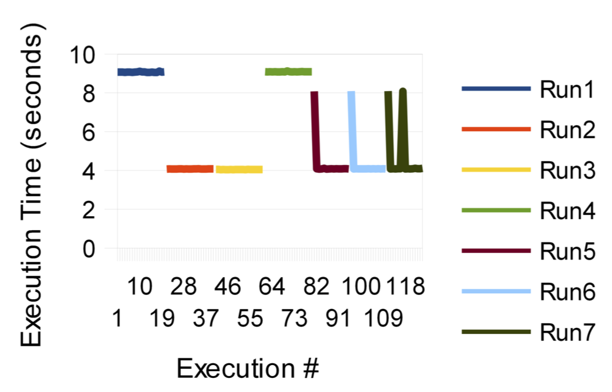

   Low-volume object retrival.

Low-volume 2 – time series
^^^^^^^^^^^^^^^^^^^^^^^^^^

.. code:: sql

   SELECT taiMidPoint, fluxToAbMag(psfFlux), fluxToAbMag(psfFluxErr), ra, decl
   FROM Source
   WHERE objectId = <objId>

This query retrieves information from all detections of a particular
astronomical object, effectively providing a time-series of measurements
on a desired object. For testing, the objectId was randomized as for the
Low Volume 1 query, which meant that null results were retrieved where
the Source data was missing due to available space on the test cluster.

In :numref:`fig-low-volume-time-series` we see that performance is roughly
constant at about 4 seconds per query. Run 1 was done after Low Volume
1's Run 1 and we discount its 9 second execution times similarly as
anomalous.

.. _fig-low-volume-time-series:

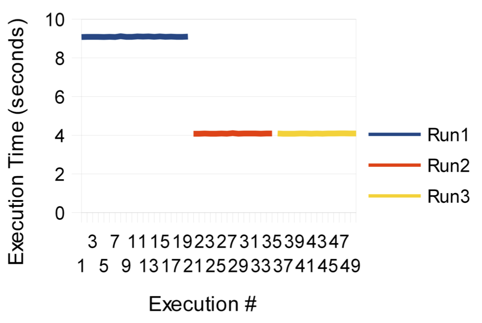

   Low-volume time series.

Low-volume 3 – spatially-restricted filter
^^^^^^^^^^^^^^^^^^^^^^^^^^^^^^^^^^^^^^^^^^

.. code:: sql

   SELECT COUNT(*)
   FROM Object
   WHERE ra_PS BETWEEN 1 AND 2
   AND decl_PS BETWEEN 3 AND 4
   AND fluxToAbMag(zFlux_PS) BETWEEN 21 AND 21.5
   AND fluxToAbMag(gFlux_PS)-fluxToAbMag(rFlux_PS)

   BETWEEN 0.3 AND 0.4
   AND fluxToAbMag(iFlux_PS)-fluxToAbMag(zFlux_PS)
   BETWEEN 0.1 AND 0.12;

In :numref:`fig-low-volume-spatial-filter` we see the same 4 second performance that was seen for the
other low volume queries. Again, the ~9 second performance in Run 2
could not be reproduced so we discount it as resulting from competing
processes on the cluster.

.. _fig-low-volume-spatial-filter:

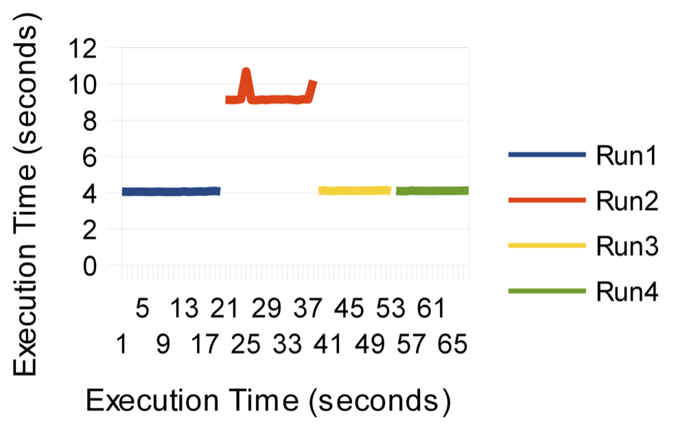

   Low-volume spatially-restricted filter.

High volume 1 – count
^^^^^^^^^^^^^^^^^^^^^

.. code:: sql

   SELECT COUNT(*) FROM Object

.. _fig-150-node-high-volume-count:

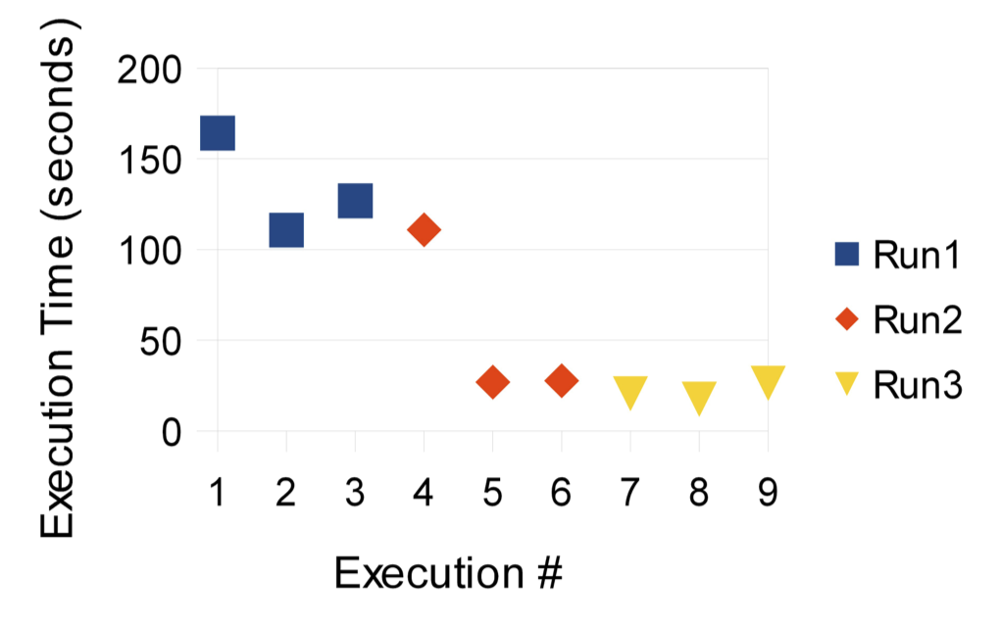

   High volume count.

High-volume 2 – full-sky filter
^^^^^^^^^^^^^^^^^^^^^^^^^^^^^^^

.. code:: sql

   SELECT objectId, ra_PS, decl_PS, uFlux_PS, gFlux_PS,
          rFlux_PS, iFlux_PS, zFlux_PS, yFlux_PS
   FROM Object
   WHERE fluxToAbMag(iFlux_PS) - fluxToAbMag(zFlux_PS) > 4

Using the on-disk data footprint (MySQL's MyISAM .MYD, without indexes
or metadata) of the Object table (1.824x10\ :sup:`12` bytes), we can
compute the aggregate effective table scanning bandwidth. Run 3's 7
minute execution yields 4.0GB/s in aggregate, or 27MB/s per node, while
the other runs yield approximately 11GB/s in aggregate, or 76MB/s per
node. Since each node was configured to execute up to 4 queries in
parallel, Run 3's bandwidth is more realistic, given seek activity from
competing queries and the disk manufacturer's reported theoretical
transfer rate of 98MB/s.

.. _fig-150-node-high-volume-full-sky:

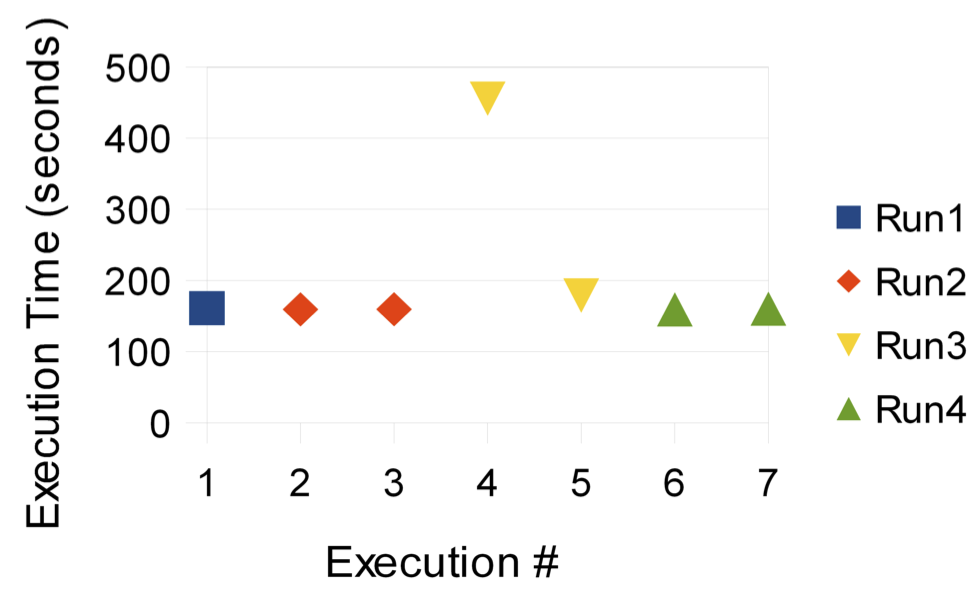

   High volume full-sky filter.

High-volume 3 – density
^^^^^^^^^^^^^^^^^^^^^^^

.. code:: sql

   SELECT COUNT(*) AS n, AVG(ra_PS), AVG(decl_PS), chunkId
   FROM Object
   GROUP BY chunkId

.. _fig-150-node-high-volume-density:

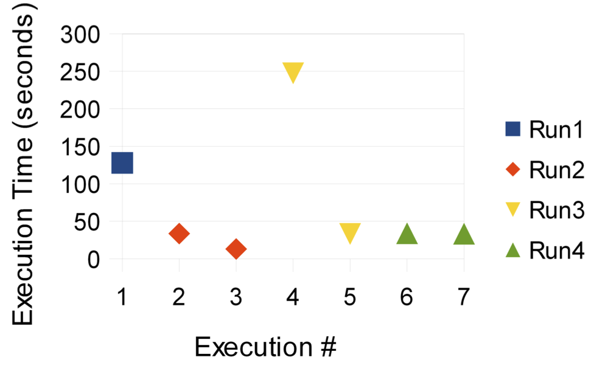

   High volume full-sky filter.

This query computes statistics for table fragments (which are roughly
equal in spatial area), giving a rough estimate of object density over
the sky. It illustrates more complex aggregation query support in Qserv.
This query is of similar complexity to High Volume 2, but
:numref:`fig-150-node-high-volume-density`
illustrates measured times significantly faster, which is probably due
to reduced results transmission time. As mentioned for HV2, cache
behavior was not controlled, but the 4 minute time in Run 3 may be
close.

Super-high-volume 1 – near neighbor
^^^^^^^^^^^^^^^^^^^^^^^^^^^^^^^^^^^

.. code:: sql

   SELECT COUNT(*)
   FROM Object o1, Object o2
   WHERE qserv_areaspec_box(-5,-5,5,-5)
   AND qserv_angSep(o1.ra_PS, o1.decl_PS,
                    o2.ra_PS, o2.decl_PS) < 0.1

This query finds pairs of objects within a specified spherical distance
which lie within a particular part of the sky. Over two randomly
selected 100 deg\ :sup:`2` areas, the execution times were about 10
minutes (667.19 seconds and 660.25 seconds). The resultant row counts
ranged between 3 to 5 billion. Since execution uses on-the-fly generated
tables, the tables do not fit in memory, and Qserv does not yet
implement caching, we expect caching effects to be negligible.

Super-high-volume 2 – sources not near objects
^^^^^^^^^^^^^^^^^^^^^^^^^^^^^^^^^^^^^^^^^^^^^^

.. code:: sql

   SELECT o.objectId, s.sourceId, s.ra, s.decl,
          o.ra_PS, o.decl_PS
   FROM Object o, Source s
   WHERE qserv_areaspec_box(224.1, -7.5, 237.1, 5.5)
   AND o.objectId = s.objectId
   AND qserv_angSep(s.ra, s.decl, o.ra_PS, o.decl_PS) > 0.0045

This is an expensive query – an :math:`O(kn)` join over 150 square
degrees between a 2TB table and a 30TB table. Each objectId is unique in
Object, but is shared by 41 rows (on average) in Source, so :math:`k
\sim 41`. We recorded times of a few hours (5:20:38.00, 2:06:56.33, and
2:41:03.45). The variance is presumed to be caused by varying spatial
object density over the three random areas selected.

.. _test-150-node-scaling:

Scaling
~~~~~~~

We tested Qserv's scalability by measuring its performance while varying
the number of nodes in the cluster. To simulate different cluster sizes,
the frontend was configured to only dispatch queries for partitions
belonging to the desired set of cluster nodes.  This varies the overall
data size proportionally without changing the data size per node
(200-300GB). We measured performance at 40, 100, and 150 nodes to
demonstrate weak scaling.

Scaling with small queries
^^^^^^^^^^^^^^^^^^^^^^^^^^

From :numref:`fig-150-node-scaling-small-1` —
:numref:`fig-150-node-scaling-small-3`, we see that execution time is
unaffected by node count given that the data per node is constant. The
spike in the 40-node configuration in
:numref:`fig-150-node-scaling-small-3` is caused by 2 slow queries (23s
and 57s); the other 28 executed in times ranging from 4.09 to 4.11
seconds.

.. _fig-150-node-scaling-small-1:

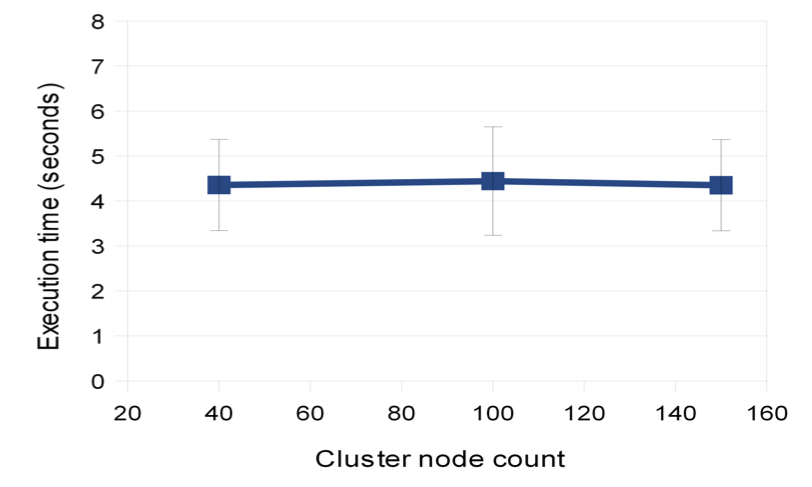

   Scaling with node count (1).

.. _fig-150-node-scaling-small-2:

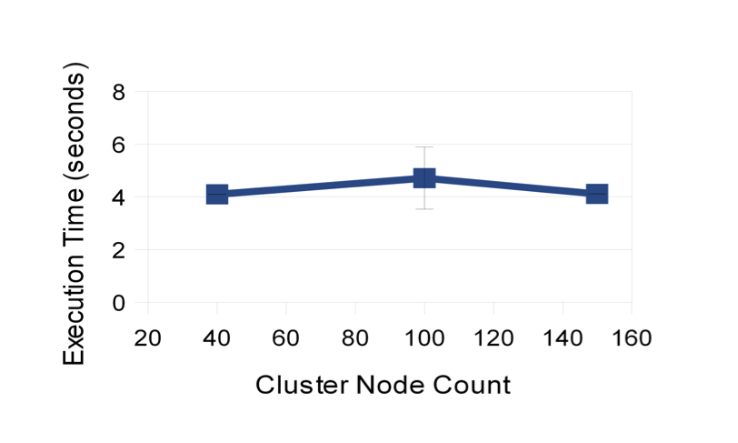

   Scaling with node count (2).

.. _fig-150-node-scaling-small-3:

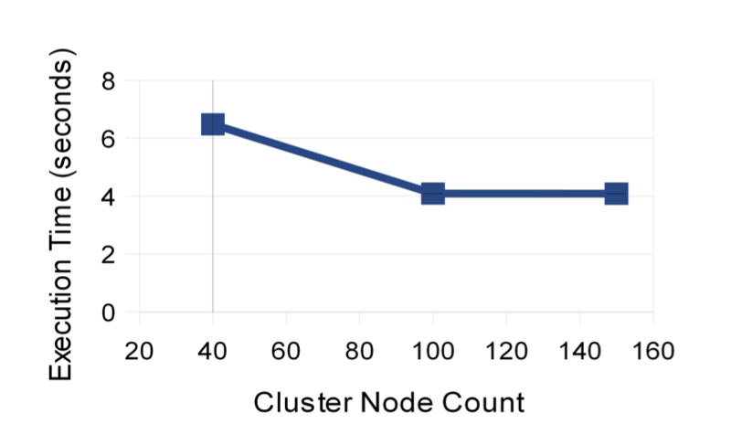

   Scaling with node count (3).

Scaling with expensive queries
^^^^^^^^^^^^^^^^^^^^^^^^^^^^^^

**High Volume**

If Qserv scaled perfectly linearly, the execution time should be
constant when the data per node is constant. In
:numref:`fig-150-node-scaling-high-volume` the times for high volume
queries show a slight increase. HV1 is a primarily a test of dispatch
and result collection overhead and its time increases linearly with the
number of chunks since the front-end has a fixed amount of work to do
per chunk. Since we varied the set of chunks in order to vary the
cluster size, the execution time of HV1 should thus vary linearly with
cluster size. HV3 seems to have a similar trend since due to cache
effects – its result was cached so execution became more dominated by
overhead.

The High Volume 2 query approximately exhibits the flat behavior that
would indicate perfect scalability. Caching effects may have clouded the
results, but they did not dominate. If the query results were perfectly
cached, we expect the overall execution time to be dominated by overhead
as in HV1, and this is clearly not the case.

.. _fig-150-node-scaling-high-volume:

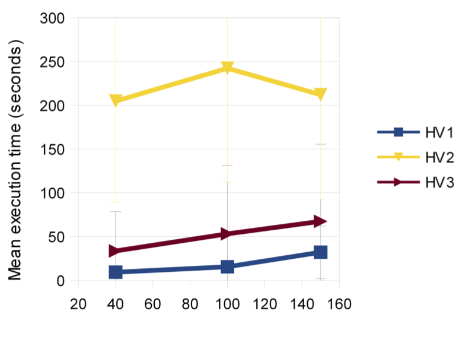

   Scaling with high volume queries.

**Super High Volume**

The tests on expensive queries did not show perfect scalability, but
nevertheless, the measurements did show some amount of parallelism. It
is unclear why execution in the 100-node configuration was the slowest
for both SHV1 and SHV2. Our time-limited access to the cluster did not
allow us to repeat executions of these expensive queries and study their
performance in better detail.

.. _fig-150-node-scaling-super-high-volume:

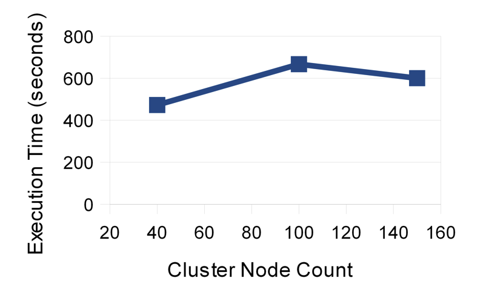

   Scaling with super high volume queries.

.. _test-150-node-concurrency:

Concurrency
~~~~~~~~~~~

.. _fig-node-concurrency:

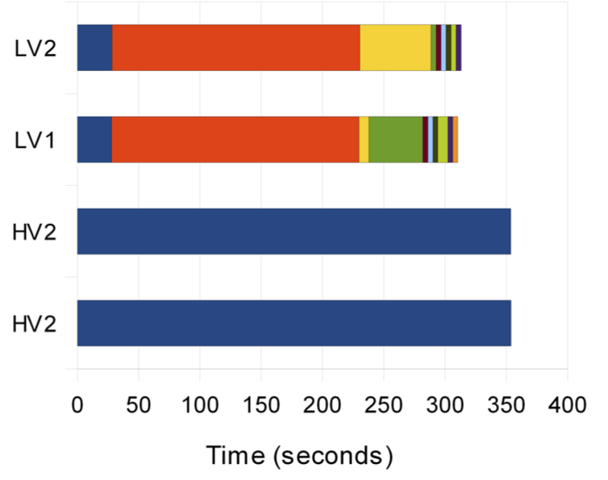

   Concurrency test.

We were able to test Qserv with multiple queries in flight. We ran 4
“streams” of queries: two parallel invocations of HV2, one of LV1, and
one of LV2. Each low volume stream paused for 1 second between queries.
Figure 12 illustrates concurrent performance. We see that the HV2
queries take about twice the time (5:53.75 and 5:53.71) as they would if
running alone. This makes sense since each is a full table scan that is
competing for resources and shared scanning has not been implemented.
The first queries in the low volume streams execute in about 30 seconds,
but each of their second queries seems to get “stuck” in queues. Later
queries in the streams finish faster. Since the worker nodes maintain
first- in-first-out queues for queries and do not implement any concept
of query cost, long queries can easily hog the system. The slowness of
low volume queries after the second queries may be curious at first
glance, since they should be queued at the end on their assigned worker
nodes and thus complete near the end of the HV2 queries. In that case,
subsequent queries would land on workers with nearly empty queues and
execute immediately. This slowness can be explained by query skew –
short queries may land on workers that have or have not
finished their work on the high volume queries.

.. _test-150-node-discussion:

Discussion
~~~~~~~~~~

Latency
^^^^^^^

LSST's data access needs include supporting both small, frequent,
interactive queries and longer, hour/day-scale queries. We designed
Qserv to operate efficiently in both cases to avoid needing multiple
systems, which would be costly in development, maintenance, and
hardware. Indexing was implemented in order to reduce latency for cheap
queries that only touch a small part of the data.

The current Qserv implementation incurs significant overhead in
dispatching queries and collecting results. In early development we
decided to minimize the intelligence on each worker, so the front-end
master became responsible for preparing the SQL queries so that workers
did not need to perform parsing or variable substitution. Results
collection is somewhat heavyweight as well. MySQL does not provide a
method to transfer tables between server instances, so tables are dumped
to SQL statements using *mysqldump* and reloaded on the front-end. This
method was chosen to speed prototyping, but its costs in speed, disk,
network, and database transactions are strong motivations to explore a
more efficient method.

Solid-state storage
^^^^^^^^^^^^^^^^^^^

Some of Qserv's design choices (e.g., shared scanning) are motivated by
the need to work around poor seek performance characteristics of disks.
Solid-state storage has now become a practical alternative to mechanical
disk in many applications. While it may be useful for indexes, its
current cost differential per unit capacity means that it is still
impractical to store bulk data. In the case of flash storage, the most
popular solid-state storage technology, shared scanning is still
effective in optimizing performance since DRAM is much faster than flash
storage and flash still has “seek” penalty characteristics (though it is
much better than spinning disk).

Many core
^^^^^^^^^

We expect the performance to be I/O constrained, since the workload is
data, not CPU performance limited. It is unlikely that many cores can be
leveraged on a single node since they will be sized with only the number
of disk spindles that saturate the north bridge, but shared scanning
should increase CPU utilization efficiency.

Alternate partitioning
^^^^^^^^^^^^^^^^^^^^^^

The rectangular fragmentation in right ascension and declination, while
convenient to visualize physically for humans, is problematic due to
severe distortion near the poles. We are exploring the use of a
hierarchical scheme, such as the hierarchical triangular mesh [Kunszt]_
for partitioning and spatial indexing. These schemes can produce
partitions with less variation in area, and map spherical points to
integer identifiers encoding the points' partitions at many subdivision
levels.  Interactive queries with very small spatial extent can then be
rewritten to operate over a small set of fine partition IDs. If chunks
are stored in partition ID order, this may allow I/O to occur at below
sub-chunk granularity without incurring excessive seeks. Another bonus
is that mature, well tested, and high-performance open source libraries
exist for computing the partition IDs of points and mapping spherical
regions to partition ID sets.

Distributed management
^^^^^^^^^^^^^^^^^^^^^^

The Qserv system is implemented as a single master with many workers.
This approach is reasonable and has performed adequately in testing, but
the bottlenecks are clear. A Qserv instance at LSST's planned scale may
have a million fragment queries in flight, and while we have plans to
optimize the query management code path, managing millions from a single
point is likely to be problematic. The test data set described in this
paper is partitioned into about 9,000 chunks, which means that a launch
of even the most trivial full-sky query launches about 9,000 chunk
queries.

One way to distribute the management load is to launch multiple master
instances. This is simple and requires no code changes other than some
logic in the MySQL Proxy to load-balance between different Qserv
masters. Another way is to implement tree-based query management.
Instead of managing individual chunk queries, the master would dispatch
groups of them to lower-level masters which would could either subdivide
and dispatch subgroups or manage the individual chunk queries
themselves.

.. _jhu-test:

100-TB Scalability Test (JHU 20-node cluster)
---------------------------------------------

In the fall of 2012, we were provided the opportunity to use a cluster
of computers at John Hopkins University (JHU), that were large memory,
multi-processor computers, each with very large storage attached, to
setup as a Qserv service. There were 21 nodes provided for us, and the
nodes had two processors with 12 cores each of Intel Xeon X5650 CPUs at
2.67GHz. But mounted as a data volume, were 22TB raid arrays, to provide
a possible 450TB of storage. This would provide a high volume storage
test, but with a low number of compute nodes, with one master node, and
20 worker nodes.

The data used would be produced on each node, starting with a test
dataset called “pt12”. This test dataset was 220GB, but high density
data in one particular spot in the sky, a few degrees wide. We chose a
high density spot of this data, and then duplicated with across the
whole sphere, to provide a high density dataset over the whole sky,
yielding an estimated 100TB of data.

The production of this large amount of data proved to have problems. The
production was rather slow, taking many weeks for a full production on
each node. At first long processes were setup, and the stability of the
cluster was an issue, with processes dying after days of running, and
many smaller production processes were setup to get past stability
issues. This produced over 100TB of csv text files, into about 7000
chunks worth of data. Once that was done, then this data was loaded into
MySQL MyISAM tables, and with the large data sizes this also took days.

Over the course of this time, often nodes would go out with problems,
and be down for some amount of time, before coming back. Often this
would be with the data still on the mounted volumes, but the loss of
computing nodes would set back the time until the data would be
complete. But this was a small problem, than the problem of data
stability. Once all the nodes were up and running, the data service was
still having problems. This was found to be either loss or corruption of
a few of the thousands of tables on the various nodes. With loss of
data, either data would be re-created or just blocked for testing. Over
the course of testing, dealing with data corruption was constant issue,
but still a large percentage would be accessible at least. Also a
problem was file corruption on the install software, and a few nodes
needed to be reinstalled over the course of the testing. A full 100TB of
data was generated, but only about 85TB could ever be served, before the
resources had to be given back.

But some testing was able to get done on this cluster. A full table scan
was performed on the Object data, although this was only on the aprox,
85TB of data was served, not the complete 100TB of data that was
generated. The query was performed:

.. code:: sql

   SELECT count(*) FROM Object

.. code:: text

   +------------+
   | count(*)   |
   +------------+
   | 2059335968 |
   +------------+
   
   1 row in set (19.26 sec)

Showing 2B objects in the table. The result here was after the query was
performed a few times, and the cache had been stabilized. This is
similar to the times found from previous testing.

The low volume test from access to a small portion of the sky was also
performed. Using the query:

.. code:: sql

   SELECT count(*)
   FROM Object
   WHERE qserv_areaspec_box(1,3,2,4)
   AND scisql_fluxToAbMag(zFlux_PS) BETWEEN 21 AND 21.5

.. code:: text

   +----------+
   | count(*) |
   +----------+
   | 748      |
   +----------+
   
   1 row in set (4.45 sec)

This time for access is also similar to previous testing, looking for
the number of object in a small part of the sky of a certain color. The
~4.5 sec. overhead here is a baseline overhead for data access in this
version of the qserv software.

A high volume data test was performed, looking for color information on
records within a certain range of color. This will scan over all
objects, to return certain number of records. The test query was:

.. code:: sql

   SELECT objectId, ra_PS, decl_PS, uFlux_PS, gFlux_PS,
          rFlux_PS,iFlux_PS, zFlux_PS, yFlux_PS
   FROM Object
   WHERE scisql_fluxToAbMag(iFlux_PS) -
         scisql_fluxToAbMag(zFlux_PS) > 4

This query returned 15695 records in 6 min 33.50 sec. Again this query
was performed a number of times, and this time is the average time after
the caches had stabilized. This query was performed again, this time
looking at a lower number of records, looking for the difference between
*i* and *z* flux of 5 this time. This query returned 2967 records, in 6 min
14.0 sec. The time was a little lower this time, which was mostly the
time to print the records to the screen, where the rest of the time was
the over-head in scanning the available object data to return these
records. The previous tests were done on 30TB of data, but using 150
nodes, although these nodes had many less cores. But this test would
return in about 180 sec there, where here it is about 375 sec. The extra
time here will come from the access of larger amounts of data per node,
and amount of data in general, and the access rate of the data storage.

.. _slac-concurrency-test:

Concurrency Tests (SLAC 100,000 chunk-queries)
----------------------------------------------

A previous version of the Qserv master code had dedicated two fixed size
thread pools to each query, one for dispatching chunk queries, and the
other for reading back results. The dispatch pool was sized at a quite
high 500 threads for two reasons. Firstly, one goal was to dispatch work
as quickly as possible, allowing the Qserv workers to prioritize as they
know best. Secondly, the first query dispatch against a chunk takes ~5s,
so that cluster cold start latency on a full table scan of ~10,000
chunks takes approximately 100s with this many dispatch threads.
Subsequently, `XRootD`_ caching allows for near instantaneous dispatches in
comparison.

The thread pool for result reads was given a much smaller size: just 20
threads per query. This is because the Qserv master process can only
exploit limited amounts of parallelism when merging worker results for a
single query. In fact, the main benefit of using a number as high as 20
threads is that it reduces result merge latency when chunk query
execution times (and hence result availability times) are skewed.

An unfortunate consequence of this simple design was that running too
many concurrent queries would cause thread creation failures in the
Qserv master process. We therefore changed to a unified query dispatch
and result reader thread pool model.

To test our ability to handle many concurrent full-table scan queries
without running out of threads, we partitioned the PT1.2 Object table
into ~8,000 chunks, and distributed them across an 80 node cluster at
SLAC. The nodes in this cluster were quite old and had limited
quantities of RAM, making them the perfect workhorses for this sort of
test. In particular, asking for more than ~1000 threads would cause
Qserv master failure on this platform. Using the new unified thread-pool
design we were able to successfully run between 2 and 12 concurrent
Object table scans each involving ~8,000 chunk queries, requiring a
total execution time of 2 to 8 minutes, thus demonstrating that the
Qserv master can handle loads of ~100,000 in-flight chunk queries, even
on very old hardware.

Note that using a unified thread pool for result reads requires special
measures to avoid query starvation. A single query can easily require
10,000 result reads and there will be far fewer total threads in the
pool. As a result, we must be careful to avoid assigning all threads to
a single query, or queries that should be interactive can easily become
decidedly non-interactive as they wait for a table scan to finish. Our
unified thread pool implementation therefore assigns available threads
to the query using the fewest worker threads, and makes sure to create
new threads when a new query is encountered (up to some hard limit).

To test this, we setup Qserv with a single master node and a single
worker node. The worker was configured with ~12,000 empty chunk tables.
We then submitted both full-table scans (``SELECT COUNT(*) FROM
Object``), and an interactive query (``SELECT COUNT(*) FROM Object WHERE
objectId IN (1)``) requiring just a single chunk query to answer. Though
we were able to demonstrate that the master immediately allocated
threads to dispatch the lone interactive chunk query and read back its
results, the execution time of the interactive query was still far
higher than it should have been. It turns out this is because the Qserv
worker uses a FIFO chunk query scheduling policy, and the single chunk
query corresponding to the interactive user query was being queued up
behind a multitude of chunk queries from the full table scan on the
worker side. We are currently working to address this deficiency as part
of ongoing work on shared scans.

.. _in2p3-scalability-test:

300-node Scalability Test (IN2P3 300-node cluster)
--------------------------------------------------

The largest test we run to-date was run during July-September of 2013 on
a 300-node cluster at the IN2P3 center in France. The main purpose of
the test was to test Qserv scalability and performance beyond 150 nodes,
and re-check concurrency at scale.

.. _in2p3-hardware:

Hardware
~~~~~~~~

Test machines were quad-core Intel(R) Xeon L5430 running at 2.66GHz
speed, with small local spinning disks (120GB of usable space), and 16GB
of RAM per machine. We received an allocation of 320 nodes, which was
intended to allow for a 300 node test in spite of some failed nodes (and
indeed, 17 nodes failed during the tests!)

.. _in2p3-data:

Data
~~~~

With only 120GB of available storage per node, only a limited amount of
data could get produced. We tuned our data synthesizer to produce 50GB
of table data per node, giving 15TB of aggregate data. 220GB of LSST
PT1.2 data was synthesized into a dense stripe covering the declination
range -9˚ to +9˚, setting the partitioning to 120 stripes and 9
substripes (1.5˚ x 1.5˚ chunks and 10 arc-minute-sided subchunks).
This yielded 3,000 chunks of data, with 9 to 11 chunks of data on each
node. The Object table had 0.4 billion rows, and the Source table had 14
billion rows. Data partitions for the Source table averaged 4GB.

Data synthesis took a couple hours for the Object table and overnight
for the Source table. Recent work on the installation software enabled
data loading ingest to happen within a couple hours (comparing to ~6
days for the 150-node test we run two years earlier.)

.. _in2p3-software-stability-issues:

Software stability issues identified
~~~~~~~~~~~~~~~~~~~~~~~~~~~~~~~~~~~~

The initial Qserv installation did not function for queries involving
300 nodes, even though subsets involving 10, 50, 100, and 150 nodes
functioned properly. The first culprit was the use of an older `XRootD`_
release that was missing recent patches for a particular client race
condition. Another culprit was instability exacerbated by excessive use
of threads in the original threading model that the testing in section
9.5 was to address. This was addressed by re-tuning relevant threading
constants. The new `XRootD`_ client we are working on (expected to be ready
in November of 2013) is expected to further improve thread management.

.. _in2p3-queries:

Queries
~~~~~~~

Low volume – object retrieval
^^^^^^^^^^^^^^^^^^^^^^^^^^^^^

.. code:: sql

   SELECT * FROM Object WHERE objectId = <id>

End-to-end user execution time averaged at 1.1 seconds.

Low volume – small area search
^^^^^^^^^^^^^^^^^^^^^^^^^^^^^^

.. code:: sql

   SELECT count(*)
   FROM Object
   WHERE qserv_areaspec_box(1,3,2,4) AND
         scisql_fluxToAbMag(zFlux_PS) BETWEEN 21 AND 21.5

This average query response time was 1.3 sec. This is roughly the
minimum end-to-end execution time for query that selects small region
for this version of Qserv.

Low volume – small area search with additional conditions
^^^^^^^^^^^^^^^^^^^^^^^^^^^^^^^^^^^^^^^^^^^^^^^^^^^^^^^^^

.. code:: sql

   SELECT count(*) FROM Object
   WHERE qserv_areaspec_box(1,2,3,4)
   AND scisql_fluxToAbMag(zFlux_PS) BETWEEN 21 AND 21.5
   AND scisql_fluxToAbMag(gFlux_PS)-
       scisql_fluxToAbMag(rFlux_PS) BETWEEN 0.3 AND 0.4
   AND scisql_fluxToAbMag(iFlux_PS)-
       scisql_fluxToAbMag(zFlux_PS) BETWEEN 0.1 AND 0.12

This average query response time was 1.3 sec. The extra CPU expense of
the conditions was insignificant.

Low volume – simple join
^^^^^^^^^^^^^^^^^^^^^^^^

.. code:: sql

   SELECT s.ra, s.decl
   FROM Object o
   JOIN Source s USING (objectId)
   WHERE o.objectId = 142367243760566706
   AND o.latestObsTime = s.taiMidPoint

This returned in an average time of 11.2 sec.

High volume – object count
^^^^^^^^^^^^^^^^^^^^^^^^^^

.. code:: sql

   SELECT COUNT(*) FROM Object

End-to-end user execution time averaged 7.8 seconds. This is the minimum
overhead to dispatch queries for all 3,000 chunks to all 300 nodes and
retrieve their results. A condition-less ``COUNT(*)`` is executed as a
metadata lookup by MySQL when using MyISAM tables, involving almost no
disk I/O.

Similar query executed on the Source table returned in 11.9 seconds.

High volume – full Object scans
^^^^^^^^^^^^^^^^^^^^^^^^^^^^^^^

.. code:: sql

   SELECT COUNT(*) FROM LSST.Object WHERE gFlux_PS>1e-25

This query was repeated with different constants in the filtering
condition, and the execution time did not vary significantly – it
returned in an average time of 8.45 sec – or less than 1 second longer
than the condition-less ``COUNT(*)`` query.

.. code:: sql

   SELECT objectId, ra_PS, decl_PS, uFlux_PS, gFlux_PS,
          rFlux_PS,iFlux_PS, zFlux_PS, yFlux_PS
   FROM Object
   WHERE scisql_fluxToAbMag(iFlux_PS)-
         scisql_fluxToAbMag(zFlux_PS)>4

Varying the flux difference filter in a range of 4-5, the execution time
ranged between 7-9 seconds.

.. code:: sql

   SELECT objectId, ra_PS, decl_PS,
          scisql_fluxToAbMag(zFlux_PS)
   FROM LSST.Object
   WHERE scisql_fluxToAbMag(zFlux_PS) BETWEEN 25 AND 26
   
End-to-end execution time ranged from 7.7 to 8.4 seconds.

High volume – Source table scan
^^^^^^^^^^^^^^^^^^^^^^^^^^^^^^^

.. code:: sql

   SELECT objectId
   FROM Source
   JOIN Object USING(objectId)
   WHERE qserv_areaspec_box(1,3,2,4)

This returned in 9 min 42.9 sec. Some portion of this time was spent
printing the results to the screen (this test utilized a standard MySQL
command-line client).

Super-high volume – near neighbor
^^^^^^^^^^^^^^^^^^^^^^^^^^^^^^^^^

.. code:: sql

   SELECT COUNT(*) FROM Object o1, Object o2
   WHERE qserv_areaspec_box(-5,-5,5,5)
   AND scisql_angSep(o1.ra_PS, o1.decl_PS,
   o2.ra_PS, o2.decl_PS) < 0.1

This query finds pairs of objects within a specified spherical distance
which lie within a large part of the sky (100 deg\ :sup:`2` area). The
execution times was 4 min 50 sec. The resultant row counts was ~7
billion.

.. _in2p3-test-scaling:

Scaling
~~~~~~~

We run a subset of the above queries on different number nodes (50, 100,
250, 200, 250, 300), in “week scaling” configuration, to determine how
our software scales.

.. _fig-in2p3-dispatch-overhead:

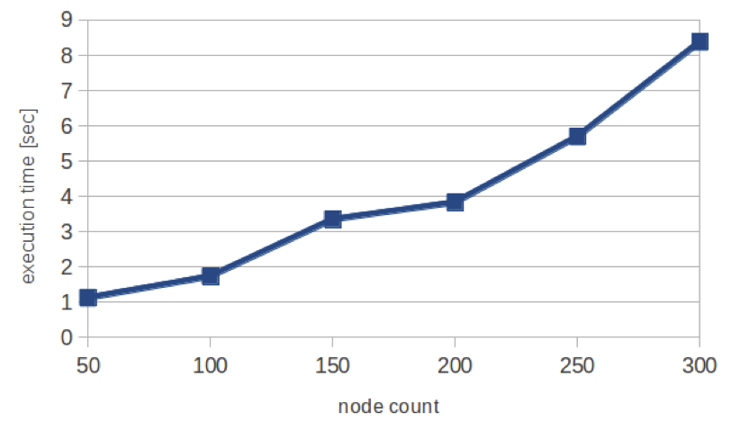

   Dispatch overhead.

.. _fig-in2p3-simple-object-selection:

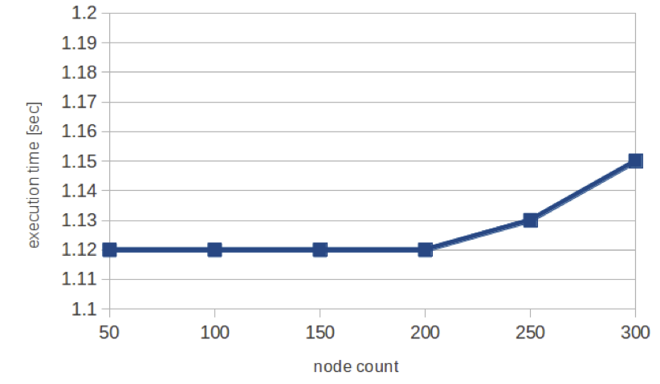

   Simple object selection.

.. _fig-in2p3-mid-size-area:

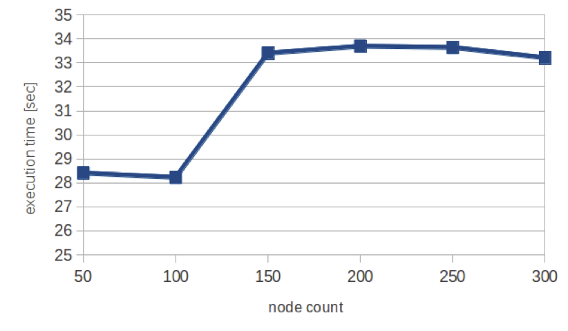

   Select from a mid-size area.

.. _in2p3-test-discussion:

Discussion
~~~~~~~~~~

We showed linear scalability of the dispatch – see
:numref:`fig-in2p3-dispatch-overhead`, achieving below 10 sec (12 for
Source catalog) times when run on the entire, 300 node cluster. Queries
that touch all chunks on all clusters are required to complete under an
hour, so 10-12 sec overhead is very low. During previous large scale
tests we run on 150 nodes 2 years ago, we were getting ~4 sec overhead.
During this test, we measured 3.3 sec on 150-node configuration, which
indicates we reduced the overhead, however since hardware used for these
two tests was not the same, direct comparison would not be entirely
fair.

We showed the overhead for simple, interactive queries was on the order
of 1.8 sec when dispatching a query on one of the 300-nodes (see
:numref:`fig-in2p3-simple-object-selection`). Yes, we can observe a non
linearity starting from ~200 nodes, however that non-linearity is on the
order of 0.03 second when going from 200 to 300 nodes. Since we are
required to answer interactive queries under 10 sec, the <20% overhead
is already acceptable, though we are planning to reduce it further in
the future.

We were able to run all interactive-type queries well under required 10
second, with the exception of simple Object-Source join, which tool 11.2
sec. The longer-than-ideal time is attributed to unnecessary
materialization of subchunks for every query that involves a join – this
is expected to be optimized and alleviated in the near future.

More complex queries, such as a query that selects from a mid-size
region showed linear scalability as well
(:numref:`fig-in2p3-mid-size-area`). The one time 6-sec “jump” between
100 and 150 node test is attributed to switching to different number of
chunks: as we reduced the size of the cluster from 150 to 100 nodes, we
excluded some chunks that were previously falling inside searched
region.

We were also able to run complex queries, such as full table scans and
near neighbor queries, and did not observe any anomalies.

It is important to note that due to the ratio of data size to RAM, a
large fraction of the data, in particular for the “small” Object catalog
was cached in memory. Such environment was particularly good for testing
dispatch and result returning overheads, however it would be unfair to
approximate observed performance to production-size data sets,
especially given that we also had a smaller number of chunks (3,000 in
the test vs expected 20,000 in production).

.. _other-demonstrations:

Other Demonstrations
====================

.. _demo-shared-scans:

Shared Scans
------------

We have conducted preliminary empirical evaluation of our basic shared
scan implementation. The software worked exactly as expected, and we
have not discovered any unforeseen challenges. For the tests we used a
mix of queries with a variety of filters, different CPU load, different
result sizes, some with grouping, some with aggregations, some with
complex math. Specifically, we have measured the following:

- A single full table scan through the Object table took ~3 minutes.
  Running a mix 30 such queries using our shared scan code took 5 min 27
  sec (instead of expected ~1.5 hour it’d take if we didn’t use the
  shared scan code.)

- A single full table scan through Source table took between ~14 min 26
  sec and 14 min 36 sec depending on query complexity. Running a mix of
  30 such queries using shares scan code took 25 min 30 sec.  (instead
  of over 7 hours).

In both cases the extra time it took comparing to the timing of a single
query was related to (expected) CPU contention: we have run 30
simultaneous queries on a slow, 4-core machine.

In addition, we demonstrated running simultaneously a shared scan plus
short, interactive queries. The interactive queries completed as
expected, in some cases with a small (1-2 sec) delay.

.. _demo-fault-tolerance:

Fault Tolerance
---------------

To prove Qserv can gracefully handle faults, we artificially triggered
different error conditions, such as corrupting random parts of a
internal MySQL files while Qserv is reading them, or corrupting data
sent between various components of the Qserv (e.g., from the `XRootD`_ to
the master process).

.. _demo-worker-failure:

Worker failure
~~~~~~~~~~~~~~

These tests are meant to simulate worker failure in general, including
spontaneous termination of a worker process and/or inability to
communicate with a worker node.

When a relevant worker (i.e. one managing relevant data) has failed
prior to query execution, either 1) duplicate data exists on another
worker node, in which case `XRootD`_ silently routes requests from the
master to this other node, or 2) the data is unavailable elsewhere, in
which case `XRootD`_ returns an error code in response to the master's
request to open for write. The former scenario has been successfully
demonstrated during multi-node cluster tests. In the latter scenario,
Qserv gracefully terminates the query and returns an error to the user.
The error handling of the latter scenario involves recently developed
logic and has been successfully demonstrated on a single-node,
multi-worker process setup.

Worker failure during query execution can, in principle, have several
manifestations.

1. If `XRootD`_ returns an error to the Qserv master in response to a
   request to open for write, Qserv will repeat request for open a fixed
   number (e.g. 5) of times. This has been demonstrated.

2. If `XRootD`_ returns an error to the Qserv master in response to a
   write, Qserv immediately terminates the query gracefully and returns
   an error to the user. This has been demonstrated. Note that this may
   be considered acceptable behavior (as opposed to attempting to
   recover from the error) since it is an unlikely failure-mode.

3. If `XRootD`_ returns an error to the Qserv master in response to a
   request to open for read, Qserv will attempt to recover by
   re-initializing the associated chunk query in preparation for a
   subsequent write. This is considered the most likely manifestation of
   worker failure and has been successfully demonstrated on a
   single-node, multi-worker process setup.

4. If `XRootD`_ returns an error to the Qserv master in response to a read,
   Qserv immediately terminates the query gracefully and returns an
   error to the user. This has been demonstrated. Note that this may be
   considered acceptable behavior (as opposed to attempting to recover
   from the error) since it is an unlikely failure-mode.

.. _demo-data-corruption:

Data corruption
~~~~~~~~~~~~~~~

These tests are meant to simulate data corruption that might occur on
disk, during disk I/O, or during communication over the network. We
simulate these scenarios in one of two ways. 1) Truncate data read via
`XRootD`_ by the Qserv master to an arbitrary length. 2) Randomly choose a
single byte within a data stream read via `XRootD`_ and change it to a
random value. The first test necessarily triggers an exception within
Qserv. Qserv responds by gracefully terminating the query and returning
an error message to the user indicating the point of failure (e.g.
failed while merging query results). The second test intermittently
triggers an exception depending on which portion of the query result is
corrupted. This is to be expected since Qserv verifies the format but
not the content of query results. Importantly, for all tests, regardless
of which portion of the query result was corrupted, the error was
isolated to the present query and Qserv remained stable.

.. _demo-future-tests:

Future tests
~~~~~~~~~~~~

Much of the Qserv-specific fault tolerance logic was recently developed
and requires additional testing. In particular, all worker failure
simulations described above must be replicated within a multi-cluster
setup.

.. _multiple-qserve:

Multiple Qserv Installations on a Single Machine
------------------------------------------------

Once in operations, it will be important to allow multiple qserv
instances to coexist on a single machine. This will be necessary when
deploying new Data Release, or for testing new version of the software
(e.g., MySQL, or Qserv). In the short term, it is useful for shared code
development and testing on a limited number of development machines we
have access to. We have successfully demonstrated Qserv have no
architectural issues or hardcoded values such as ports or paths that
would prevent us from running multiple instances on a single machine.

.. _references:

References
==========

.. [LDM-141] *LSST Data Management Storage Sizing and I/O Model*, Docushare
   `LDM-141 (spreadsheet) <http://ls.st/ldm-141>`_
   and `LDM-139 (explanation) <http://ls.lst/ldm-139>`_.

.. [common-queries] *Common User Queries,*
   http://dev.lsstcorp.org/trac/wiki/dbQueries

.. [Dean04] *MapReduce: Simplified Data Processing on Large Clusters –
   Google*, Jeffrey Dean, Sanjay Ghemawat, OSDI'04

.. [Bigtable06] *Bigtable: A Distributed Storage System for Structured Data*,
   http://labs.google.com/papers/bigtable-osdi06.pdf

.. [Chubby] *Google Chubby*: http://labs.google.com/papers/chubby.html

.. [Pike] *Interpreting the Data: Parallel Analysis with Sawzall*, Rob
   Pike, Sean Dorward, Robert Griesemer, Sean Quinlan, Scientific
   Programming Journal

.. [Dremel] *Dremel: Interactive Analysis of Web-Scale Datasets*.
   http://research.google.com/pubs/archive/36632.pdf

.. [Greenplum] http://www.greenplum.com/resources/mapreduce/

.. [Chattopadhyay11] *Tenzing: A SQL Implementation On the MapReduce Framework*,
   Bishwapesh Chattopadhyay at al, to be released at VLDB 2011

.. [Yahoo] http://pressroom.yahoo.net/pr/ycorp/yahoo-and-benchmark-capital-introduce-hortonworks.aspx

.. [Szalay08] Szalay, A., Bell, B., Vandenberg, J., Wonders, A., Burns, R., Fay,
   D., Heasley, J, Hey, T., Nieto-Santisteban, M., Thakar, A.,
   Catharine van Ingen, Wilton, R., GrayWulf: *Scalable Clustered
   Architecture for Data Intensive Computing*, Microsoft Technical
   Report MSR-TR-2008-187, 2008.

.. [Simmhan09] Simmhan, Y., Barga, R., Catharine van Ingen, Nieto-Santisteban, M.,
   Dobos, L., Li, N., Shipway, M., Szalay, A., Werner, S., Heasley, J.,
   *GrayWulf: Scalable Software Architecture for Data Intensive
   Computing*, Hawaii International Conference on System Sciences, pp.
   1-10, 42nd Hawaii International Conference on System Sciences, 2009.

.. [Jedicke06] Jedicke R., Magnier E. A., Kaiser N., Chambers K. C. *The next
   decade of Solar System discovery with Pan-STARRS*. In *Proceedings
   of the International Astronomical Union,* pp 341-352, 2006

.. [Gray07] Gray J., Nieto-Santisteban M., Szalay A., *The Zones Algorithm for
   Finding Points-Near-a-Point or Cross-Matching Spatial Datasets*,
   Microsoft Technical Report MSR TR 2006 52, 2007

.. [dbms209] *eBay's two enormous data warehouses*.
   http://www.dbms2.com/2009/04/30/ebays-two-enormous-data-warehouses/

.. [dbms210] *eBay followup — Greenplum out, Teradata > 10 petabytes, Hadoop has some value, and more* 
   http://www.dbms2.com/2010/10/06/ebay-followup-greenplum-out-teradata-10-petabytes-hadoop-has-some-value-and-more/

.. [eweek04] *At Wal-Mart, Worlds Largest Retail Data Warehouse Gets Even Larger*
   http://www.eweek.com/c/a/Enterprise-Applications/At-WalMart-Worlds-Largest-Retail-Data-Warehouse-Gets-Even-Larger/

.. [scidb] *History of SciDB*, http://www.scidb.org/about/history.php

.. [Becla05] *Lessons Learned from Managing a Petabyte*, Jacek Becla, Daniel
   Wang, CIDR Conference, Asilomar, CA, USA, January 2005

.. [Intersystems13] *European Space Agency Chooses InterSystems CACHE Database,*
   http://www.intersystems.com/casestudies/cache/esa.html

.. [ODBMS11] *Object in Space*,
   http://www.odbms.org/blog/2011/02/objects-in-space/

.. [Stonebaker05] *C-store: a column-oriented DBMS ,* Stonebraker, M., Abadi, D.  J.,
   Batkin, A., Chen, X., Cherniack, M., Ferreira, M., Lau, E., Lin, A.,
   Madden, S., O'Neil, E., O'Neil, P., Rasin, A., Tran, N., and Zdonik,
   S. In *Proceedings of the 31st international Conference on Very
   Large Data Bases* (Trondheim, Norway, August 30 - September 02,
   2005). Very Large Data Bases. VLDB Endowment, 553-564., 2005

.. [Pavlo09] *A Comparison of Approaches to Large-Scale Data Analysis,* A.
   Pavlo, E. Paulson, A. Rasin, D. J. Abadi, D. J. Dewitt, S. Madden,
   and M. Stonebraker. In SIGMOD '09: Proceedings of the 2009 ACM
   SIGMOD International Conference, 2009

.. [Docushare-11701] Solid state disks tests, Docushare Document-11701

.. [Docushare-7025] *DM Risk Register*, Docushare Document-7025, latest
   version at https://www.lsstcorp.org/sweeneyroot/riskmanagement/risks_01.php

.. [perftests] *Query Set for Performance Tests*,
   http://dev.lsstcorp.org/trac/wiki/dbQueriesForPerfTest

.. [LDM-144] *LSST Data Management Infrastructure Costing*, Docushare
   `LDM-144 (spreadsheet) <http://ls.st/ldm-144>`_
   `and LDM-143 (explanation) <http://ls.st/ldm-144>`_.

.. [Kunszt] *The Hierarchical Triangular Mesh*, Peter Kunszt, Alexander Szalay,
   Aniruddha Thakar

.. [databasecolumn] *Mapreduce: a major step back,*
   http://www.databasecolumn.com/2008/01/mapreduce-a-major-step-back.html,
   http://www.databasecolumn.com/2008/01/mapreduce-continued.html.

.. [hadoop-users] Hadoop users: http://wiki.apache.org/hadoop/PoweredBy

.. [nosqlpedia] http://nosqlpedia.com/wiki/Facebook\_Messaging\_-\_HBase\_Comes\_of\_Age

.. [Dryad07] *Distributed Data-Paralle Programs from Sequential Building
   Blocks*,
   http://research.microsoft.com/en-us/projects/dryad/eurosys07.pdf

.. 50. http://www.emc.com/about/news/press/2010/20100706-01.htm

.. [Calpont08] http://www.mysqlconf.com/mysql2009/public/schedule/detail/8997

.. [Calpont09] Calpont Launches Open Source Analytics Database Offering,
    http://www.calpont.com/pr/95-calpont-launches-open-source-analytics-database-offering

.. [HighScalability08] *Skype Plans for PostgreSQL to scale to 1 billion users*,
   http://highscalability.com/skype-plans-postgresql-scale-1-billion-users

.. [PostGIS] http://postgis.refractions.net/

.. [Vertica] *Using Vertica as a Structured Data Repositories for Apache Hadoop*,
   http://www.vertica.com/MapReduce

.. [slac-test] *100-node scalability test run at SLAC*,
   http://dev.lsstcorp.org/trac/wiki/dbQservTesting

.. [Cache] *Using Caché's Globals,*
   http://docs.intersystems.com/documentation/cache/20082/pdfs/GGBL.pdf

.. [Becla07] Organizing the Extremely Large LSST Database for Real-Time
   Astronomical Processing, J. Becla, K-T Lim, S. Monkewitz, M.
   Nieto-Santisteban, A. Thakar, Astronomical Data Analysis Software &
   Systems XVII, London, UK, September 2007

.. [TokuDB] *TokuDB: Scalable High Performance for MySQL and MariaDB Databases*,
   http://www.tokutek.com/wp-content/uploads/2013/04/Tokutek-White-Paper.pdf

.. [CitusDB] *Overview of CitusDB*, http://www.citusdata.com/docs

.. 63. *Oracle Further Commercializes MySQL Database*, PCWorld,
..     http://www.pcworld.com/article/240151/oracle\_further\_commercializes\_mysql\_database.html

.. [Ulin13] *Driving MySQL Innovation*, Tom Ulin, Oracle,
   http://www.percona.com/live/mysql-conference-2013/sessions/keynote-driving-mysql-innovation

.. [Actian] *Ingres Becomes Actian to Take Action on Big Data*,
   http://www.actian.com/ingres-becomes-actian

.. [Zdnet] *Microsoft drops `Dryad`_; puts its big-data bets on Hadoop**,
   http://www.zdnet.com/blog/microsoft/microsoft-drops-dryad-puts-its-big-data-bets-on-hadoop/11226

.. [Nobari13] *TOUCH: In-Memory Spatial Join by Hierarchical Data-Oriented
   Partitioning*, Sadegh Nobari, Farhan Tauheed, Thomas Heinis,
   Panagiotis Karras, Stéphane Bressan, Anastasia Ailamaki, SIGMOD,
   2013

.. _mr-solutions:

Appendix A – Map/Reduce Solutions
=================================

.. _mr-hadoop:

Hadoop
------

Hadoop is a Lucene sub-project hosted by Apache. It is open source. It
tries to re-create the Google MR technology [Dean04]_ to provide a
framework in which parallel searches/projections/transformations (the
*Map* phase) and aggregations/groupings/sorts/joins (the Reduce phase)
using key-value pairs can be reliably performed over extremely large
amounts of data. The framework is written in Java though the actual
tasks executing the map and reduce phases can be written in any language
as these are scheduled external jobs. The framework is currently
supported for GNU/Linux platforms though there is on-going work for
Windows support. It requires that ssh be uniformly available in order to
provide daemon control.

Hadoop consists of over 550 Java classes implementing multiple
components used in the framework:

- The Hadoop Distributed File System (HDFS), a custom POSIX-like file
  system that is geared for a write-once-read-many access model.  HDFS
  is used to distribute blocks of a file, optionally replicated, across
  multiple nodes. HDFS is implemented with a single Namenode that
  maintains all of the meta-data (i.e., file paths, block maps, etc.)
  managed by one or more Datanodes (i.e., a data server running on each
  compute node). The Namenode is responsible for all meta-data
  operations (e.g., renames and deletes) as well as file allocations.
  It uses a rather complicated distribution algorithm to maximize the
  probability that all of the data is available should hardware failures
  occur. In general, HDFS always tries to satisfy read requests with
  data blocks that are closest to the reader. To that extent, HDFS also
  provides mechanisms, used by the framework, to co-locate jobs and
  data. The HDFS file space is layered on top of any existing native
  file system.

- A single JobTracker, essentially a job scheduler responsible for
  submitting and tracking map/reduce jobs across all of the nodes.

- A TaskTracker co-located with each HDFS DataNode daemon which is
  responsible for actually running a job on a node and reporting its
  status.

- DistributedCache to distribute program images as well as other
  required read-only files to all nodes that will run a map/reduce
  program.

- A client API consisting of JobConf, JobClient, Partitioner,
  OutputCollector, Reporter, InputFormat, OutputFormat among others that
  is used to submit and run map/reduce jobs and retrieve the output.

Hadoop is optimized for applications that perform a streaming search
over large amounts of data. By splitting the search across multiple
nodes, co-locating each with the relevant data, wherever possible, and
executing all the sub-tasks in parallel, results can be obtained
(relatively) quickly. However, such co-ordination comes with a price.
Job setup is a rather lengthy process and the authors recommend that the
map phase take at least a minute to execute to prevent job-setup from
dominating the process. Since all of the output is scattered across many
nodes, the map phase must also be careful to not produce so much output
as to overwhelm the network during the reduce phase, though the
framework provides controls for load balancing this operation and has a
library of generally useful mappers and reducers to simplify the task.
Even so, running ad hoc map/reduce jobs can be problematic. The latest
workaround used by many Hadoop users involves running Hadoop services
continuously (and jobs are attached to these services very fast). By
default, joining tables in MR involves transferring data for all the
joined tables into the *reducer*, and performing the join in the
*reduce* stage, which can easily overwhelm the network. To avoid this,
data must be partitioned, and data chunked joined together must be
placed together (on the same node), in order to allow performing the
join in the *map* stage.

Today's implementation of Hadoop requires full data scan even for
simplest queries. To avoid this, indices are needed. Implementing
indices has been planned by the community for several years, and
according to the latest estimates they will be implemented in one or two
years. In the meantime, those who need indices must implement and
maintain them themselves, the index files can be stored e.g. as files in
the Hadoop File System (HDFS).

One of the “features” of MR systems is lack of official catalog
(schema); instead, knowledge about schema in part of the code. While
this dramatically improves flexibility and speeds up prototyping, it
makes it harder to manage such data store in the long term, in
particular if multi-decade projects with large number of developers are
involved.

Lack of some features that are at the core of every database system
should not be a surprise – MR systems are simply built with different
needs in mind, and even `the Hadoop website officially states that
*Hadoop is not a substitute for a database*
<http://wiki.apache.org/hadoop/HadoopIsNot>`_. Nethertheless, many have
attempted to compare Hadoop performance with databases. According to
some publications and feedback from Hadoop users we talked to, Hadoop is
about an order of magnitude more wasteful of hardware than a e.g. DB2
[databasecolumn]_.

Hadoop has a large community supporting it; e.g., over 300 people
attended the first Hadoop summit (in 2008). It is used in production by
many organizations, including Facebook, Yahoo!, and Amazon Facebook
[hadoop-users]_.
It is also commercially supported by Cloudera. Hadoop Summit 2011 was
attended by more than 1,600 people from more than 400 companies.

We evaluated Hadoop in 2008. The evaluation included discussions with
key developers, including Eric Baldeschwieler from Yahoo!, Jeff
Hammerbacher from Facebook, and later Cloudera, discussions with users
present at the 1\ :sup:`st` Hadoop Summit, and a meeting with the
Cloudera team in September of 2010.

.. _mr-hive:

Hive
----

`Hive`_ is a data warehouse infrastructure developed by Facebook on
top of Hadoop; it puts structures on the data, and defines SQL-like
query language. It inherits Hadoop's deficiencies including high latency
and expensive joins. `Hive`_ works on static data, it particular it can't
deal with changing data, as row-level updates are not supported.
Although it does support some database features, it is a “state where
databases were ~1980: there are almost no optimizations” (based on
Cloudera, meeting at SLAC Sept 2010). Typical solutions involve
implementing missing pieces in user code, for example once can build
their own indexes and interact directly with HDFS (and skip the Hadoop
layer).

.. _mr-hbase:

HBase
-----

`HBase`_ is a column-oriented structured storage modeled after Google's
Bigtable [Bigtable06]_, and built on top of the Hadoop HDFS. It is good
at incremental updates and column key lookups, however, similarly to
plain MR, it offers no mechanism to do joins – a typical solution used
by most users is to denormalize data. `HBase`_ is becoming increasingly
more popular at Facebook [nosqlpedia]_. It is supported commercially by
Cloudera, Datameer and `Hadapt`_.

.. _mr-pig-latin:

Pig Latin
---------

Pig Latin is a procedural data flow language for expressing data
analysis programs. It provides many useful primitives including filter,
foreach ... generate, group, join, cogroup, union, sort and distinct,
which greatly simplify writing Map/Reduce programs or gluing multiple
Map/Reduce programs together. It is targeted at large-scale
summarization of datasets that typically require full table scans, not
fast lookups of small numbers of rows. We have talked to the key
developer of Pig Latin – Chris Olston.

.. _mr-other:

Other Hadoop-related Systems
----------------------------

Other systems build for Hadoop include `Zookeeper`_ – a service for
coordinating Hadoop's processes (ala Google's Chubby [Chubby]_) , and
Simon – a cluster and application monitoring tool. Simon is similar to
Ganglia, except it has more/better aggregation.

.. _mr-dryad:

Dryad
-----

`Dryad`_ [Dryad07]_ is a system developed by Microsoft Research for executing
distributed computations. It supports a more general computation model
than MR in that it can execute graphs of operations, using so called
Directed Acyclic Graph (DAG). It is somewhat analogous to the MR model
in that it can model MR itself, among others, more complex flows. The
graphs are similar to the query plans in a relational database. The
graph execution is optimized to take advantage of data locality if
possible, with computation moving to the data. If non-local data is
needed, it is transferred over the network.

`Dryad`_ currently works on flat files. It is similar to Hadoop in this
way.

The core execution engine in `Dryad`_ has been used in production for
several years but not heavily. There are several integration pieces we
might want (loading data from databases instead of files, tracking
replicas of data) that do not yet exist.

Beyond the execution engine, `Dryad`_ also incorporates a simple per-node
task scheduler inherited from elsewhere in Microsoft. It runs
prioritized jobs from a queue. `Dryad`_ places tasks on nodes based on the
data available on the node and the state of the task queue on the node.
A centralized scheduler might improve things, particularly when multiple
simultaneous jobs are running; that is an area that is being
investigated.

`Dryad`_ requires that the localization or partitioning of data be exposed
to it. It uses a relatively generic interface to obtain this metadata
from an underlying filesystem, enabling it to talk to either a
proprietary GFS-like filesystem or local disks.

`Dryad`_ runs only on Windows .NET at present. Building the system outside
of Microsoft is difficult because of dependencies on internal libraries;
this situation is similar to the one with Google's GFS and Map/Reduce.
The core execution engine could conceivably be implemented within Hadoop
or another system, as its logic is not supposed to be terribly
complicated. The performance-critical aspect of the system is the
transfer of data between nodes, a task that Windows and Unix filesystems
have not been optimized for and which `Dryad`_ therefore provides.

`Dryad`_ has been released as open source to academics/researchers in
July 2009. This release however does not include any distributed
filesystem for use with the system. Internally, Microsoft uses the
`Cosmos file system <http://www.goland.org/whatiscosmos/>`_, but it is
not available in the academic release. Instead there are bindings for
NTFS and SQL Server.

Microsoft dropped supporting `Dryad`_ back in late 2011 [Zdnet]_.

.. _mr-dremel:

Dremel
------

Dremel is a scalable, interactive ad-hoc query system for analysis of
read-only data, implemented as an internal project at Google [Dremel]_.
Information about Dremel has been made available in July 2010. Dremel's
architecture is in many ways similar to our baseline architecture
(executing query in parallel on many nodes in shared nothing
architecture, auto fail over, replicating hot spots). Having said that,
we do not have access to the source code, even though Google is an LSST
collaborator, and there is `no corresponding open source alternative to
date <http://www.quora.com/How-will-Dremel-change-future-Hadoop-releases>`_.

.. _mr-tenzing:

Tenzing
-------

Tenzing is an SQL implementation on the MapReduce Framework
[Chattopadhyay11]_ We managed to obtain access to pre-published paper
from Google through our `XLDB`_ channels several months before planned
publication at the VLDB 2011 conference.

Tenzing is a query engine built on top of MR for ad hoc analysis of
Google data. It supports a mostly complete SQL implementation (with
several extensions) combined with several key characteristics such as
heterogeneity, high performance, scalability, reliability, metadata
awareness, low latency support for columnar storage and structured data,
and easy extensibility.

The Tenzing project underscores importance and need of database-like
features in any large scale system.

.. _nosql:

"NoSQL"
-------

The popular term *NoSQL* originally refered to systems that do not
expose SQL interface to the user, and it recently evolved and refers to
structured systems such as key-value stores or document stores. These
systems tend to provide high availability at the cost of relaxed
consistency (“eventual” consistency). Today's key players include
`Cassandra`_ and `MongoDB`_.

While a key/value store might come handy in several places in LSST,
these systems do not address many key needs of the project. Still, a
scalable distributed key-value store may be appropriate to integrate as
an indexing solution within a larger solution.

.. _db-solutions:

Appendix B – Database Solutions
===============================

In alphabetical order.

.. _sec-actian:

Actian
------

Actian, formerly known as Ingres [Actian]_ provides analytical services
through Vectorwise, acquired from CWI in 2010. Primary speed ups rely on
exploiting data level parallelism (rather than tuple-at-a-time
processing). Main disadvantage from LSST perspective: it is a
single-node system.

.. _sec-cache:

Caché
-----

InterSystems Caché is a shared-nothing object database system, released
as an embedded engine since 1972. Internally it stores data as
multi-dimensional arrays, and interestingly, supports overlaps. We are
in discussions with the company—we have been discussing Caché with
Stephen Angevine since early 2007, and met with Steven McGlothlin in
June 2011. We also discussed Caché with William O'Mullane from the ESA's
Gaia mission, an astronomical survey that selected Caché as their
underlying database store in 2010 [25, 26]). InterSystems offers free
licensing for all development and research, for academic and non-profit
research, plus support contracts with competitive pricing. However,
their system does not support compression and stores data in strings,
which may not be efficient for LSST catalog data.

A large fraction of the code is already available as open source for
academia and non-profit organizations under the name “Globals” [Cache]_.

.. _sec-citrusdb:

CitusDB
-------

CitusDB is a new commercial distributed database built on top on
PostgreSQL. It supports joins between one large and multiple small
tables [CitusDB]_ (star schema) – this is insufficient for LSST.

.. _db2:

DB2
---

IBM's DB2 “parallel edition” implements a shared-nothing architecture
since mid-1990. Based on discussions with IBM representatives including
Guy Lohman (e.g., at the meeting in June 2007) as well as based on
various news, it appears that IBM's main focus is on supporting
unstructured data (XML), not large scale analytics. All their majors
projects announced in the last few years seem to confirm them, including
Viper, Viper2 and Cobra (XML) and pureScale (OLTP).

.. _db-drizzle:

Drizzle
-------

`Drizzle`_ is a fork from the MySQL Database, the fork was done
shortly after the announcement of the acquisition of MySQL by Oracle
(April 2008). `Drizzle`_ is lighter than MySQL: most advanced features such
as partitioning, triggers and many others have been removed (the code
base was trimmed from over a million lines down to some 300K, it has
also been well modularized). `Drizzle`_'s main focus is on the cloud
market. It runs on a single server, and there are no plans to implement
shared-nothing architecture. To achieve shared-nothing architecture,
`Drizzle`_ has hooks for an opaque sharding key to be passed through
client, proxy, server, and storage layers, but this feature is still
under development, and might be limited to hash-based sharding.

Default engine is InnoDB. MyISAM engine is not part of `Drizzle`_, it is
likely MariaDB engine will become a replacement for MyISAM.

`Drizzle`_\ ’s first GA release occurred in March 2011.

We have discussed the details of `Drizzle`_ with key `Drizzle`_ architects and
developers, including Brian Aker (the chief architect), and most
developers and users present at the `Drizzle`_ developers meeting in April
2008.

.. _sec-greenplum:

Greenplum
---------

Greenplum is a commercial parallelization extension of PostgreSQL. It
utilizes a shared-nothing, MPP architecture. A single Greenplum database
image consists of an array of individual databases which can run on
different commodity machines. It uses a single Master as an entry point.
Failover is possible through mirroring database segments. According to
some, it works well with simple queries but has issues with more complex
queries. Things to watch out for: distributed transaction manager,
allegedly there are some issues with it.

Up until recently, Greenplum powered one of the largest (if not the
largest) database setups: eBay was using it to manage 6.5 petabytes of
data on a 96-node cluster [dbms209]_. We are in close contact with the
key eBay developers of this system, including Oliver Ratzesberger.

We are in contact with the Greenplum CTO: Luke Lonergan.

08/28/2008: Greenplum announced supporting MapReduce [Greenplum]_.

Acquired by EMC in July 2010.

.. _gridsql:

GridSQL
-------

GridSQL is an open source project sponsored by EnterpriseDB. GridSQL is
a thin layer written on top of postgres that implemented shared-nothing
clustered database system targeted at data warehousing. This system
initially looked very promising, so we evaluated it in more details,
including installing it on our 3-node cluster and testing its
capabilities. We determined that currently in GridSQL, the only way to
distribute a table across multiple nodes is via hash partitioning. We
can't simply hash partition individual objects, as this would totally
destroy data locality, which is essential for spatial joins. A
reasonable workaround is to hash partition entire declination zones
(hash partition on zoneId), this will insure all objects for a
particular zone end up on the same node. Further, we can “chunk” each
zone into smaller pieces by using a regular postgres range partitioning
(sub-tables) on each node.

The main unsolved problems are:

- near neighbor queries. Even though it is possible to slice a large
  table into pieces and distribute across multiple nodes, it is not
  possible to optimize a near neighbor query by taking advantage of data
  locality – GridSQL will still need to do n2 correlations to complete
  the query. In practice a special layer on top of GridSQL is still
  needed to optimize near neighbor queries.

- shared scans.

Another issue is stability, and lack of good documentation.

Also since GridSQL is based on PostgreSQL, it inherits the postgres
“cons”, such as the slow performance (comparing to MySQL) and having to
reload all data every year.

The above reasons greatly reduce the attractiveness of GridSQL.

We have discussed in details the GridSQL architecture with their key
developer, Mason Sharp, who confirmed the issues we identified are
unlikely to be fixed/implemented any time soon.

Gridsql Tests
~~~~~~~~~~~~~

We installed GridSQL on a 3 node cluster at SLAC and run tests aimed to
uncover potential bottlenecks, scalability issues and understand
performance. For these tests we used simulated data generated by the
software built for LSST by the UW team.

Note that GridSQL uses PostgreSQL underneath, so these tests included
installing and testing PostgreSQL as well.

For these tests we used the USNO-B catalog. We run a set of
representative queries, ranging from low volume queries (selecting a
single row for a large catalog, a cone search), to high-volume queries
(such as near-neighbor search).

Our timing tests showed acceptable overheads in performance compared to
PostgreSQL standalone.

We examined all data partitioning options available in GridSQL. After
reading documentation, interacting with GridSQL developers, we
determined that currently in GridSQL, the only way to distribute a table
across multiple nodes is via hash partitioning. We can't simply hash
partition individual objects, as this would totally destroy data
locality, which is essential for spatial joins. A reasonable workaround
we found is to hash partition entire declination zones (hash partition
on zoneId), this will insure all objects for a particular zone end up on
the same node. Further, we can “chunk” each zone into smaller pieces by
using a regular PostgreSQL range partitioning (sub-tables) on each node.

We were unable to find a clean solution for the near neighbor queries.
Even though it is possible to slice a large table into pieces and
distribute across multiple nodes, it is not possible to optimize a near
neighbor query by taking advantage of data locality, so in practice
GridSQL will still need to do n2 correlations to complete the query. In
practice a special layer on top of GridSQL is still needed to optimize
near neighbor queries. So in practice, we are not gaining much (if
anything) by introducing GridSQL into our architecture.

During the tests we uncovered various stability issues, and lack of good
documentation.

In addition, GridSQL is based on PostgreSQL, so it inherits the
PostgreSQL “cons”, such as the slow performance (comparing to MySQL) and
having to reload all data every year, described separately.

.. _infinidb:

InfiniDB
--------

InfiniDB is an open source, columnar DBMS consisting of a MySQL front
end and a columnar storage engine, build and supported by Calpont.
Calpont introduced their system at the MySQL 2008 User Conference
[Calpont08]_, and more officially announced it in late Oct 2009
[Calpont09]_. It implements true MPP, shared nothing (or shared-all,
depending how it is configured) DBMS. It allows data to be range-based
horizontal partitioning, partitions can be distributed across many nodes
(overlapping partitions are not supported though). It allows to run
*distributed* scans, filter aggregations and hash joins, and offers both
intra- and inter- server parallelism. During cross-server joins: no
direct communication is needed between workers. Instead, they build 2
separate hash maps, distribute smaller one, or if too expensive to
distribute they can put it on the “user” node.

A single-server version of InfiniDB software is available through free
community edition. Multi-node, MPP version of InfiniDB is only available
through commercial, non-free edition, and is closed source.

We are in contact with Jim Tommaney, CTO of the Calpont Corporation
since April 2008. In late 2010 we run the most demanding query – the
near neighbor tests using Calpont. Details of these tests are covered in
:ref:`infinidb-tests`.

.. _luciddb:

LucidDB
-------

LucidDB is an open source columnar DBMS. Early startup (version 0.8 as
of March 2009). They have no plans to do shared-nothing (at least there
is no mention of it, and on their main page they mention “great
performance using only a single off-the-shelf Linux or Windows
server.”). Written mostly in java.

.. _dbs-mysql:

MySQL
-----

MySQL utilizes a shared-memory architecture. It is attractive primarily
because it is a well supported, open source database with a large
company (now Oracle) behind it and a big community supporting it. (Note,
however, that much of that community uses it for OLTP purposes that
differ from LSST's needs.) MySQL's optimizer used be below-average,
however it is slowly catching up, especially the MariaDB version.

We have run many, many performance tests with MySQL. These are
documented in trac in various places, many of them on these four pages:

- http://dev.lsstcorp.org/trac/wiki/dbSpatialJoinPerf

- http://dev.lsstcorp.org/trac/wiki/dbBuildSubPart

- http://dev.lsstcorp.org/trac/wiki/dbSubPartOverhead

- http://dev.lsstcorp.org/trac/wiki/DbStoringRefCat

We are well plugged into the MySQL community, we attended all MySQL User
Conferences in the past 5 years, and talked to many MySQL developers,
including director of architecture (Brian Aker), the founders (Monty
Widenius, David Axmark), and theMySQL optimizer gurus.

There are several notable open-source forks of MySQL:

- The main one, supported by Oracle. After initial period when Oracle
  was pushing most new functionality into commercial version of MySQL
  only [Error: Reference source not found], the company now appears
  fully committed to support MySQL, arguing MySQL is a critical
  component of web companies and it is one of the components of the full
  stack of products they offer. Oracle has doubled the number of MySQL
  engineers and tripled the number of MySQL QA staff over the past year
  [Ulin13]_, and the community seems to believe Oracle is truly committed now
  to support MySQL. The main “problem” from LSST perspective is that
  Oracle is putting all the effort into InnoDB engine only (the engine
  used by web companies including Facebook and Google), while the MyISAM
  engine, the engine of choice for LSST, selected because of vastly
  different access pattern characteristics, remains neglected and Oracle
  currently has no plans to change that.

- MontyProgram and SkySQL used to support two separate forks of MySQL,
  in April 2013 they joint efforts; the two founders of MySQL stand
  behind these two companies. MontyProgram is supporting a viable
  alternative to InnoDB, called MariaDB, and puts lots of efforts into
  improving and optimizing MyISAM. As an example, the mutli-core
  performance issues present in all MySQL engines in the past were fixed
  by Oracle for InnoDB, and in *Aria*, the MontyProgram's version of
  MyISAM by MontyProgram.

- Percona, which focuses on multi-core scaling

- `Drizzle`_, which is aslimmed-down version, rewriten from scratch and no
  longer compatible with MySQL. Based on discussions with the users, the
  `Drizzle`_ effort has not picked up, and is slowly dying.

Spatial indexes / GIS. As of version 5.6.1, MySQL has rewritten spatial
support, added support for spatial indexes (for MyISAM only) and
functions using the OpenGIS geometry model. We have not yet tested this
portion of MySQL, and have preferred using geometry functionality from
SciSQL, a MySQL plug-in written inhouse..

.. _mysql-columnar-engines:

MySQL – Columnar Engines
~~~~~~~~~~~~~~~~~~~~~~~~

.. _kickfire:

KickFire
^^^^^^^^

KickFire is a hardware appliance built for MySQL. It runs a proprietary
database kernel (a columnar data store with aggressive compression) with
operations performed on a custom dataflow SQL chip. An individual box
can handle up to a few terabytes of data. There are several factors that
reduce the attractiveness of this approach:

- it is a proprietary “black box”, which makes it hard to debug, plus it
  locks us into a particular technology

- it is an appliance, and custom hardware tends to get obsolete fairly
  rapidly

- it can handle low numbers of terabytes; another level is still needed
  (on top?) to handle petabytes

- there is no apparent way to extend it (not open source, all-in-one
  “black box”)

We have been in contact with the key people since April of 2007, when
the team gave us a demo of their appliance under an NDA.

.. _infobright:

InfoBright
^^^^^^^^^^

Infobright is a proprietary columnar engine for MySQL. Infobright
Community Edition is open-source, but lacks many features, like
parallelism and DML (INSERT, UPDATE, DELETE, etc). Infobright Enterprise
Edition is closed-source, but supports concurrent queries and DML.
Infobright’s solution emphasizes single-node performance without
discussing distributed operation (except for data ingestion in the
enterprise edition).

.. _sec-tokudb:

TokuDB
~~~~~~

Tokutek built a specialized engine, called TokuDB. The engine relies on
new indexing method, called Fractal Tree indexes [TokuDB]_, this new type of
an index primarily increases speed of inserts and data replication.
While its benefits are not obvious for our data access center, rapid
inserts might be useful for Level 1 data sets (Alert Production). We
have been in touch with the Tokutek team for several years, the key
designers of the Fractal Tree index gave a detailed tutorial at the
`XLDB`_-2012 conference we organized.

The engine was made open source in Apr 2013.

.. _netezza:

Netezza
-------

Netezza Performance Server (NPS) is a proprietary, network attached,
*streaming* data warehousing appliance that can run in a shared-nothing
environment. It is built on PostgreSQL.

The architecture of NPS consists of two tiers: a SMP host and hundreds
of massively parallel blades, called Snippet Processing Units (SPU).
Each SPU consists of a CPU, memory, disk drive and an FPGA chip that
filters records as they stream off the disk. See
http://www.netezza.com/products/index.cfm for more information.

According to some rumours, see eg
http://www.dbms2.com/2009/09/03/teradata-and-netezza-are-doing-mapreduce-too/,
Netezza is planning to support map/reduce.

Pros:

- It is a good, scalable solution

- It has good price/performance ratio.

Cons:

- it is an appliance, and custom hardware tends to get obsolete fairly
  rapidly

- high hardware cost

- proprietary

Purchased by IBM.

.. _oracle:

Oracle
------

Oracle provides scalability through Oracle Real Application Clusters
(RAC). It implements a shared-storage architecture.

Cons: proprietary, expensive. It ties users into specialized (expensive)
hardware (*Oracle Clusterware*) in the form of storage area networks to
provide sufficient disk bandwidth to the cluster nodes; the cluster
nodes themselves are often expensive shared-memory machines as well. It
is very expensive to scale to very large data sets, partly due to the
licensing model. Also, the software is very monolithic, it is therefore
changing very, very slowly.

We have been approached several times by Oracle representatives, however
given we believe Oracle is not a good fit for LSST, we decided not to
invest our time in detailed investigation.

.. _paraccel:

ParAccel
--------

ParAccel Analytic Database is a proprietary RDBMS with a shared-nothing
MPP architecture using columnar data storage. They are big on
extensibility and are planning to support user-defined types, table
functions, user-defined indexes, user-defined operators, user-defined
compression algorithms, parallel stored procedures and more.

When we talked to ParAccel representatives (Rick Glick, in May 2008),
the company was still in startup mode.

.. _postgres:

PostgreSQL
----------

PostgreSQL is an open source RDBMS running in a shared-memory
architecture.

PostgreSQL permits horizontal partitioning of tables. Some large-scale
PostgreSQL-based applications use that feature to scale. It works well
if cross-partition communication is not required.

The largest PostgreSQL setup we are aware of is AOL's 300 TB
installation (as of late 2007). Skype is planning to use PostgreSQL to
scale up to billions of users, by introducing a layer of proxy servers
which will hash SQL requests to an appropriate PostgreSQL database
server, but this is an OLTP usage that supports immense volumes of small
queries [HighScalability08]_.

PostgreSQL also offers good GIS support [PostGIS]_. We are collaborating
with the main authors of this extension.

One of the main weaknesses of PostgreSQL is a less-developed support
system. The companies that provide support contracts are less
well-established than Sun/MySQL. Unlike MySQL, but more like Hadoop, the
community is self-organized with no single central organization
representing the whole community, defining the roadmap and providing
long term support. Instead, mailing lists and multiple contributors
(people and organizations) manage the software development.

PostgreSQL is more amenable to modification than MySQL, which may be one
reason why it has been used as the basis for many other products,
including several mentioned below.

Based on the tests we run, PostgreSQL performance is 3.7x worse than
MySQL. We realize the difference is partly due to very different
characteristics of the engines used in these tests (fully ACID-compliant
PostgreSQL vs non-transactional MyISAM), however the non-transactional
solution is perfectly fine, and actually preferred for our immutable
data sets.

We are in touch with few most active PostgreSQL developers, including
the authors of Q3C mentioned above, and Josh Berkus.

.. _postgres-tests:

Tests
~~~~~

We have run various performance tests with PostgreSQL to compare its
performance with MySQL. These tests are described in details in the
“Baseline architecture related” section below. Based on these tests we
determined PostgreSQL is significantly (3.7x) slower than MySQL for most
common LSST queries.

We have also tried various partitioning schemes available in PostgreSQL.
In that respect, we determined PostgreSQL is much more advanced than
MySQL.

Also, during these tests we uncovered that PostgreSQL requires
dump/reload of all tables for each major data release (once per year),
see http://www.postgresql.org/support/versioning. The PostgreSQL
community believes this is unlikely to change in the near future. This
is probably the main show-stopper preventing us from adapting
PostgreSQL.

.. _sec-scidb:

SciDB
-----

SciDB is a new open source system inspired by the needs of LSST15 and
built for scientific analytics. SciDB implements a shared nothing,
columnar MPP array database, user defined functions, overlapping
partitions, and many other features important for LSST. SciDB Release
11.06, the first production release, was published on June 15, 2011. We
are in the process of testing this release.

.. _sqlserver:

SQLServer
---------

Microsoft's SQLServer's architecture is shared-memory. The largest
SQLServer based setup we are aware of is the SDSS database (6 TB), and
the Pan-STARRS database.

In 2008 Microsoft bought DATAllegro and began an effort, codenamed
“Project Madison,” to integrate it into SQLServer. Madison relies on
shared nothing *computing*. Control servers are connected to compute
nodes via dual Infiniband links, and compute servers are connected to
a large SAN via dual Fiber Channel links. Fault tolerance relies on
(expensive) hardware redundancy. For example, servers tend to have
dual power supplies. However, servers are unable to recover from
*storage* node failures, thought a different replica may be used. The
only way to distribute data across nodes is by hashing; the system
relies on replicating *dimension* tables. [the above is based on the
talk we attended:
http://wiki.esi.ac.uk/w/files/5/5c/Dyke-Details\_of\_Project\_Madison-1.pdf]

Cons: It is proprietary, relies on expensive hardware (appliance), and
it ties users to the Microsoft OS.

**About DATAllegro**. DATAllegro was a company specializing in data
warehousing server appliances that are pre-configured with a version of
the Ingres database optimized to handle relatively large data sets
(allegedly up to hundreds of terabytes). The optimizations reduce search
space during joins by forcing hash joins. The appliances rely on high
speed interconnect(Infiniband).

.. _sybase-iq:

Sybase IQ
---------

`Sybase IQ`_ is a commercial columnar database product by Sybase Corp.
`Sybase IQ`_ utilizes a “shared-everything” approach that designed to
provide graceful load-balancing. We heard opinions that most of the good
talent has left the company; thus it is unlikely it will be a major
database player.

Cons: proprietary.

.. _terradata:

Teradata
--------

Teradata implements a shared-nothing architecture. The two largest
customers include eBay and WalMart. Ebay is managing multi petabyte
Teradata-based database.

The main disadvantage of Teradata is very high cost.

We are in close contact with Steve Brobst, acting as Teradata CTO, and
key database developers at eBay.

.. _teradata:

Vertica
-------

The Vertica Analytics Platform is a commercial product based on the open
source *C-store* column-oriented database, and now owned by HP. It
utilizes a shared-nothing architecture. Its implementation is quite
innovative, but involves signficant complexity underneath.

It is built for star/snowflake schemas. It currently can not join
multiple fact tables; e.g. self-joins are not supported though this will
be fixed in future releases. Star joins in the MPP environment are made
possible by replicating dimension tables and partitioning the fact
table.

In 2009, a Vertica Hadoop connector was implemented. This allows Hadoop
developers to push down map operators to Vertica database, stream Reduce
operations into Vertica [Vertica]_, and move data between the two
environments.

Cons:

- lack of support of self-joins

- proprietary..

.. _other-dbs:

Others
------

In addition to map/reduce and RDBMS systems, we also evaluation several
other software packages which could be used as part of our custom
software written on top of MySQL. The components needed include SQL
parser, cluster management and task management.

.. _db-cluster-task-management:

Cluster and task and management
~~~~~~~~~~~~~~~~~~~~~~~~~~~~~~~

Two primary candidates to use as cluster and task management we
identified so far are Gearman and `XRootD`_. Cluster management involves
keeping track of available nodes, allowing nodes to be added/removed
dynamically. Task management involves executing tasks on the nodes.

Detailed requirements what we need are captured at:
http://dev.lsstcorp.org/trac/wiki/dbDistributedFrameworkRequirements

.. _sec-gearman:

Gearman
^^^^^^^

`Gearman`_ is a distributed job execution system, available as open source.
It provides task management functions, e.g., cluster management is left
out to be handled in application code.

During a meeting setup in June 2009 with Eric Day, the key developer
working on integration of `Drizzle`_ with `Gearman`_, who also wrote the C++
version of `Gearman`_, we discussed details of `Gearman`_ architecture and its
applicability for LSST.

`Gearman`_ manages workers as resources that provide RPC execution
capabilities. It is designed to provide scalable access to many
resources that can provide similar functionality (e.g., compress an
image, retrieve a file, perform some expensive computation). While we
could imagine a scheme to use `Gearman`_\ ’s dispatch system, its design did
not match LSST’s needs well. One problem was its store-and-forward
approach to arguments and results, which would mean that the query
service would need to implement its own side transmission channel or
potentially flood the `Gearman`_ coordinator with bulky results.

.. _infinidb-tests:

Appendix C: Tests with InfiniDB
===============================

*In late 2010 we collaborated with the Calpont team on testing their
InfiniDB product. Testing involved executing the most complex queries
such as near neigbor on 1 billion row USNOB catalog. The tests were
run by Jim Tommaney, the final results are pasted below.*

****

Thank you for the chance to evaluate InfiniDB against the stellar data
set and the near neighbor problem. Towards that end I installed our 2.0
version on a Dell 610 server with 16GB memory, 8 physical cores (16
Hyper-Threaded Intel virtual cores), and a 4 disk raid 0 data mount
point with 7200 RPM disk drives.

As you know, the N-squared search space becomes problematic at scale, so
part of the solution involved a specialized query and the addition of 4
additional columns as shown below. These new columns defined two
overlapping grids on top of the search space such that any given object
existed in 2 grids. Note that these are abstract grids represented by
additional columns and the table is a single table with our standard
vertical + horizontal partitioning that happens with the basic create
table statement. So, this virtual 'gridding' doesn't change other
characteristics of the table or prevent other such extensions.

Column additions:

.. code:: sql

   alter table object add column ra_r2 decimal(5,2);
   alter table object add column decl_r2 decimal(4,2);
   alter table object add column ra_d2 decimal(5,2);
   alter table object add column decl_d2 decimal(4,2);

Example update statements:

.. code:: sql

   update object set ra_r2 = round(ra,2) where ra < 10;
   update object set decl_r2 = round(decl,2) where ra < 10;
   update object set ra_d2 = truncate(ra,2) where ra < 10;
   update object set decl_d2 = truncate(decl,2) where ra < 10;

The query itself consist of 4 parts, the sum of which is the count
of near neighbors.

1. Search within Grid D defined by ``ra_d2``, ``decl_d2``. 

2. Search within Grid R defined by ``ra_r2``, ``decl_r2``, adding
   predicates to only include matches that span two D Grids.

   .. code:: sql

      and (( o1.ra_d2 <> o2.ra_d2 ) or (o1.decl_d2 <> o2.decl_d2))

3. There is the additional condition where a given pair of neighbors
   span both Grid D and Grid R. For this subset of the data, the
   neighboring objects share Grid R coordinates for RA, and Grid D
   coordinates for Decl.

   .. code:: sql
   
      FROM object o1 join object o2 on
           (o1.ra_r2 = o2.ra_r2 and o1.decl_d2 = o2.decl_d2)

4. The last case covers the same basic condition as 3, but includes a
   join that covers neighboring objects that share Grid D coordinates
   for RA, and Grid R coordinates for Decl.

   .. code:: sql

      FROM object o1 join object o2 on
           (o1.ra_d2 = o2.ra_d2 and o1.decl_r2 = o2.decl_r2)

Anyway, the results appear very promising, and indicate that it may
satisfy arbitrarily large search spaces. I executed the query
against the full range of declination, and searched with the range
of RA between 0 and ``ra_limit``. I then scaled ``ra_limit`` between 0.01
through 20 and charted the results below, trending search space vs.
rows processed per second. The baseline numbers you provided appear
to avg. about 1000 rows/second, and capped out at about 80k search
space. With InfiniDB, the search rate is relatively flat after a
ramp-up of a couple seconds, running at about ~800 K rows processed
per second through a search space of about 32 M x 32 M objects. At
32M objects x 32M objects the query consumed about 6GB for the hash
structures, however extending the query logic above would allow for
running something like 33 of these queries serially to search
through a 1B x 1B space. Running the 4 sections serially would
reduce the memory requirements if desired.

.. _fig-infinidb-near-neighbors:

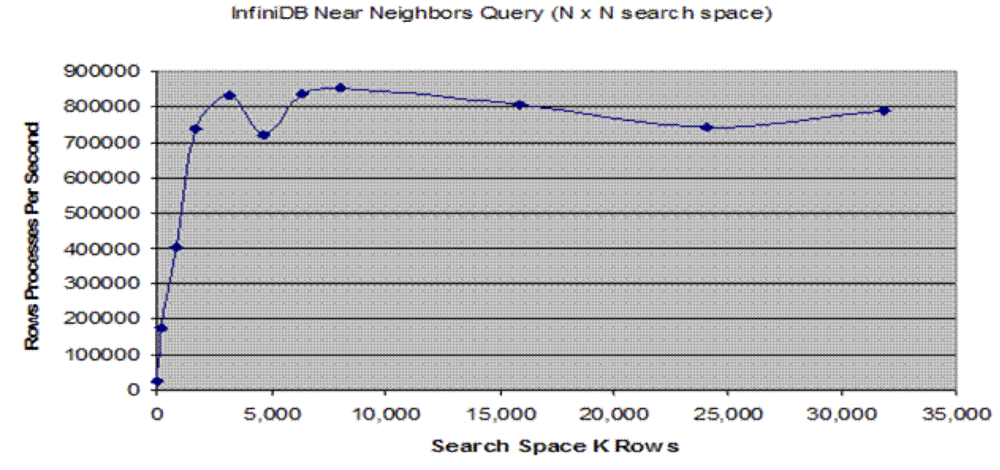

   InfiniDB Near Neighbors Cluster Query (N x N).

There are a number of variations on the near neighbor problem that
provide a filter on one of the object tables, i.e. search for white
dwarf that I would characterize as M x N problems where M << N. To
profile those queries I selected an arbitrary filter ``( o1.bMag > 24.9
)`` that restricted 1 of the 2 sides of the join to at most ~330 K
objects. I then executed 12 queries with ra between 0 and ``ra_limit``,
varying ``ra_limit`` from 30 to 360. Each query was executed 3 times
sequentially following a flush of the data buffer cache, and the average
of the three values charted.

With a bounded M, the processing rate went up significantly,
approaching 4.5 M rows per second when the second and third
executions of a query were satisfied from cache, and running at
nearly 3 M rows per second for larger queries that did not fit in
the data buffer cache ( which was configured at 8 GB ). These
queries only used about 6% of memory for temporary space and could
be run against an arbitrarily large N as desired.

.. _fig-infinidb-m-n-selective-query:

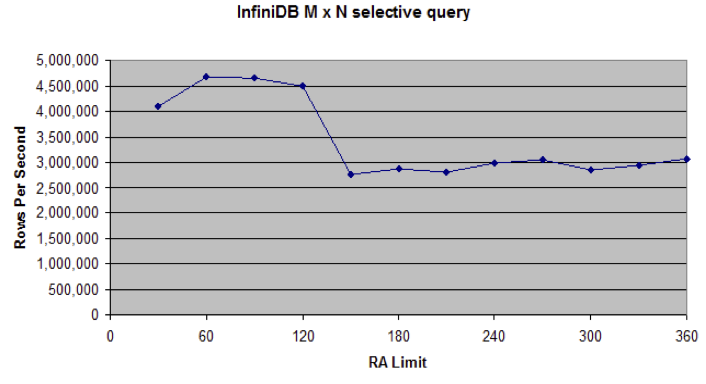

   InfiniDB M x N selective query.

There are more details regarding the load rate, options on other
grid sizes, limitation of this style grid analysis for larger
definitions of 'near', etc. that can be shared and reviewed as
desired, and I am more than happy to profile additional queries as
desired. For example, I can take a look at getting an exact time for
finding all of the near-neighbors within a 1B x 1B search space if
that is interesting (should be something like 23-25 minutes), it is
just a matter of tweaking the query restrictions to allow proper
handling of objects on each side of these larger query boundary.

There are definitely some significant differences between InfiniDB
and MySQL in terms of best practices for a number of items. For
example, our fastest load capability is via cpimport rather than
load data infile. The near neighbors problem appears to be one
example of many where we handle large data analysis significantly
better than MySQL, although there are plenty of examples where MySQL
shines relative to InfinDB (individual row insertion, individual
record access via index, etc). Any external application that relies
on individual row lookups with an expected latency in the
microseconds will run significantly slower with InfiniDB.

.. code:: sql

   select sum(cnt) from (
     SELECT count(*) cnt
     FROM object o1 join object o2 using(ra_d2, decl_d2)
     WHERE ABS(o1.ra - o2.ra) < 0.00083 / o2.cosRadDecl AND ABS(o1.decl -
           o2.decl) < 0.00083 and o1.objectid <> o2.objectid
           and o1.ra >= 0 and o1.ra < @ra_limit and o1.bMag > 24.9
           and o2.ra >= 0 and o2.ra < @ra_limit
     union all
     SELECT count(*) cnt
     FROM object o1 join object o2 using(ra_r2, decl_r2)
     WHERE ABS(o1.ra - o2.ra) < 0.00083 / o2.cosRadDecl
           and ABS(o1.decl - o2.decl) < 0.00083
           and o1.objectid <> o2.objectid
           and o1.ra >= 0 and o1.ra < @ra_limit and o1.bMag > 24.9
           and o2.ra >= 0 and o2.ra < @ra_limit
           and (( o1.ra_d2 <> o2.ra_d2 ) or (o1.decl_d2 <> o2.decl_d2))
     union all
     select count(*) cnt
     FROM object o1 join object o2 on (o1.ra_r2 = o2.ra_r2 and
          o1.decl_d2 = o2.decl_d2 )
     WHERE ABS(o1.ra - o2.ra) < 0.00083 / o2.cosRadDecl AND
           ABS(o1.decl - o2.decl) < 0.00083
           and o1.ra_d2 <> o2.ra_d2
           and o1.decl_r2 <> o2.decl_r2
           and abs(o1.ra - o1.ra_r2) * o1.cosRadDecl < 0.00083
           and abs(o2.ra - o2.ra_r2) * o2.cosRadDecl < 0.00083
           and abs(o1.decl - (o1.decl_d2 + 0.005)) < 0.00083
           and abs(o2.decl - (o2.decl_d2 + 0.005)) < 0.00083
           and o1.objectid <> o2.objectid
           and o1.ra >= 0 and o1.ra < @ra_limit and o1.bMag > 24.9
           and o2.ra >= 0 and o2.ra < @ra_limit
     union all
     select count(*) cnt
     FROM object o1 join object o2 on (o1.ra_d2 = o2.ra_d2 and
          o1.decl_r2 = o2.decl_r2 )
     WHERE ABS(o1.ra - o2.ra) < 0.00083 / o2.cosRadDecl AND
           ABS(o1.decl - o2.decl) < 0.00083
           and o1.ra_r2 <> o2.ra_r2
           and o1.decl_d2 <> o2.decl_d2
           and abs(o1.ra - (o1.ra_d2 + 0.005)) * o1.cosRadDecl < 0.00083
           and abs(o2.ra - (o2.ra_d2 + 0.005)) * o2.cosRadDecl < 0.00083
           and abs(o1.decl - o1.decl_r2 ) < 0.00083
           and abs(o2.decl - o2.decl_r2 ) < 0.00083
           and o1.objectid <> o2.objectid
           and o1.ra >= 0 and o1.ra < @ra_limit and o1.bMag > 24.9
           and o2.ra >= 0 and o2.ra < @ra_limit
   ) a;

.. code:: text

   mysql> set @ra_limit:= 0.01;
   
   Query OK, 0 rows affected (0.00 sec)

   mysql> . near_neighbors.sql
   
   +----------+------------------------+--------------------------+
   | count(*) | count(distinct(ra_d2)) | count(distinct(decl_d2)) |
   +----------+------------------------+--------------------------+
   | 16652    | 1                      | 8643                     |
   +----------+------------------------+--------------------------+
   
   1 row in set (0.07 sec)
   
   +----------+
   | sum(cnt) |
   +----------+
   | 2834     |
   +----------+
   
   1 row in set (0.60 sec)
   
   +----------------------------------------------------------------------------------------------------+
   | idb()                                                                                              |
   +----------------------------------------------------------------------------------------------------+
   | Query Stats: MaxMemPct-0; ApproxPhyI/O-0; CacheI/O-0; BlocksTouched-0; PartitionBlocksEliminated-0 |
   +----------------------------------------------------------------------------------------------------+
   
   1 row in set (0.00 sec)

.. code:: text

   mysql> set @ra_limit:= 0.1;
   
   Query OK, 0 rows affected (0.00 sec)

   mysql> . near_neighbors.sql
   
   +----------+------------------------+--------------------------+
   | count(*) | count(distinct(ra_d2)) | count(distinct(decl_d2)) |
   +----------+------------------------+--------------------------+
   | 167632   | 10                     | 17048                    |
   +----------+------------------------+--------------------------+
   
   1 row in set (0.08 sec)
   
   +----------+
   | sum(cnt) |
   +----------+
   | 31757    |
   +----------+
   
   1 row in set (0.95 sec)
   
   +----------------------------------------------------------------------------------------------------+
   | idb()                                                                                              |
   +----------------------------------------------------------------------------------------------------+
   | Query Stats: MaxMemPct-6; ApproxPhyI/O-0; CacheI/O-0; BlocksTouched-0; PartitionBlocksEliminated-0 |
   +----------------------------------------------------------------------------------------------------+
   
   1 row in set (0.00 sec)

.. code:: text

   mysql> set @ra_limit:= 0.5;

   Query OK, 0 rows affected (0.00 sec)

   mysql> . near_neighbors.sql

   +----------+------------------------+--------------------------+
   | count(*) | count(distinct(ra_d2)) | count(distinct(decl_d2)) |
   +----------+------------------------+--------------------------+
   | 833849   | 50                     | 17812                    |
   +----------+------------------------+--------------------------+
   
   1 row in set (0.16 sec)
   
   +----------+
   | sum(cnt) |
   +----------+
   | 155065   |
   +----------+
   
   1 row in set (2.07 sec)
   
   +----------------------------------------------------------------------------------------------------+
   | idb()                                                                                              |
   +----------------------------------------------------------------------------------------------------+
   | Query Stats: MaxMemPct-6; ApproxPhyI/O-0; CacheI/O-0; BlocksTouched-0; PartitionBlocksEliminated-0 |
   +----------------------------------------------------------------------------------------------------+
   
   1 row in set (0.00 sec)

.. code:: text

   mysql> set @ra_limit:= 1;
   
   Query OK, 0 rows affected (0.00 sec)
   
   mysql> . near_neighbors.sql
   
   +----------+------------------------+--------------------------+
   | count(*) | count(distinct(ra_d2)) | count(distinct(decl_d2)) |
   +----------+------------------------+--------------------------+
   | 1638966  | 100                    | 17891                    |
   +----------+------------------------+--------------------------+
   
   1 row in set (0.21 sec)
   
   +----------+
   | sum(cnt) |
   +----------+
   | 290972   |
   +----------+
   
   1 row in set (2.22 sec)
   
   +----------------------------------------------------------------------------------------------------+
   | idb()                                                                                              |
   +----------------------------------------------------------------------------------------------------+
   | Query Stats: MaxMemPct-7; ApproxPhyI/O-0; CacheI/O-0; BlocksTouched-0; PartitionBlocksEliminated-0 |
   +----------------------------------------------------------------------------------------------------+
   
   1 row in set (0.00 sec)

.. code:: text

   mysql> set @ra_limit:= 2;
   
   Query OK, 0 rows affected (0.00 sec)
   
   mysql> . near_neighbors.sql
   
   +----------+------------------------+--------------------------+
   | count(*) | count(distinct(ra_d2)) | count(distinct(decl_d2)) |
   +----------+------------------------+--------------------------+
   | 3153437  | 200                    | 17947                    |
   +----------+------------------------+--------------------------+
   
   1 row in set (0.25 sec)
   
   +----------+
   | sum(cnt) |
   +----------+
   | 516670   |
   +----------+
   
   1 row in set (3.79 sec)
   
   +----------------------------------------------------------------------------------------------------+
   | idb()                                                                                              |
   +----------------------------------------------------------------------------------------------------+
   | Query Stats: MaxMemPct-8; ApproxPhyI/O-0; CacheI/O-0; BlocksTouched-0; PartitionBlocksEliminated-0 |
   +----------------------------------------------------------------------------------------------------+
   
   1 row in set (0.00 sec)

.. code:: text

   mysql> set @ra_limit:= 3;

   Query OK, 0 rows affected (0.00 sec)

   mysql> . near_neighbors.sql

   +----------+------------------------+--------------------------+
   | count(*) | count(distinct(ra_d2)) | count(distinct(decl_d2)) |
   +----------+------------------------+--------------------------+
   | 4675828  | 300                    | 17961                    |
   +----------+------------------------+--------------------------+

   1 row in set (0.28 sec)

   +----------+
   | sum(cnt) |
   +----------+
   | 734540   |
   +----------+

   1 row in set (6.51 sec)

   +----------------------------------------------------------------------------------------------------+
   | idb()                                                                                              |
   +----------------------------------------------------------------------------------------------------+
   | Query Stats: MaxMemPct-9; ApproxPhyI/O-0; CacheI/O-0; BlocksTouched-0; PartitionBlocksEliminated-0 |
   +----------------------------------------------------------------------------------------------------+

   1 row in set (0.01 sec)

.. code:: text

   mysql> set @ra_limit:= 4;
   
   Query OK, 0 rows affected (0.00 sec)
   
   mysql> . near_neighbors.sql
   
   +----------+------------------------+--------------------------+
   | count(*) | count(distinct(ra_d2)) | count(distinct(decl_d2)) |
   +----------+------------------------+--------------------------+
   | 6356011  | 400                    | 17967                    |
   +----------+------------------------+--------------------------+
   
   1 row in set (0.40 sec)
   
   +----------+
   | sum(cnt) |
   +----------+
   | 1037556  |
   +----------+
   
   1 row in set (7.61 sec)
   
   +-----------------------------------------------------------------------------------------------------+
   | idb()                                                                                               |
   +-----------------------------------------------------------------------------------------------------+
   | Query Stats: MaxMemPct-13; ApproxPhyI/O-0; CacheI/O-0; BlocksTouched-0; PartitionBlocksEliminated-0 |
   +-----------------------------------------------------------------------------------------------------+
   
   1 row in set (0.00 sec)

.. code:: text

   mysql> set @ra_limit:= 5;
   
   Query OK, 0 rows affected (0.00 sec)
   
   mysql> . near_neighbors.sql
   
   +----------+------------------------+--------------------------+
   | count(*) | count(distinct(ra_d2)) | count(distinct(decl_d2)) |
   +----------+------------------------+--------------------------+
   | 7989071  | 500                    | 17975                    |
   +----------+------------------------+--------------------------+
   
   1 row in set (0.46 sec)
   
   +----------+
   | sum(cnt) |
   +----------+
   | 1326087  |
   +----------+
   
   1 row in set (9.38 sec)
   
   +-----------------------------------------------------------------------------------------------------+
   | idb()                                                                                               |
   +-----------------------------------------------------------------------------------------------------+
   | Query Stats: MaxMemPct-14; ApproxPhyI/O-0; CacheI/O-0; BlocksTouched-0; PartitionBlocksEliminated-0 |
   +-----------------------------------------------------------------------------------------------------+
   
   1 row in set (0.00 sec)

.. code:: text

   mysql> set @ra_limit:= 10;
   
   Query OK, 0 rows affected (0.00 sec)
   
   mysql> . near_neighbors.sql
   
   +----------+------------------------+--------------------------+
   | count(*) | count(distinct(ra_d2)) | count(distinct(decl_d2)) |
   +----------+------------------------+--------------------------+
   | 15896387 | 1000                   | 17986                    |
   +----------+------------------------+--------------------------+
   
   1 row in set (0.92 sec)
   
   +----------+
   | sum(cnt) |
   +----------+
   | 2609059  |
   +----------+
   
   1 row in set (19.71 sec)
   
   +-----------------------------------------------------------------------------------------------------+
   | idb()                                                                                               |
   +-----------------------------------------------------------------------------------------------------+
   | Query Stats: MaxMemPct-18; ApproxPhyI/O-0; CacheI/O-0; BlocksTouched-0; PartitionBlocksEliminated-0 |
   +-----------------------------------------------------------------------------------------------------+
   
   1 row in set (0.01 sec)

.. code:: text

   mysql> set @ra_limit:= 15;
   
   Query OK, 0 rows affected (0.00 sec)
   
   mysql> . near_neighbors.sql
   
   +----------+------------------------+--------------------------+
   | count(*) | count(distinct(ra_d2)) | count(distinct(decl_d2)) |
   +----------+------------------------+--------------------------+
   | 24045205 | 1500                   | 17993                    |
   +----------+------------------------+--------------------------+
   
   1 row in set (1.34 sec)
   
   +----------+
   | sum(cnt) |
   +----------+
   | 3949531  |
   +----------+
   
   1 row in set (32.46 sec)
   
   +-----------------------------------------------------------------------------------------------------+
   | idb()                                                                                               |
   +-----------------------------------------------------------------------------------------------------+
   | Query Stats: MaxMemPct-28; ApproxPhyI/O-0; CacheI/O-0; BlocksTouched-0; PartitionBlocksEliminated-0 |
   +-----------------------------------------------------------------------------------------------------+
   
   1 row in set (0.01 sec)

.. code:: text

   mysql> set @ra_limit:= 20;
   
   Query OK, 0 rows affected (0.00 sec)
   
   mysql> . near_neighbors.sql
   
   +----------+------------------------+--------------------------+
   | count(*) | count(distinct(ra_d2)) | count(distinct(decl_d2)) |
   +----------+------------------------+--------------------------+
   | 31841849 | 2000                   | 17996                    |
   +----------+------------------------+--------------------------+
   
   1 row in set (1.74 sec)
   
   +----------+
   | sum(cnt) |
   +----------+
   | 5247760  |
   +----------+
   
   1 row in set (40.48 sec)
   
   +-----------------------------------------------------------------------------------------------------+
   | idb()                                                                                               |
   +-----------------------------------------------------------------------------------------------------+
   | Query Stats: MaxMemPct-37; ApproxPhyI/O-0; CacheI/O-0; BlocksTouched-0; PartitionBlocksEliminated-0 |
   +-----------------------------------------------------------------------------------------------------+
   
   1 row in set (0.00 sec)

``lsst_near_neighbors.sql``:

.. code:: sql

   select sum(cnt) from (
     SELECT count(*) cnt
     FROM object o1 join object o2 using(ra_d2, decl_d2)
     WHERE ABS(o1.ra - o2.ra) < 0.00083 / o2.cosRadDecl AND ABS(o1.decl -
     o2.decl) < 0.00083 and o1.objectid < o2.objectid
     and o1.ra >= 0 and o1.ra < @ra_limit
     and o2.ra >= 0 and o2.ra < @ra_limit
     union all
     SELECT count(*) cnt
     FROM object o1 join object o2 using(ra_r2, decl_r2)
     WHERE ABS(o1.ra - o2.ra) < 0.00083 / o2.cosRadDecl
     and ABS(o1.decl - o2.decl) < 0.00083
     and o1.objectid < o2.objectid
     and o1.ra >= 0 and o1.ra < @ra_limit
     and o2.ra >= 0 and o2.ra < @ra_limit
     and (( o1.ra_d2 <> o2.ra_d2 ) or (o1.decl_d2 <> o2.decl_d2))
     union all
     select count(*) cnt
     FROM object o1 join object o2 on (o1.ra_r2 = o2.ra_r2 and
     o1.decl_d2 = o2.decl_d2 )
     WHERE ABS(o1.ra - o2.ra) < 0.00083 / o2.cosRadDecl AND
     ABS(o1.decl - o2.decl) < 0.00083
     and o1.ra_d2 <> o2.ra_d2
     and o1.decl_r2 <> o2.decl_r2
     and abs(o1.ra - o1.ra_r2) * o1.cosRadDecl < 0.00083
     and abs(o2.ra - o2.ra_r2) * o2.cosRadDecl < 0.00083
     and abs(o1.decl - (o1.decl_d2 + 0.005)) < 0.00083
     and abs(o2.decl - (o2.decl_d2 + 0.005)) < 0.00083
     and o1.objectid < o2.objectid
     and o1.ra >= 0 and o1.ra < @ra_limit
     and o2.ra >= 0 and o2.ra < @ra_limit
     union all
     select count(*) cnt
     FROM object o1 join object o2 on (o1.ra_d2 = o2.ra_d2 and
     o1.decl_r2 = o2.decl_r2 )
     WHERE ABS(o1.ra - o2.ra) < 0.00083 / o2.cosRadDecl AND
     ABS(o1.decl - o2.decl) < 0.00083
     and o1.ra_r2 <> o2.ra_r2
     and o1.decl_d2 <> o2.decl_d2
     and abs(o1.ra - (o1.ra_d2 + 0.005)) * o1.cosRadDecl < 0.00083
     and abs(o2.ra - (o2.ra_d2 + 0.005)) * o2.cosRadDecl < 0.00083
     and abs(o1.decl - o1.decl_r2 ) < 0.00083
     and abs(o2.decl - o2.decl_r2 ) < 0.00083
     and o1.objectid < o2.objectid
     and o1.ra >= 0 and o1.ra < @ra_limit
     and o2.ra >= 0 and o2.ra < @ra_limit
   ) a;

.. _qserve-research:

Appendix D Qserv-related Research Topics
========================================

**Locality-efficient group scheduling:** Qserv breaks up a query into a
number of independent sub-queries with unique data dependencies. When
multiple high-level queries are in flight, it must schedule many more
sub-queries, trying to minimize the latency of each top-level query
while maximizing the total system hardware utilization and I/O
efficiency. We propose researching this problem of locality-efficient
group scheduling and implementing the solution in the context of Qserv.
We will characterize its performance and describe the trade-offs that
affect system performance.

**Windowed-mapping of distributed request queues on k-resources:**
Because Qserv queries can be split into thousands (or millions) of
independent sub-queries, the resulting task of assigning sub-queries to
nodes may be computationally expensive. We propose development of a
windowed-mapping algorithm that ensures :math:`O(k)` assignment given a
sufficient window size, as well as heuristics for finding the window
size for a given system configuration. Successful development of the
algorithm and corresponding implementation will help Qserv scale beyond
thousands of nodes with near constant latency.

**Fault-tolerant sloppy-state task management:** In large clusters, the
task manager is often bottlenecked by the frequency and sheer number of
state updates from its numerous execution nodes. We propose development
of a scheduling algorithm that shifts part of the management to the
requesting clients and keeping only sloppy system state on the
centralized scheduler. We speculate that stale state information is
usually sufficient for the scheduler, and that client-reported
corrections in the remaining cases is low enough that keeping sloppy
state is a large net benefit. We believe this management model will
minimize the management messaging between the scheduler, clients, and
workers and enable extreme scaling in Qserv. Our successful
implementation should be useful for many other systems for scheduling
tasks on large numbers of execution nodes.

.. _community-consult:

Appendix E: People/Communities We Talked To
===========================================

Solution providers of considered products:

- Map/Reduce – key developers from Google

- Hadoop – key developers from Yahoo!, founders and key developers
  behind Cloudera and `Hortonworks`_, companyies supporting enterprise
  edition of Hadoop

- `Hive`_ – key developers from Facebook.

- `Dryad`_ – key developers from Microsoft (`Dryad`_ is Microsofts's version
  of map/reduce), including Michael Isard

- `Gearman`_ – key developers (gearman is a system which allows to run
  MySQL in a distributed fashion)

- representatives from all major database vendors, including Teradata,
  Oracle, IBM/DB2, Greenplum, Postgres, MySQL, MonetDB, SciDB

- representatives from promising startups including HadoopDB, ParAcell,
  EnterpriseDB, Calpont, Kickfire

- Intersystem's Cache—Stephen Angevine, Steven McGlothlin

- Metamarkets

User communities:

- Web companies, including Google, Yahoo, eBay, AOL

- Social networks companies, including Facebook, LinkedIn, Twitter,
  Zynga and Quora

- Retail companies, including Amazon, eBay and Sears,

- Drug discovery (Novartis)

- Oil & gas companies (Chevron, Exxon)

- telecom (Nokia, Comcast, ATT)

- science users from HEP (LHC), astronomy (SDSS, Gaia, 2MASS, DES,
  Pan-STARRS, LOFAR), geoscience, biology

Leading database researchers

- M Stonebraker

- D DeWitt

- S Zdonik

- D Maier

- M Kersten

.. _change-record:

Change Record
=============

+-------------+------------+----------------------------------+-----------------+
| **Version** | **Date**   | **Description**                  | **Owner**       |
+=============+============+==================================+=================+
| 1.0         | 6/15/2009  | Initial version.                 | Jacek Becla     |
+-------------+------------+----------------------------------+-----------------+
| 2.0         | 7/12/2011  | Most sections rewritten, added   | Jacek Becla     |
|             |            | scalability test section         |                 |
+-------------+------------+----------------------------------+-----------------+
| 2.1         | 8/12/2011  | Refreshed future-plans and       | Jacek Becla,    |
|             |            | schedule of testing sections,    | Daniel Wang     |
|             |            | added section about fault        |                 |
|             |            | tolerance.                       |                 |
+-------------+------------+----------------------------------+-----------------+
| 3.0         | 8/2/2013   | Synchronized with latest         | Jackek Becla,   |
|             |            | changes to the requirements      | Daniel Wang,    |
|             |            | (LSE-163). Rewrote most of the   | Serge Mokewitz, |
|             |            | “Implementation” chapter.        | Kian-Tat Lim,   |
|             |            | Documented new tests, refreshed  | Douglas Smith,  |
|             |            | all other chapters.              | Bill Chickering |
+-------------+------------+----------------------------------+-----------------+
| 3.1         | 10/10/2013 | Refreshed numbers based on       | Jacek Becla     |
|             |            | latest LDM-141. Updated shared   | Daniel Wang     |
|             |            | scans (implementation) and       |                 |
|             |            | 300-node test sections, added    |                 |
|             |            | section about shared scans       |                 |
|             |            | demonstration                    |                 |
+-------------+------------+----------------------------------+-----------------+
| 3.2         | 10/10/2013 | TCT approved                     | R Allsman       |
+-------------+------------+----------------------------------+-----------------+

.. _XRootD: http://xrootd.slac.stanford.edu

.. _XLDB: http://xldb.org

.. _Hortonworks: http://www.hortonworks.com/

.. _Hadapt: http://hadapt.com

.. _Hive: http://wiki.apache.org/hadoop/Hive

.. _HBase: http://hadoop.apache.org/hbase/

.. _Zookeeper: website: http://zookeeper.sourceforge.net/

.. _Dryad: http://research.microsoft.com/en-us/projects/dryad/

.. _Cassandra: http://cassandra.apache.org/

.. _MongoDB: http://www.mongodb.org/

.. _Drizzle: http://drizzle.org/

.. _SybaseIQ: http://www.sybase.com/products/datawarehousing/sybaseiq

.. _Gearman: http://gearman.org/
